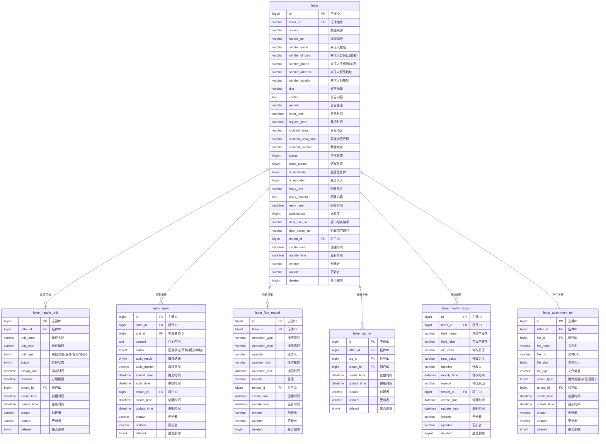

# M01 信件核心模块 - 数据库设计

## 文档信息

**模块编号：** M01
**模块名称：** 信件核心模块
**文档版本：** v1.0
**创建日期：** 2026-04-13
**技术栈：** MySQL 8.0 + MyBatis Plus

---

## 1. 表结构设计

### 1.1 ER图



---

## 2. 表结构详细设计

### 2.1 信件主表（letter）

信件主信息表，包含来信人信息和信件内容。

| 字段名 | 数据类型 | 长度 | 必填 | 默认值 | 说明 |
|--------|----------|------|------|--------|------|
| id | BIGINT | - | 是 | 自增 | 主键ID |
| letter_no | VARCHAR | 32 | 是 | - | 信件编号，唯一标识 |
| source | VARCHAR | 20 | 是 | - | 数据来源（平安厅/信访/12389/12345等） |
| handle_no | VARCHAR | 64 | 否 | NULL | 外部系统的办理编号 |
| sender_name | VARCHAR | 100 | 是 | - | 来信人真实姓名 |
| sender_id_card | VARCHAR | 100 | 是 | - | 来信人身份证号码（加密存储） |
| sender_phone | VARCHAR | 100 | 是 | - | 来信人联系电话（加密存储） |
| sender_address | VARCHAR | 500 | 否 | NULL | 来信人提供的联系地址 |
| sender_location | VARCHAR | 200 | 否 | NULL | 根据身份证解析的归属地 |
| title | VARCHAR | 200 | 否 | NULL | 信件标题 |
| content | TEXT | - | 否 | NULL | 信件详细内容 |
| remark | VARCHAR | 500 | 否 | NULL | 内部备注信息 |
| letter_time | DATETIME | - | 否 | NULL | 来信提交时间 |
| register_time | DATETIME | - | 否 | NULL | 系统登记时间 |
| incident_area | VARCHAR | 100 | 否 | NULL | 事发市（区/县） |
| incident_area_code | VARCHAR | 50 | 否 | NULL | 事发地区代码 |
| incident_location | VARCHAR | 500 | 否 | NULL | 案发地点 |
| status | TINYINT | - | 是 | 0 | 信件状态 |
| close_status | TINYINT | - | 否 | NULL | 结案状态 |
| is_duplicate | TINYINT | - | 否 | 0 | 是否重复件（0否/1是） |
| is_recorded | TINYINT | - | 否 | 0 | 是否录入（0否/1是） |
| reply_unit | VARCHAR | 200 | 否 | NULL | 回复单位 |
| reply_content | TEXT | - | 否 | NULL | 回复内容 |
| reply_time | DATETIME | - | 否 | NULL | 回复时间 |
| satisfaction | TINYINT | - | 否 | NULL | 满意度（1满意/2基本满意/3不满意） |
| dept_site_no | VARCHAR | 64 | 否 | NULL | 来源站点编号 |
| dept_owner_no | VARCHAR | 64 | 否 | NULL | 归属部门的编号 |
| tenant_id | BIGINT | - | 是 | - | 租户ID |
| create_time | DATETIME | - | 是 | 插入时间 | 创建时间 |
| update_time | DATETIME | - | 是 | 插入时间 | 最后更新时间 |
| creator | VARCHAR | 64 | 是 | - | 创建者 |
| updater | VARCHAR | 64 | 是 | - | 更新者 |
| deleted | TINYINT | - | 是 | 0 | 是否删除（0否/1是） |

**信件状态（status）枚举值：**

| 值 | 状态 | 说明 |
|----|------|------|
| 0 | 待处理 | 信件刚创建，等待分配办理单位 |
| 1 | 受理中 | 已分配办理单位，正在办理 |
| 2 | 待审核 | 办理单位提交回复，等待审核 |
| 3 | 待回复 | 审核通过，准备回复来信人 |
| 4 | 已完成 | 信件处理完成，结案 |
| 5 | 无法受理 | 信件无法受理 |
| 6 | 审核不通过 | 审核驳回，需要重新办理 |
| 9 | 重新修改 | 需要重新修改回复内容 |
| 10 | 重新办理 | 需要重新办理 |

---

### 2.2 办理单位表（letter_handle_unit）

信件办理单位信息表，记录主办、督办、协办单位。

| 字段名 | 数据类型 | 长度 | 必填 | 默认值 | 说明 |
|--------|----------|------|------|--------|------|
| id | BIGINT | - | 是 | 自增 | 主键ID |
| letter_id | BIGINT | - | 是 | - | 信件ID |
| unit_name | VARCHAR | 200 | 是 | - | 单位名称 |
| unit_code | VARCHAR | 64 | 是 | - | 单位编码 |
| unit_type | TINYINT | - | 是 | - | 单位类型 |
| status | TINYINT | - | 是 | 0 | 办理状态 |
| assign_time | DATETIME | - | 否 | NULL | 指派时间 |
| deadline | DATETIME | - | 否 | NULL | 办理期限 |
| tenant_id | BIGINT | - | 是 | - | 租户ID |
| create_time | DATETIME | - | 是 | 插入时间 | 创建时间 |
| update_time | DATETIME | - | 是 | 插入时间 | 最后更新时间 |
| creator | VARCHAR | 64 | 是 | - | 创建者 |
| updater | VARCHAR | 64 | 是 | - | 更新者 |
| deleted | TINYINT | - | 是 | 0 | 是否删除 |

**单位类型（unit_type）枚举值：**

| 值 | 类型 | 说明 |
|----|------|------|
| 1 | 主办单位 | 主要办理单位 |
| 2 | 督办单位 | 督促办理单位 |
| 3 | 协办单位 | 协助办理单位 |

**办理状态（status）枚举值：**

| 值 | 状态 | 说明 |
|----|------|------|
| 0 | 待办理 | 已指派，等待开始办理 |
| 1 | 办理中 | 正在办理 |
| 2 | 已回复 | 已提交回复 |
| 3 | 已完成 | 办理完成 |

---

### 2.3 信件回复表（letter_reply）

办理单位提交的回复内容表。

| 字段名 | 数据类型 | 长度 | 必填 | 默认值 | 说明 |
|--------|----------|------|------|--------|------|
| id | BIGINT | - | 是 | 自增 | 主键ID |
| letter_id | BIGINT | - | 是 | - | 信件ID |
| unit_id | BIGINT | - | 是 | - | 办理单位ID |
| content | TEXT | - | 是 | - | 回复内容 |
| status | TINYINT | - | 是 | 0 | 回复状态 |
| audit_result | TINYINT | - | 否 | NULL | 审核结果 |
| audit_opinion | VARCHAR | 500 | 否 | NULL | 审核意见 |
| submit_time | DATETIME | - | 否 | NULL | 提交时间 |
| audit_time | DATETIME | - | 否 | NULL | 审核时间 |
| tenant_id | BIGINT | - | 是 | - | 租户ID |
| create_time | DATETIME | - | 是 | 插入时间 | 创建时间 |
| update_time | DATETIME | - | 是 | 插入时间 | 最后更新时间 |
| creator | VARCHAR | 64 | 是 | - | 创建者 |
| updater | VARCHAR | 64 | 是 | - | 更新者 |
| deleted | TINYINT | - | 是 | 0 | 是否删除 |

**回复状态（status）枚举值：**

| 值 | 状态 | 说明 |
|----|------|------|
| 0 | 草稿 | 草稿状态，可编辑 |
| 1 | 待审核 | 已提交，等待审核 |
| 2 | 已通过 | 审核通过 |
| 3 | 已驳回 | 审核驳回 |

---

### 2.4 流转记录表（letter_flow_record）

信件流转处理的流程记录表。

| 字段名 | 数据类型 | 长度 | 必填 | 默认值 | 说明 |
|--------|----------|------|------|--------|------|
| id | BIGINT | - | 是 | 自增 | 主键ID |
| letter_id | BIGINT | - | 是 | - | 信件ID |
| operation_type | VARCHAR | 50 | 是 | - | 操作类型 |
| operation_desc | VARCHAR | 500 | 是 | - | 操作描述 |
| operator | VARCHAR | 100 | 是 | - | 操作人 |
| operator_unit | VARCHAR | 200 | 否 | NULL | 操作单位 |
| operation_time | DATETIME | - | 是 | 插入时间 | 操作时间 |
| remark | VARCHAR | 500 | 否 | NULL | 备注 |
| tenant_id | BIGINT | - | 是 | - | 租户ID |
| create_time | DATETIME | - | 是 | 插入时间 | 创建时间 |
| update_time | DATETIME | - | 是 | 插入时间 | 最后更新时间 |
| creator | VARCHAR | 64 | 是 | - | 创建者 |
| updater | VARCHAR | 64 | 是 | - | 更新者 |
| deleted | TINYINT | - | 是 | 0 | 是否删除 |

**操作类型（operation_type）枚举值：**

| 值 | 类型 | 说明 |
|----|------|------|
| CREATE | 创建 | 信件创建 |
| ASSIGN | 指派 | 指派办理单位 |
| ACCEPT | 受理 | 受理信件 |
| REPLY | 回复 | 提交回复 |
| AUDIT | 审核 | 审核回复 |
| PASS | 通过 | 审核通过 |
| REJECT | 驳回 | 审核驳回 |
| COMPLETE | 完成 | 信件完成 |
| DELETE | 删除 | 信件删除 |
| RESTORE | 恢复 | 信件恢复 |
| MODIFY | 修改 | 信件修改 |

---

### 2.5 标签关联表（letter_tag_rel）

信件与标签的关联关系表。

| 字段名 | 数据类型 | 度 | 必填 | 默认值 | 说明 |
|--------|----------|------|------|--------|------|
| id | BIGINT | - | 是 | 自增 | 主键ID |
| letter_id | BIGINT | - | 是 | - | 信件ID |
| tag_id | BIGINT | - | 是 | - | 标签ID |
| tenant_id | BIGINT | - | 是 | - | 租户ID |
| create_time | DATETIME | - | 是 | 插入时间 | 创建时间 |
| update_time | DATETIME | - | 是 | 插入时间 | 最后更新时间 |
| creator | VARCHAR | 64 | 是 | - | 创建者 |
| updater | VARCHAR | 64 | 是 | - | 更新者 |
| deleted | TINYINT | - | 是 | 0 | 是否删除 |

---

### 2.6 修改记录表（letter_modify_record）

信件修改操作记录表。

| 字段名 | 数据类型 | 度 | 必填 | 默认值 | 说明 |
|--------|----------|------|------|--------|------|
| id | BIGINT | - | 是 | 自增 | 主键ID |
| letter_id | BIGINT | - | 是 | - | 信件ID |
| field_name | VARCHAR | 50 | 是 | - | 修改字段名 |
| field_label | VARCHAR | 100 | 是 | - | 字段中文名 |
| old_value | VARCHAR | 1000 | 否 | NULL | 修改前值 |
| new_value | VARCHAR | 1000 | 否 | NULL | 修改后值 |
| modifier | VARCHAR | 100 | 是 | - | 修改人 |
| modify_time | DATETIME | - | 是 | 插入时间 | 修改时间 |
| reason | VARCHAR | 500 | 否 | NULL | 修改原因 |
| tenant_id | BIGINT | - | 是 | - | 租户ID |
| create_time | DATETIME | - | 是 | 插入时间 | 创建时间 |
| update_time | DATETIME | - | 是 | 插入时间 | 最后更新时间 |
| creator | VARCHAR | 64 | 是 | - | 创建者 |
| updater | VARCHAR | 64 | 是 | - | 更新者 |
| deleted | TINYINT | - | 是 | 0 | 是否删除 |

---

### 2.7 附件关联表（letter_attachment_rel）

信件相关的附件文件关联表。

| 字段名 | 数据类型 | 度 | 必填 | 默认值 | 说明 |
|--------|----------|------|------|--------|------|
| id | BIGINT | - | 是 | 自增 | 主键ID |
| letter_id | BIGINT | - | 是 | - | 信件ID |
| file_id | BIGINT | - | 是 | - | 附件文件ID |
| file_name | VARCHAR | 200 | 是 | - | 文件名 |
| file_url | VARCHAR | 500 | 是 | - | 文件URL |
| file_size | BIGINT | - | 否 | NULL | 文件大小（字节） |
| file_type | VARCHAR | 50 | 否 | NULL | 文件类型（扩展名） |
| attach_type | TINYINT | - | 是 | 1 | 附件类型 |
| tenant_id | BIGINT | - | 是 | - | 租户ID |
| create_time | DATETIME | - | 是 | 插入时间 | 创建时间 |
| update_time | DATETIME | - | 是 | 插入时间 | 最后更新时间 |
| creator | VARCHAR | 64 | 是 | - | 创建者 |
| updater | VARCHAR | 64 | 是 | - | 更新者 |
| deleted | TINYINT | - | 是 | 0 | 是否删除 |

**附件类型（attach_type）枚举值：**

| 值 | 类型 | 说明 |
|----|------|------|
| 1 | 来信附件 | 来信人上传的附件 |
| 2 | 回复附件 | 回复时上传的附件 |

---

## 3. 索引设计

### 3.1 信件主表索引（letter）

| 索引名 | 索引类型 | 索引字段 | 说明 |
|--------|----------|----------|------|
| PRIMARY | 主键 | id | 主键索引 |
| uk_letter_no | 唯一索引 | letter_no | 信件编号唯一索引 |
| idx_source | 普通索引 | source | 数据来源索引 |
| idx_status | 普通索引 | status | 信件状态索引 |
| idx_sender_name | 普通索引 | sender_name | 来信人姓名索引 |
| idx_register_time | 普通索引 | register_time | 登记时间索引 |
| idx_deleted | 普通索引 | deleted | 删除标记索引 |
| idx_tenant_id | 普通索引 | tenant_id | 租户ID索引 |
| idx_handle_no | 普通索引 | handle_no | 办理编号索引 |

### 3.2 办理单位表索引（letter_handle_unit）

| 索引名 | 索引类型 | 索引字段 | 说明 |
|--------|----------|----------|------|
| PRIMARY | 主键 | id | 主键索引 |
| idx_letter_id | 普通索引 | letter_id | 信件ID索引 |
| idx_unit_code | 普通索引 | unit_code | 单位编码索引 |
| idx_unit_type | 普通索引 | unit_type | 单位类型索引 |
| idx_tenant_id | 普通索引 | tenant_id | 租户ID索引 |

### 3.3 信件回复表索引（letter_reply）

| 索引名 | 索引类型 | 索引字段 | 说明 |
|--------|----------|----------|------|
| PRIMARY | 主键 | id | 主键索引 |
| idx_letter_id | 普通索引 | letter_id | 信件ID索引 |
| idx_unit_id | 普通索引 | unit_id | 办理单位ID索引 |
| idx_tenant_id | 普通索引 | tenant_id | 租户ID索引 |

### 3.4 流转记录表索引（letter_flow_record）

| 索引名 | 索引类型 | 索引字段 | 说明 |
|--------|----------|----------|------|
| PRIMARY | 主键 | id | 主键索引 |
| idx_letter_id | 普通索引 | letter_id | 信件ID索引 |
| idx_operation_type | 普通索引 | operation_type | 操作类型索引 |
| idx_tenant_id | 普通索引 | tenant_id | 租户ID索引 |

### 3.5 标签关联表索引（letter_tag_rel）

| 索引名 | 索引类型 | 索引字段 | 说明 |
|--------|----------|----------|------|
| PRIMARY | 主键 | id | 主键索引 |
| idx_letter_id | 普通索引 | letter_id | 信件ID索引 |
| idx_tag_id | 普通索引 | tag_id | 标签ID索引 |
| uk_letter_tag | 唯一索引 | letter_id, tag_id | 信件标签唯一索引 |
| idx_tenant_id | 普通索引 | tenant_id | 租户ID索引 |

### 3.6 修改记录表索引（letter_modify_record）

| 索引名 | 索引类型 | 索引字段 | 说明 |
|--------|----------|----------|------|
| PRIMARY | 主键 | id | 主键索引 |
| idx_letter_id | 普通索引 | letter_id | 信件ID索引 |
| idx_tenant_id | 普通索引 | tenant_id | 租户ID索引 |

### 3.7 附件关联表索引（letter_attachment_rel）

| 猆引名 | 索引类型 | 索引字段 | 说明 |
|--------|----------|----------|------|
| PRIMARY | 主键 | id | 主键索引 |
| idx_letter_id | 普通索引 | letter_id | 信件ID索引 |
| idx_file_id | 普通索引 | file_id | 文件ID索引 |
| idx_tenant_id | 普通索引 | tenant_id | 租户ID索引 |

---

## 4. DDL脚本

```sql
-- =============================================
-- M01 信件核心模块 - 数据库DDL脚本
-- =============================================

-- 1. 信件主表
CREATE TABLE `letter` (
    `id` BIGINT NOT NULL AUTO_INCREMENT COMMENT '主键ID',
    `letter_no` VARCHAR(32) NOT NULL COMMENT '信件编号',
    `source` VARCHAR(20) NOT NULL COMMENT '数据来源',
    `handle_no` VARCHAR(64) DEFAULT NULL COMMENT '办理编号',
    `sender_name` VARCHAR(100) NOT NULL COMMENT '来信人姓名',
    `sender_id_card` VARCHAR(100) NOT NULL COMMENT '来信人身份证(加密)',
    `sender_phone` VARCHAR(100) NOT NULL COMMENT '来信人手机号(加密)',
    `sender_address` VARCHAR(500) DEFAULT NULL COMMENT '来信人联系地址',
    `sender_location` VARCHAR(200) DEFAULT NULL COMMENT '来信人归属地',
    `title` VARCHAR(200) DEFAULT NULL COMMENT '留言标题',
    `content` TEXT DEFAULT NULL COMMENT '留言内容',
    `remark` VARCHAR(500) DEFAULT NULL COMMENT '留言备注',
    `letter_time` DATETIME DEFAULT NULL COMMENT '留言时间',
    `register_time` DATETIME DEFAULT NULL COMMENT '登记时间',
    `incident_area` VARCHAR(100) DEFAULT NULL COMMENT '事发地区',
    `incident_area_code` VARCHAR(50) DEFAULT NULL COMMENT '事发地区代码',
    `incident_location` VARCHAR(500) DEFAULT NULL COMMENT '案发地点',
    `status` TINYINT NOT NULL DEFAULT 0 COMMENT '信件状态',
    `close_status` TINYINT DEFAULT NULL COMMENT '结案状态',
    `is_duplicate` TINYINT DEFAULT 0 COMMENT '是否重复件',
    `is_recorded` TINYINT DEFAULT 0 COMMENT '是否录入',
    `reply_unit` VARCHAR(200) DEFAULT NULL COMMENT '回复单位',
    `reply_content` TEXT DEFAULT NULL COMMENT '回复内容',
    `reply_time` DATETIME DEFAULT NULL COMMENT '回复时间',
    `satisfaction` TINYINT DEFAULT NULL COMMENT '满意度',
    `dept_site_no` VARCHAR(64) DEFAULT NULL COMMENT '部门站点编号',
    `dept_owner_no` VARCHAR(64) DEFAULT NULL COMMENT '归属部门编号',
    `tenant_id` BIGINT NOT NULL COMMENT '租户ID',
    `create_time` DATETIME NOT NULL DEFAULT CURRENT_TIMESTAMP COMMENT '创建时间',
    `update_time` DATETIME NOT NULL DEFAULT CURRENT_TIMESTAMP ON UPDATE CURRENT_TIMESTAMP COMMENT '更新时间',
    `creator` VARCHAR(64) NOT NULL DEFAULT '' COMMENT '创建者',
    `updater` VARCHAR(64) NOT NULL DEFAULT '' COMMENT '更新者',
    `deleted` TINYINT NOT NULL DEFAULT 0 COMMENT '是否删除',
    PRIMARY KEY (`id`),
    UNIQUE KEY `uk_letter_no` (`letter_no`),
    KEY `idx_source` (`source`),
    KEY `idx_status` (`status`),
    KEY `idx_sender_name` (`sender_name`),
    KEY `idx_register_time` (`register_time`),
    KEY `idx_deleted` (`deleted`),
    KEY `idx_tenant_id` (`tenant_id`),
    KEY `idx_handle_no` (`handle_no`)
) ENGINE=InnoDB DEFAULT CHARSET=utf8mb4 COLLATE=utf8mb4_unicode_ci COMMENT='信件主表';

-- 2. 办理单位表
CREATE TABLE `letter_handle_unit` (
    `id` BIGINT NOT NULL AUTO_INCREMENT COMMENT '主键ID',
    `letter_id` BIGINT NOT NULL COMMENT '信件ID',
    `unit_name` VARCHAR(200) NOT NULL COMMENT '单位名称',
    `unit_code` VARCHAR(64) NOT NULL COMMENT '单位编码',
    `unit_type` TINYINT NOT NULL COMMENT '单位类型',
    `status` TINYINT NOT NULL DEFAULT 0 COMMENT '办理状态',
    `assign_time` DATETIME DEFAULT NULL COMMENT '指派时间',
    `deadline` DATETIME DEFAULT NULL COMMENT '办理期限',
    `tenant_id` BIGINT NOT NULL COMMENT '租户ID',
    `create_time` DATETIME NOT NULL DEFAULT CURRENT_TIMESTAMP COMMENT '创建时间',
    `update_time` DATETIME NOT NULL DEFAULT CURRENT_TIMESTAMP ON UPDATE CURRENT_TIMESTAMP COMMENT '更新时间',
    `creator` VARCHAR(64) NOT NULL DEFAULT '' COMMENT '创建者',
    `updater` VARCHAR(64) NOT NULL DEFAULT '' COMMENT '更新者',
    `deleted` TINYINT NOT NULL DEFAULT 0 COMMENT '是否删除',
    PRIMARY KEY (`id`),
    KEY `idx_letter_id` (`letter_id`),
    KEY `idx_unit_code` (`unit_code`),
    KEY `idx_unit_type` (`unit_type`),
    KEY `idx_tenant_id` (`tenant_id`)
) ENGINE=InnoDB DEFAULT CHARSET=utf8mb4 COLLATE=utf8mb4_unicode_ci COMMENT='办理单位表';

-- 3. 信件回复表
CREATE TABLE `letter_reply` (
    `id` BIGINT NOT NULL AUTO_INCREMENT COMMENT '主键ID',
    `letter_id` BIGINT NOT NULL COMMENT '信件ID',
    `unit_id` BIGINT NOT NULL COMMENT '办理单位ID',
    `content` TEXT NOT NULL COMMENT '回复内容',
    `status` TINYINT NOT NULL DEFAULT 0 COMMENT '回复状态',
    `audit_result` TINYINT DEFAULT NULL COMMENT '审核结果',
    `audit_opinion` VARCHAR(500) DEFAULT NULL COMMENT '审核意见',
    `submit_time` DATETIME DEFAULT NULL COMMENT '提交时间',
    `audit_time` DATETIME DEFAULT NULL COMMENT '审核时间',
    `tenant_id` BIGINT NOT NULL COMMENT '租户ID',
    `create_time` DATETIME NOT NULL DEFAULT CURRENT_TIMESTAMP COMMENT '创建时间',
    `update_time` DATETIME NOT NULL DEFAULT CURRENT_TIMESTAMP ON UPDATE CURRENT_TIMESTAMP COMMENT '更新时间',
    `creator` VARCHAR(64) NOT NULL DEFAULT '' COMMENT '创建者',
    `updater` VARCHAR(64) NOT NULL DEFAULT '' COMMENT '更新者',
    `deleted` TINYINT NOT NULL DEFAULT 0 COMMENT '是否删除',
    PRIMARY KEY (`id`),
    KEY `idx_letter_id` (`letter_id`),
    KEY `idx_unit_id` (`unit_id`),
    KEY `idx_tenant_id` (`tenant_id`)
) ENGINE=InnoDB DEFAULT CHARSET=utf8mb4 COLLATE=utf8mb4_unicode_ci COMMENT='信件回复表';

-- 4. 流转记录表
CREATE TABLE `letter_flow_record` (
    `id` BIGINT NOT NULL AUTO_INCREMENT COMMENT '主键ID',
    `letter_id` BIGINT NOT NULL COMMENT '信件ID',
    `operation_type` VARCHAR(50) NOT NULL COMMENT '操作类型',
    `operation_desc` VARCHAR(500) NOT NULL COMMENT '操作描述',
    `operator` VARCHAR(100) NOT NULL COMMENT '操作人',
    `operator_unit` VARCHAR(200) DEFAULT NULL COMMENT '操作单位',
    `operation_time` DATETIME NOT NULL DEFAULT CURRENT_TIMESTAMP COMMENT '操作时间',
    `remark` VARCHAR(500) DEFAULT NULL COMMENT '备注',
    `tenant_id` BIGINT NOT NULL COMMENT '租户ID',
    `create_time` DATETIME NOT NULL DEFAULT CURRENT_TIMESTAMP COMMENT '创建时间',
    `update_time` DATETIME NOT NULL DEFAULT CURRENT_TIMESTAMP ON UPDATE CURRENT_TIMESTAMP COMMENT '更新时间',
    `creator` VARCHAR(64) NOT NULL DEFAULT '' COMMENT '创建者',
    `updater` VARCHAR(64) NOT NULL DEFAULT '' COMMENT '更新者',
    `deleted` TINYINT NOT NULL DEFAULT 0 COMMENT '是否删除',
    PRIMARY KEY (`id`),
    KEY `idx_letter_id` (`letter_id`),
    KEY `idx_operation_type` (`operation_type`),
    KEY `idx_tenant_id` (`tenant_id`)
) ENGINE=InnoDB DEFAULT CHARSET=utf8mb4 COLLATE=utf8mb4_unicode_ci COMMENT='流转记录表';

-- 5. 标签关联表
CREATE TABLE `letter_tag_rel` (
    `id` BIGINT NOT NULL AUTO_INCREMENT COMMENT '主键ID',
    `letter_id` BIGINT NOT NULL COMMENT '信件ID',
    `tag_id` BIGINT NOT NULL COMMENT '标签ID',
    `tenant_id` BIGINT NOT NULL COMMENT '租户ID',
    `create_time` DATETIME NOT NULL DEFAULT CURRENT_TIMESTAMP COMMENT '创建时间',
    `update_time` DATETIME NOT NULL DEFAULT CURRENT_TIMESTAMP ON UPDATE CURRENT_TIMESTAMP COMMENT '更新时间',
    `creator` VARCHAR(64) NOT NULL DEFAULT '' COMMENT '创建者',
    `updater` VARCHAR(64) NOT NULL DEFAULT '' COMMENT '更新者',
    `deleted` TINYINT NOT NULL DEFAULT 0 COMMENT '是否删除',
    PRIMARY KEY (`id`),
    KEY `idx_letter_id` (`letter_id`),
    KEY `idx_tag_id` (`tag_id`),
    UNIQUE KEY `uk_letter_tag` (`letter_id`, `tag_id`),
    KEY `idx_tenant_id` (`tenant_id`)
) ENGINE=InnoDB DEFAULT CHARSET=utf8mb4 COLLATE=utf8mb4_unicode_ci COMMENT='标签关联表';

-- 6. 修改记录表
CREATE TABLE `letter_modify_record` (
    `id` BIGINT NOT NULL AUTO_INCREMENT COMMENT '主键ID',
    `letter_id` BIGINT NOT NULL COMMENT '信件ID',
    `field_name` VARCHAR(50) NOT NULL COMMENT '修改字段名',
    `field_label` VARCHAR(100) NOT NULL COMMENT '字段中文名',
    `old_value` VARCHAR(1000) DEFAULT NULL COMMENT '修改前值',
    `new_value` VARCHAR(1000) DEFAULT NULL COMMENT '修改后值',
    `modifier` VARCHAR(100) NOT NULL COMMENT '修改人',
    `modify_time` DATETIME NOT NULL DEFAULT CURRENT_TIMESTAMP COMMENT '修改时间',
    `reason` VARCHAR(500) DEFAULT NULL COMMENT '修改原因',
    `tenant_id` BIGINT NOT NULL COMMENT '租户ID',
    `create_time` DATETIME NOT NULL DEFAULT CURRENT_TIMESTAMP COMMENT '创建时间',
    `update_time` DATETIME NOT NULL DEFAULT CURRENT_TIMESTAMP ON UPDATE CURRENT_TIMESTAMP COMMENT '更新时间',
    `creator` VARCHAR(64) NOT NULL DEFAULT '' COMMENT '创建者',
    `updater` VARCHAR(64) NOT NULL DEFAULT '' COMMENT '更新者',
    `deleted` TINYINT NOT NULL DEFAULT 0 COMMENT '是否删除',
    PRIMARY KEY (`id`),
    KEY `idx_letter_id` (`letter_id`),
    KEY `idx_tenant_id` (`tenant_id`)
) ENGINE=InnoDB DEFAULT CHARSET=utf8mb4 COLLATE=utf8mb4_unicode_ci COMMENT='修改记录表';

-- 7. 附件关联表
CREATE TABLE `letter_attachment_rel` (
    `id` BIGINT NOT NULL AUTO_INCREMENT COMMENT '主键ID',
    `letter_id` BIGINT NOT NULL COMMENT '信件ID',
    `file_id` BIGINT NOT NULL COMMENT '附件文件ID',
    `file_name` VARCHAR(200) NOT NULL COMMENT '文件名',
    `file_url` VARCHAR(500) NOT NULL COMMENT '文件URL',
    `file_size` BIGINT DEFAULT NULL COMMENT '文件大小',
    `file_type` VARCHAR(50) DEFAULT NULL COMMENT '文件类型',
    `attach_type` TINYINT NOT NULL DEFAULT 1 COMMENT '附件类型',
    `tenant_id` BIGINT NOT NULL COMMENT '租户ID',
    `create_time` DATETIME NOT NULL DEFAULT CURRENT_TIMESTAMP COMMENT '创建时间',
    `update_time` DATETIME NOT NULL DEFAULT CURRENT_TIMESTAMP ON UPDATE CURRENT_TIMESTAMP COMMENT '更新时间',
    `creator` VARCHAR(64) NOT NULL DEFAULT '' COMMENT '创建者',
    `updater` VARCHAR(64) NOT NULL DEFAULT '' COMMENT '更新者',
    `deleted` TINYINT NOT NULL DEFAULT 0 COMMENT '是否删除',
    PRIMARY KEY (`id`),
    KEY `idx_letter_id` (`letter_id`),
    KEY `idx_file_id` (`file_id`),
    KEY `idx_tenant_id` (`tenant_id`)
) ENGINE=InnoDB DEFAULT CHARSET=utf8mb4 COLLATE=utf8mb4_unicode_ci COMMENT='附件关联表';
```

---

## 5. 数据安全说明

### 5.1 加密字段

以下字段需要进行加密存储：

| 字段 | 加密方式 | 说明 |
|------|----------|------|
| sender_id_card | AES加密 | 来信人身份证号码 |
| sender_phone | AES加密 | 来信人联系电话 |

加密实现建议：
- 使用 MyBatis Plus 的 TypeHandler 实现自动加密/解密
- 加密密钥通过配置文件管理，不同租户可使用不同密钥

### 5.2 软删除机制

所有表均采用软删除机制（deleted字段）：
- 删除操作：设置 deleted = 1
- 恢复操作：设置 deleted = 0
- 查询操作：默认过滤 deleted = 1 的记录
- 管理员查询已删除：可通过参数查询 deleted = 1 的记录

---

## 变更历史

| 版本 | 日期 | 变更内容 | 变更人 |
|-----|------|---------|--------|
| v1.0 | 2026-04-13 | 初始版本，完成7张表设计 | Claude |