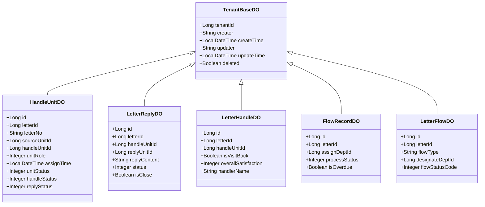

# M02 信箱管理模块 - 实体设计

## 文档信息

**产品名称：** gaxx-pro 信件处理系统
**模块名称：** M02 信箱管理模块
**文档版本：** v1.0
**创建日期：** 2026-04-13
**技术栈：** Java/Spring Boot + MyBatis Plus
**状态：** 草稿

---

## 1. 枚举类设计

### 1.1 单位角色枚举（UnitRoleEnum）

```java
package com.gaxx.mailletter.enums;

import lombok.AllArgsConstructor;
import lombok.Getter;

/**
 * 办理单位角色枚举
 * 
 * 用于定义办理单位在信件处理中的角色类型
 */
@Getter
@AllArgsConstructor
public enum UnitRoleEnum {

    /**
     * 主办单位 - 主要办理信件的单位
     */
    MAIN(0, "主办"),
    
    /**
     * 督办单位 - 监督办理进度的单位
     */
    SUPERVISE(1, "督办"),
    
    /**
     * 协办单位 - 协助办理的单位
     */
    ASSIST(2, "协办");

    /**
     * 角色编码
     */
    private final Integer code;
    
    /**
     * 角色名称
     */
    private final String name;

    /**
     * 根据编码获取枚举
     */
    public static UnitRoleEnum getByCode(Integer code) {
        if (code == null) {
            return null;
        }
        for (UnitRoleEnum value : values()) {
            if (value.getCode().equals(code)) {
                return value;
            }
        }
        return null;
    }

    /**
     * 根据编码获取名称
     */
    public static String getNameByCode(Integer code) {
        UnitRoleEnum enumValue = getByCode(code);
        return enumValue != null ? enumValue.getName() : null;
    }

    /**
     * 校验编码是否有效
     */
    public static boolean isValidCode(Integer code) {
        return getByCode(code) != null;
    }
}
```

---

### 1.2 单位状态枚举（UnitStatusEnum）

```java
package com.gaxx.mailletter.enums;

import lombok.AllArgsConstructor;
import lombok.Getter;

/**
 * 办理单位状态枚举
 * 
 * 用于定义办理单位的启用/禁用状态
 */
@Getter
@AllArgsConstructor
public enum UnitStatusEnum {

    /**
     * 启用状态
     */
    ENABLED(0, "启用"),
    
    /**
     * 禁用状态
     */
    DISABLED(1, "禁用");

    private final Integer code;
    private final String name;

    public static UnitStatusEnum getByCode(Integer code) {
        if (code == null) {
            return null;
        }
        for (UnitStatusEnum value : values()) {
            if (value.getCode().equals(code)) {
                return value;
            }
        }
        return null;
    }

    public static String getNameByCode(Integer code) {
        UnitStatusEnum enumValue = getByCode(code);
        return enumValue != null ? enumValue.getName() : null;
    }
}
```

---

### 1.3 办理状态枚举（HandleStatusEnum）

```java
package com.gaxx.mailletter.enums;

import lombok.AllArgsConstructor;
import lombok.Getter;

/**
 * 办理状态枚举
 * 
 * 用于定义办理单位的办理状态
 */
@Getter
@AllArgsConstructor
public enum HandleStatusEnum {

    /**
     * 未提交 - 办理单位尚未提交办理结果
     */
    NOT_SUBMITTED(0, "未提交"),
    
    /**
     * 已提交 - 办理单位已提交办理结果
     */
    SUBMITTED(1, "已提交"),
    
    /**
     * 已退回 - 办理结果被上级退回
     */
    RETURNED(2, "已退回");

    private final Integer code;
    private final String name;

    public static HandleStatusEnum getByCode(Integer code) {
        if (code == null) {
            return null;
        }
        for (HandleStatusEnum value : values()) {
            if (value.getCode().equals(code)) {
                return value;
            }
        }
        return null;
    }

    public static String getNameByCode(Integer code) {
        HandleStatusEnum enumValue = getByCode(code);
        return enumValue != null ? enumValue.getName() : null;
    }
}
```

---

### 1.4 回复状态枚举（ReplyStatusEnum）

```java
package com.gaxx.mailletter.enums;

import lombok.AllArgsConstructor;
import lombok.Getter;

/**
 * 回复状态枚举
 * 
 * 用于定义办理单位的回复状态和回复记录的状态
 */
@Getter
@AllArgsConstructor
public enum ReplyStatusEnum {

    /**
     * 未提交 - 尚未提交回复
     */
    NOT_SUBMITTED(0, "未提交"),
    
    /**
     * 已提交 - 已提交回复
     */
    SUBMITTED(1, "已提交"),
    
    /**
     * 已退回 - 回复被上级退回
     */
    RETURNED(2, "已退回");

    private final Integer code;
    private final String name;

    public static ReplyStatusEnum getByCode(Integer code) {
        if (code == null) {
            return null;
        }
        for (ReplyStatusEnum value : values()) {
            if (value.getCode().equals(code)) {
                return value;
            }
        }
        return null;
    }

    public static String getNameByCode(Integer code) {
        ReplyStatusEnum enumValue = getByCode(code);
        return enumValue != null ? enumValue.getName() : null;
    }
}
```

---

### 1.5 回复记录状态枚举（ReplyRecordStatusEnum）

```java
package com.gaxx.mailletter.enums;

import lombok.AllArgsConstructor;
import lombok.Getter;

/**
 * 回复记录状态枚举
 * 
 * 用于定义回复记录的详细状态流转
 */
@Getter
@AllArgsConstructor
public enum ReplyRecordStatusEnum {

    /**
     * 草稿 - 回复内容已保存但未提交
     */
    DRAFT(0, "草稿"),
    
    /**
     * 待审核 - 回复已提交，等待审核
     */
    PENDING_AUDIT(1, "待审核"),
    
    /**
     * 审核通过 - 回复审核通过
     */
    AUDIT_PASSED(2, "审核通过"),
    
    /**
     * 审核不通过 - 回复审核不通过
     */
    AUDIT_FAILED(3, "审核不通过"),
    
    /**
     * 重新修改 - 回复需要重新修改
     */
    RE_MODIFY(4, "重新修改"),
    
    /**
     * 已答复 - 回复已答复网民
     */
    REPLIED(5, "已答复");

    private final Integer code;
    private final String name;

    public static ReplyRecordStatusEnum getByCode(Integer code) {
        if (code == null) {
            return null;
        }
        for (ReplyRecordStatusEnum value : values()) {
            if (value.getCode().equals(code)) {
                return value;
            }
        }
        return null;
    }

    public static String getNameByCode(Integer code) {
        ReplyRecordStatusEnum enumValue = getByCode(code);
        return enumValue != null ? enumValue.getName() : null;
    }

    /**
     * 判断是否可以修改
     * 草稿、待审核、重新修改、审核不通过状态可以修改
     */
    public static boolean canModify(Integer code) {
        ReplyRecordStatusEnum status = getByCode(code);
        if (status == null) {
            return false;
        }
        return status == DRAFT 
            || status == PENDING_AUDIT 
            || status == RE_MODIFY 
            || status == AUDIT_FAILED;
    }

    /**
     * 判断是否为草稿状态
     */
    public static boolean isDraft(Integer code) {
        return DRAFT.getCode().equals(code);
    }

    /**
     * 判断是否已答复网民
     */
    public static boolean isReplied(Integer code) {
        return REPLIED.getCode().equals(code);
    }
}
```

---

### 1.6 流转处理状态枚举（ProcessStatusEnum）

```java
package com.gaxx.mailletter.enums;

import lombok.AllArgsConstructor;
import lombok.Getter;

/**
 * 流转处理状态枚举
 * 
 * 用于定义流转记录的处理状态
 */
@Getter
@AllArgsConstructor
public enum ProcessStatusEnum {

    /**
     * 待处理 - 等待开始处理
     */
    PENDING(0, "待处理"),
    
    /**
     * 处理中 - 正在处理
     */
    PROCESSING(1, "处理中"),
    
    /**
     * 已回复 - 已提交回复
     */
    REPLIED(2, "已回复"),
    
    /**
     * 已完结 - 处理完成
     */
    COMPLETED(3, "已完结"),
    
    /**
     * 已退回 - 已退回上级
     */
    RETURNED(4, "已退回");

    private final Integer code;
    private final String name;

    public static ProcessStatusEnum getByCode(Integer code) {
        if (code == null) {
            return null;
        }
        for (ProcessStatusEnum value : values()) {
            if (value.getCode().equals(code)) {
                return value;
            }
        }
        return null;
    }

    public static String getNameByCode(Integer code) {
        ProcessStatusEnum enumValue = getByCode(code);
        return enumValue != null ? enumValue.getName() : null;
    }
}
```

---

### 1.7 满意度枚举（SatisfactionEnum）

```java
package com.gaxx.mailletter.enums;

import lombok.AllArgsConstructor;
import lombok.Getter;

/**
 * 满意度枚举
 * 
 * 用于定义满意度评价等级
 */
@Getter
@AllArgsConstructor
public enum SatisfactionEnum {

    /**
     * 满意
     */
    SATISFIED(1, "满意"),
    
    /**
     * 基本满意
     */
    BASICALLY_SATISFIED(2, "基本满意"),
    
    /**
     * 不满意
     */
    NOT_SATISFIED(3, "不满意");

    private final Integer code;
    private final String name;

    public static SatisfactionEnum getByCode(Integer code) {
        if (code == null) {
            return null;
        }
        for (SatisfactionEnum value : values()) {
            if (value.getCode().equals(code)) {
                return value;
            }
        }
        return null;
    }

    public static String getNameByCode(Integer code) {
        SatisfactionEnum enumValue = getByCode(code);
        return enumValue != null ? enumValue.getName() : null;
    }
}
```

---

## 2. DO实体类设计

### 2.1 办理单位DO（HandleUnitDO）

```java
package com.gaxx.mailletter.module.handleunit.dal.dataobject;

import com.baomidou.mybatisplus.annotation.*;
import com.gaxx.framework.mybatis.core.dataobject.TenantBaseDO;
import lombok.Data;
import lombok.EqualsAndHashCode;

import java.time.LocalDateTime;

/**
 * 办理单位 DO
 * 
 * 记录信件的办理单位信息，包括主办、督办、协办角色
 * 继承 TenantBaseDO 包含租户隔离和审计字段
 */
@Data
@EqualsAndHashCode(callSuper = true)
@TableName("fz_handle_unit")
public class HandleUnitDO extends TenantBaseDO {

    /**
     * 主键ID
     */
    @TableId(value = "id", type = IdType.AUTO)
    private Long id;

    /**
     * 关联信件ID
     */
    private Long letterId;

    /**
     * 关联信件编号（冗余字段）
     */
    private String letterNo;

    /**
     * 指派来源单位ID
     */
    private Long sourceUnitId;

    /**
     * 指派来源单位名称（冗余字段）
     */
    private String sourceUnitName;

    /**
     * 办理单位ID
     */
    private Long handleUnitId;

    /**
     * 办理单位名称（冗余字段）
     */
    private String handleUnitName;

    /**
     * 单位角色：0-主办，1-督办，2-协办
     * {@link com.gaxx.mailletter.enums.UnitRoleEnum}
     */
    private Integer unitRole;

    /**
     * 指派时间
     */
    private LocalDateTime assignTime;

    /**
     * 单位状态：0-启用，1-禁用
     * {@link com.gaxx.mailletter.enums.UnitStatusEnum}
     */
    private Integer unitStatus;

    /**
     * 办理状态：0-未提交，1-已提交，2-已退回
     * {@link com.gaxx.mailletter.enums.HandleStatusEnum}
     */
    private Integer handleStatus;

    /**
     * 回复状态：0-未提交，1-已提交，2-已退回
     * {@link com.gaxx.mailletter.enums.ReplyStatusEnum}
     */
    private Integer replyStatus;

    /**
     * 流程状态（备用字段）
     */
    private Integer flowStatus;

    /**
     * 流程处理结果
     */
    private String flowResult;

    /**
     * 答复时间
     */
    private LocalDateTime replyTime;

    /**
     * 关联办理表ID
     */
    private Long handleTableId;

    /**
     * 关联回复表ID
     */
    private Long replyTableId;

    /**
     * 源部门最新流程ID
     */
    private Long sourceFlowId;

    /**
     * 指派部门最新流程ID
     */
    private Long assignFlowId;
}
```

---

### 2.2 信件回复DO（LetterReplyDO）

```java
package com.gaxx.mailletter.module.handleunit.dal.dataobject;

import com.baomidou.mybatisplus.annotation.*;
import com.gaxx.framework.mybatis.core.dataobject.TenantBaseDO;
import lombok.Data;
import lombok.EqualsAndHashCode;

/**
 * 信件回复 DO
 * 
 * 办理单位提交的回复内容，包含草稿和正式提交的回复
 */
@Data
@EqualsAndHashCode(callSuper = true)
@TableName("fz_letter_reply")
public class LetterReplyDO extends TenantBaseDO {

    /**
     * 主键ID
     */
    @TableId(value = "id", type = IdType.AUTO)
    private Long id;

    /**
     * 关联信件ID
     */
    private Long letterId;

    /**
     * 关联信件编号（冗余字段）
     */
    private String letterNo;

    /**
     * 关联办理单位ID
     */
    private Long handleUnitId;

    /**
     * 回复单位ID
     */
    private Long replyUnitId;

    /**
     * 回复单位名称（冗余字段）
     */
    private String replyUnitName;

    /**
     * 接收回复单位ID
     */
    private Long receiveUnitId;

    /**
     * 接收回复单位名称（冗余字段）
     */
    private String receiveUnitName;

    /**
     * 回复部门类别
     */
    private Integer replyUnitType;

    /**
     * 给网民的回复内容
     */
    private String replyContent;

    /**
     * 上级回复内容（内部说明，不对网民展示）
     */
    private String upperReplyContent;

    /**
     * 是否结案
     */
    private Boolean isClose;

    /**
     * 是否已答复网民
     */
    private Boolean isReplyPublic;

    /**
     * 是否上级采纳
     */
    private Boolean isUpperAdopted;

    /**
     * 建议信件类型
     */
    private String suggestLetterType;

    /**
     * 是否建议结案
     */
    private Boolean isSuggestClose;

    /**
     * 回复状态：0-草稿，1-待审核，2-审核通过，3-审核不通过，4-重新修改，5-已答复
     * {@link com.gaxx.mailletter.enums.ReplyRecordStatusEnum}
     */
    private Integer status;

    /**
     * 备注信息
     */
    private String remark;
}
```

---

### 2.3 信件办理DO（LetterHandleDO）

```java
package com.gaxx.mailletter.module.handleunit.dal.dataobject;

import com.baomidou.mybatisplus.annotation.*;
import com.gaxx.framework.mybatis.core.dataobject.TenantBaseDO;
import lombok.Data;
import lombok.EqualsAndHashCode;

import java.time.LocalDateTime;

/**
 * 信件办理 DO
 * 
 * 办理过程中的详细信息，包含回访信息、满意度评价、调查情况等
 */
@Data
@EqualsAndHashCode(callSuper = true)
@TableName("fz_letter_handle")
public class LetterHandleDO extends TenantBaseDO {

    /**
     * 主键ID
     */
    @TableId(value = "id", type = IdType.AUTO)
    private Long id;

    /**
     * 关联信件ID
     */
    private Long letterId;

    /**
     * 关联信件编号（冗余字段）
     */
    private String letterNo;

    /**
     * 关联办理单位ID
     */
    private Long handleUnitId;

    /**
     * 部门类型
     */
    private Integer deptType;

    /**
     * 回复部门ID
     */
    private Long replyDeptId;

    /**
     * 回复部门名称（冗余字段）
     */
    private String replyDeptName;

    // ===== 回访信息 =====

    /**
     * 是否回访
     */
    private Boolean isVisitBack;

    /**
     * 未回访原因
     */
    private String noVisitReason;

    /**
     * 回访情况说明
     */
    private String visitBackSituation;

    /**
     * 群众电话回访反映内容
     */
    private String publicPhoneReflect;

    /**
     * 是否需要再次回复
     */
    private Boolean isNeedReplyAgain;

    // ===== 满意度评价 =====

    /**
     * 诉求解决满意度
     */
    private Integer demandSolveSatisfaction;

    /**
     * 响应速度满意度
     */
    private Integer responseSpeedSatisfaction;

    /**
     * 服务态度满意度
     */
    private Integer serviceAttitudeSatisfaction;

    /**
     * 办事能力满意度
     */
    private Integer abilitySatisfaction;

    /**
     * 跟进服务满意度
     */
    private Integer followServiceSatisfaction;

    /**
     * 整体满意度
     */
    private Integer overallSatisfaction;

    // ===== 调查情况 =====

    /**
     * 说法是否一致
     */
    private Boolean isStatementConsistent;

    /**
     * 调查情况说明
     */
    private String investigateSituation;

    /**
     * 无法开展调查原因
     */
    private String noInvestigateReason;

    /**
     * 无法调查选项
     */
    private String noInvestigateOption;

    /**
     * 不具备解决条件原因
     */
    private String noSolveConditionReason;

    /**
     * 不具备解决条件选项
     */
    private String noSolveConditionOption;

    /**
     * 未解决类型
     */
    private String unsolvedType;

    /**
     * 解决情况说明
     */
    private String solveSituation;

    /**
     * 查实情况说明
     */
    private String verifySituation;

    /**
     * 无法查实原因
     */
    private String noVerifyReason;

    /**
     * 无法查实选项
     */
    private String noVerifyOption;

    /**
     * 不合理诉求原因
     */
    private String unreasonableDemandReason;

    /**
     * 不合理诉求选项
     */
    private String unreasonableDemandOption;

    /**
     * 核查办理情况
     */
    private String checkHandleSituation;

    // ===== 审核信息 =====

    /**
     * 是否审核
     */
    private Boolean isAudit;

    /**
     * 审核意见
     */
    private String auditOpinion;

    /**
     * 审核人姓名
     */
    private String auditorName;

    /**
     * 审核人身份证号
     */
    private String auditorIdCard;

    /**
     * 未审核原因
     */
    private String noAuditReason;

    // ===== 接访信息 =====

    /**
     * 是否接访
     */
    private Boolean isInterview;

    /**
     * 接访方式
     */
    private String interviewWay;

    /**
     * 接访领导
     */
    private String interviewLeader;

    /**
     * 接访时间
     */
    private LocalDateTime interviewTime;

    /**
     * 未接访原因
     */
    private String noInterviewReason;

    /**
     * 来访人员标签
     */
    private String visitorTag;

    // ===== 办理人信息 =====

    /**
     * 主办民警姓名
     */
    private String handlerName;

    /**
     * 主办民警身份证号
     */
    private String handlerIdCard;

    /**
     * 主办民警所在单位ID
     */
    private Long handlerUnitId;

    /**
     * 主办民警所在单位名称
     */
    private String handlerUnitName;

    // ===== 批示意见 =====

    /**
     * 主办单位批示意见
     */
    private String mainUnitOpinion;

    /**
     * 区县分局批示意见
     */
    private String districtBureauOpinion;

    /**
     * 市局/厅直批示意见
     */
    private String cityBureauOpinion;

    /**
     * 厅领导批示意见
     */
    private String hallLeaderOpinion;

    // ===== 其他信息 =====

    /**
     * 办理原因
     */
    private String handleReason;

    /**
     * 群众反映原因
     */
    private String publicReflectReason;

    /**
     * 回复内容
     */
    private String replyContent;

    /**
     * 原因说明
     */
    private String reason;

    /**
     * 备注信息
     */
    private String remark;
}
```

---

### 2.4 流转记录DO（FlowRecordDO）

```java
package com.gaxx.mailletter.module.handleunit.dal.dataobject;

import com.baomidou.mybatisplus.annotation.*;
import com.gaxx.framework.mybatis.core.dataobject.TenantBaseDO;
import lombok.Data;
import lombok.EqualsAndHashCode;

import java.time.LocalDateTime;

/**
 * 流转记录 DO
 * 
 * 信件流转处理的流程记录，记录各环节的操作信息
 */
@Data
@EqualsAndHashCode(callSuper = true)
@TableName("fz_flow_record")
public class FlowRecordDO extends TenantBaseDO {

    /**
     * 主键ID
     */
    @TableId(value = "id", type = IdType.AUTO)
    private Long id;

    /**
     * 关联信件ID
     */
    private Long letterId;

    /**
     * 关联信件编号（冗余字段）
     */
    private String letterNo;

    /**
     * 处理类型：投诉/建议/咨询/求助/举报等
     */
    private String handleType;

    /**
     * 指派处理部门ID
     */
    private Long assignDeptId;

    /**
     * 指派处理部门名称（冗余字段）
     */
    private String assignDeptName;

    /**
     * 指派处理人员ID
     */
    private Long assignUserId;

    /**
     * 指派处理人员姓名（冗余字段）
     */
    private String assignUserName;

    /**
     * 源指派部门ID
     */
    private Long sourceAssignDeptId;

    /**
     * 源指派部门名称（冗余字段）
     */
    private String sourceAssignDeptName;

    /**
     * 父流程记录ID（支持嵌套）
     */
    private Long parentFlowId;

    /**
     * 部门类型
     */
    private Integer deptType;

    /**
     * 处理状态：0-待处理，1-处理中，2-已回复，3-已完结，4-已退回
     * {@link com.gaxx.mailletter.enums.ProcessStatusEnum}
     */
    private Integer processStatus;

    /**
     * 处理内容/过程记录
     */
    private String processContent;

    /**
     * 处理结果
     */
    private String processResult;

    // ===== 时限信息 =====

    /**
     * 要求回复截止时间
     */
    private LocalDateTime requireReplyTime;

    /**
     * 实际回复时间
     */
    private LocalDateTime actualReplyTime;

    /**
     * 是否超期
     */
    private Boolean isOverdue;

    /**
     * 耐期天数
     */
    private Integer overdueDays;

    // ===== 延期信息 =====

    /**
     * 延期次数
     */
    private Integer delayCount;

    /**
     * 延期原因说明
     */
    private String delayReason;

    /**
     * 最后延期时间
     */
    private LocalDateTime lastDelayTime;

    // ===== 催办信息 =====

    /**
     * 催办次数
     */
    private Integer urgeCount;

    /**
     * 最后催办时间
     */
    private LocalDateTime lastUrgeTime;

    // ===== 评价信息 =====

    /**
     * 质量评分（1-5分）
     */
    private Integer qualityScore;

    /**
     * 质量评价意见
     */
    private String qualityOpinion;

    /**
     * 市民反馈意见
     */
    private String publicFeedbackOpinion;

    /**
     * 市民满意度
     */
    private Integer publicSatisfaction;
}
```

---

### 2.5 信件流程DO（LetterFlowDO）

```java
package com.gaxx.mailletter.module.handleunit.dal.dataobject;

import com.baomidou.mybatisplus.annotation.*;
import com.gaxx.framework.mybatis.core.dataobject.TenantBaseDO;
import lombok.Data;
import lombok.EqualsAndHashCode;

import java.time.LocalDateTime;

/**
 * 信件流程 DO
 * 
 * 信件处理流程节点记录，记录每个处理环节的详细信息
 */
@Data
@EqualsAndHashCode(callSuper = true)
@TableName("fz_letter_flow")
public class LetterFlowDO extends TenantBaseDO {

    /**
     * 主键ID
     */
    @TableId(value = "id", type = IdType.AUTO)
    private Long id;

    /**
     * 关联信件ID
     */
    private Long letterId;

    /**
     * 关联信件编号（冗余字段）
     */
    private String letterNo;

    /**
     * 流程类型
     */
    private String flowType;

    /**
     * 指定流程部门ID
     */
    private Long designateDeptId;

    /**
     * 指定流程部门名称（冗余字段）
     */
    private String designateDeptName;

    /**
     * 负责流程部门ID
     */
    private Long responsibleDeptId;

    /**
     * 负责流程部门名称（冗余字段）
     */
    private String responsibleDeptName;

    /**
     * 操作部门ID（创建流程的部门）
     */
    private Long operatorDeptId;

    /**
     * 操作部门名称（冗余字段）
     */
    private String operatorDeptName;

    /**
     * 流程状态码
     */
    private Integer flowStatusCode;

    /**
     * 源部门流程状态码（备用）
     */
    private Integer sourceDeptFlowStatus;

    /**
     * 负责部门流程状态码（备用）
     */
    private Integer responsibleDeptFlowStatus;

    /**
     * 处理单位类型
     */
    private Integer handleUnitType;

    /**
     * 指定处理时间
     */
    private LocalDateTime designateTime;

    /**
     * 实际处理时间
     */
    private LocalDateTime actualHandleTime;

    /**
     * 处理内容
     */
    private String handleContent;

    /**
     * 处理结果
     */
    private String handleResult;

    /**
     * 父流程ID（备用）
     */
    private Long parentFlowId;

    /**
     * 备注信息
     */
    private String remark;
}
```

---

## 3. VO类设计

### 3.1 办理单位VO

#### 3.1.1 创建请求VO（HandleUnitSaveReqVO）

```java
package com.gaxx.mailletter.module.handleunit.controller.vo;

import io.swagger.v3.oas.annotations.media.Schema;
import lombok.Data;

import javax.validation.constraints.NotNull;

/**
 * 办理单位创建请求 VO
 */
@Data
@Schema(description = "办理单位创建请求 VO")
public class HandleUnitSaveReqVO {

    @Schema(description = "关联信件ID", requiredMode = Schema.RequiredMode.REQUIRED)
    @NotNull(message = "信件ID不能为空")
    private Long letterId;

    @Schema(description = "关联信件编号", requiredMode = Schema.RequiredMode.REQUIRED)
    @NotNull(message = "信件编号不能为空")
    private String letterNo;

    @Schema(description = "指派来源单位ID", requiredMode = Schema.RequiredMode.REQUIRED)
    @NotNull(message = "指派来源单位不能为空")
    private Long sourceUnitId;

    @Schema(description = "办理单位ID", requiredMode = Schema.RequiredMode.REQUIRED)
    @NotNull(message = "办理单位不能为空")
    private Long handleUnitId;

    @Schema(description = "单位角色：0-主办，1-督办，2-协办", requiredMode = Schema.RequiredMode.REQUIRED)
    @NotNull(message = "单位角色不能为空")
    private Integer unitRole;
}
```

#### 3.1.2 更新请求VO（HandleUnitUpdateReqVO）

```java
package com.gaxx.mailletter.module.handleunit.controller.vo;

import io.swagger.v3.oas.annotations.media.Schema;
import lombok.Data;

import javax.validation.constraints.NotNull;

/**
 * 办理单位更新请求 VO
 */
@Data
@Schema(description = "办理单位更新请求 VO")
public class HandleUnitUpdateReqVO {

    @Schema(description = "办理单位记录ID", requiredMode = Schema.RequiredMode.REQUIRED)
    @NotNull(message = "办理单位ID不能为空")
    private Long id;

    @Schema(description = "单位角色：0-主办，1-督办，2-协办")
    private Integer unitRole;

    @Schema(description = "单位状态：0-启用，1-禁用")
    private Integer unitStatus;

    @Schema(description = "流程状态")
    private Integer flowStatus;

    @Schema(description = "流程处理结果")
    private String flowResult;
}
```

#### 3.1.3 分页查询请求VO（HandleUnitPageReqVO）

```java
package com.gaxx.mailletter.module.handleunit.controller.vo;

import com.gaxx.framework.common.pojo.PageParam;
import io.swagger.v3.oas.annotations.media.Schema;
import lombok.Data;
import lombok.EqualsAndHashCode;

import java.time.LocalDateTime;

/**
 * 办理单位分页查询请求 VO
 */
@Data
@EqualsAndHashCode(callSuper = true)
@Schema(description = "办理单位分页查询请求 VO")
public class HandleUnitPageReqVO extends PageParam {

    @Schema(description = "信件ID")
    private Long letterId;

    @Schema(description = "信件编号")
    private String letterNo;

    @Schema(description = "办理单位ID")
    private Long handleUnitId;

    @Schema(description = "单位角色：0-主办，1-督办，2-协办")
    private Integer unitRole;

    @Schema(description = "单位状态：0-启用，1-禁用")
    private Integer unitStatus;

    @Schema(description = "办理状态：0-未提交，1-已提交，2-已退回")
    private Integer handleStatus;

    @Schema(description = "回复状态：0-未提交，1-已提交，2-已退回")
    private Integer replyStatus;

    @Schema(description = "指派时间开始范围")
    private LocalDateTime assignTimeBegin;

    @Schema(description = "指派时间结束范围")
    private LocalDateTime assignTimeEnd;
}
```

#### 3.1.4 响应VO（HandleUnitRespVO）

```java
package com.gaxx.mailletter.module.handleunit.controller.vo;

import io.swagger.v3.oas.annotations.media.Schema;
import lombok.Data;

import java.time.LocalDateTime;

/**
 * 办理单位响应 VO
 */
@Data
@Schema(description = "办理单位响应 VO")
public class HandleUnitRespVO {

    @Schema(description = "主键ID")
    private Long id;

    @Schema(description = "关联信件ID")
    private Long letterId;

    @Schema(description = "关联信件编号")
    private String letterNo;

    @Schema(description = "指派来源单位ID")
    private Long sourceUnitId;

    @Schema(description = "指派来源单位名称")
    private String sourceUnitName;

    @Schema(description = "办理单位ID")
    private Long handleUnitId;

    @Schema(description = "办理单位名称")
    private String handleUnitName;

    @Schema(description = "单位角色编码")
    private Integer unitRole;

    @Schema(description = "单位角色名称")
    private String unitRoleName;

    @Schema(description = "指派时间")
    private LocalDateTime assignTime;

    @Schema(description = "单位状态编码")
    private Integer unitStatus;

    @Schema(description = "单位状态名称")
    private String unitStatusName;

    @Schema(description = "办理状态编码")
    private Integer handleStatus;

    @Schema(description = "办理状态名称")
    private String handleStatusName;

    @Schema(description = "回复状态编码")
    private Integer replyStatus;

    @Schema(description = "回复状态名称")
    private String replyStatusName;

    @Schema(description = "流程状态")
    private Integer flowStatus;

    @Schema(description = "流程处理结果")
    private String flowResult;

    @Schema(description = "答复时间")
    private LocalDateTime replyTime;

    @Schema(description = "关联办理表ID")
    private Long handleTableId;

    @Schema(description = "关联回复表ID")
    private Long replyTableId;

    @Schema(description = "创建时间")
    private LocalDateTime createTime;

    @Schema(description = "更新时间")
    private LocalDateTime updateTime;

    // ===== 关联信息 =====

    @Schema(description = "关联的回复信息")
    private LetterReplyRespVO replyInfo;

    @Schema(description = "关联的办理表信息")
    private LetterHandleRespVO handleInfo;
}
```

---

### 3.2 信件回复VO

#### 3.2.1 创建请求VO（LetterReplySaveReqVO）

```java
package com.gaxx.mailletter.module.handleunit.controller.vo;

import io.swagger.v3.oas.annotations.media.Schema;
import lombok.Data;

import javax.validation.constraints.NotBlank;
import javax.validation.constraints.NotNull;
import javax.validation.constraints.Size;

/**
 * 信件回复创建请求 VO
 */
@Data
@Schema(description = "信件回复创建请求 VO")
public class LetterReplySaveReqVO {

    @Schema(description = "关联信件ID", requiredMode = Schema.RequiredMode.REQUIRED)
    @NotNull(message = "信件ID不能为空")
    private Long letterId;

    @Schema(description = "关联信件编号", requiredMode = Schema.RequiredMode.REQUIRED)
    @NotBlank(message = "信件编号不能为空")
    private String letterNo;

    @Schema(description = "关联办理单位ID", requiredMode = Schema.RequiredMode.REQUIRED)
    @NotNull(message = "办理单位不能为空")
    private Long handleUnitId;

    @Schema(description = "回复单位ID", requiredMode = Schema.RequiredMode.REQUIRED)
    @NotNull(message = "回复单位不能为空")
    private Long replyUnitId;

    @Schema(description = "接收回复单位ID")
    private Long receiveUnitId;

    @Schema(description = "给网民的回复内容", requiredMode = Schema.RequiredMode.REQUIRED)
    @NotBlank(message = "回复内容不能为空")
    @Size(max = 5000, message = "回复内容最长5000字符")
    private String replyContent;

    @Schema(description = "上级回复内容（内部说明）")
    @Size(max = 5000, message = "上级回复内容最长5000字符")
    private String upperReplyContent;

    @Schema(description = "是否结案", requiredMode = Schema.RequiredMode.REQUIRED)
    @NotNull(message = "是否结案不能为空")
    private Boolean isClose;

    @Schema(description = "建议信件类型")
    private String suggestLetterType;

    @Schema(description = "是否建议结案")
    private Boolean isSuggestClose;

    @Schema(description = "备注信息")
    @Size(max = 500, message = "备注最长500字符")
    private String remark;
}
```

#### 3.2.2 草稿保存请求VO（LetterReplyDraftReqVO）

```java
package com.gaxx.mailletter.module.handleunit.controller.vo;

import io.swagger.v3.oas.annotations.media.Schema;
import lombok.Data;

import javax.validation.constraints.NotNull;
import javax.validation.constraints.Size;

/**
 * 信件回复草稿保存请求 VO
 */
@Data
@Schema(description = "信件回复草稿保存请求 VO")
public class LetterReplyDraftReqVO {

    @Schema(description = "关联信件ID", requiredMode = Schema.RequiredMode.REQUIRED)
    @NotNull(message = "信件ID不能为空")
    private Long letterId;

    @Schema(description = "关联信件编号", requiredMode = Schema.RequiredMode.REQUIRED)
    @NotNull(message = "信件编号不能为空")
    private String letterNo;

    @Schema(description = "关联办理单位ID", requiredMode = Schema.RequiredMode.REQUIRED)
    @NotNull(message = "办理单位不能为空")
    private Long handleUnitId;

    @Schema(description = "回复单位ID", requiredMode = Schema.RequiredMode.REQUIRED)
    @NotNull(message = "回复单位不能为空")
    private Long replyUnitId;

    @Schema(description = "给网民的回复内容")
    @Size(max = 5000, message = "回复内容最长5000字符")
    private String replyContent;

    @Schema(description = "上级回复内容（内部说明）")
    @Size(max = 5000, message = "上级回复内容最长5000字符")
    private String upperReplyContent;

    @Schema(description = "是否结案")
    private Boolean isClose;

    @Schema(description = "建议信件类型")
    private String suggestLetterType;

    @Schema(description = "是否建议结案")
    private Boolean isSuggestClose;

    @Schema(description = "备注信息")
    @Size(max = 500, message = "备注最长500字符")
    private String remark;
}
```

#### 3.2.3 更新请求VO（LetterReplyUpdateReqVO）

```java
package com.gaxx.mailletter.module.handleunit.controller.vo;

import io.swagger.v3.oas.annotations.media.Schema;
import lombok.Data;

import javax.validation.constraints.NotBlank;
import javax.validation.constraints.NotNull;
import javax.validation.constraints.Size;

/**
 * 信件回复更新请求 VO
 */
@Data
@Schema(description = "信件回复更新请求 VO")
public class LetterReplyUpdateReqVO {

    @Schema(description = "回复记录ID", requiredMode = Schema.RequiredMode.REQUIRED)
    @NotNull(message = "回复ID不能为空")
    private Long id;

    @Schema(description = "给网民的回复内容", requiredMode = Schema.RequiredMode.REQUIRED)
    @NotBlank(message = "回复内容不能为空")
    @Size(max = 5000, message = "回复内容最长5000字符")
    private String replyContent;

    @Schema(description = "上级回复内容（内部说明）")
    @Size(max = 5000, message = "上级回复内容最长5000字符")
    private String upperReplyContent;

    @Schema(description = "是否结案")
    private Boolean isClose;

    @Schema(description = "建议信件类型")
    private String suggestLetterType;

    @Schema(description = "是否建议结案")
    private Boolean isSuggestClose;

    @Schema(description = "备注信息")
    @Size(max = 500, message = "备注最长500字符")
    private String remark;
}
```

#### 3.2.4 响应VO（LetterReplyRespVO）

```java
package com.gaxx.mailletter.module.handleunit.controller.vo;

import io.swagger.v3.oas.annotations.media.Schema;
import lombok.Data;

import java.time.LocalDateTime;

/**
 * 信件回复响应 VO
 */
@Data
@Schema(description = "信件回复响应 VO")
public class LetterReplyRespVO {

    @Schema(description = "主键ID")
    private Long id;

    @Schema(description = "关联信件ID")
    private Long letterId;

    @Schema(description = "关联信件编号")
    private String letterNo;

    @Schema(description = "关联办理单位ID")
    private Long handleUnitId;

    @Schema(description = "回复单位ID")
    private Long replyUnitId;

    @Schema(description = "回复单位名称")
    private String replyUnitName;

    @Schema(description = "接收回复单位ID")
    private Long receiveUnitId;

    @Schema(description = "接收回复单位名称")
    private String receiveUnitName;

    @Schema(description = "给网民的回复内容")
    private String replyContent;

    @Schema(description = "上级回复内容")
    private String upperReplyContent;

    @Schema(description = "是否结案")
    private Boolean isClose;

    @Schema(description = "是否已答复网民")
    private Boolean isReplyPublic;

    @Schema(description = "是否上级采纳")
    private Boolean isUpperAdopted;

    @Schema(description = "建议信件类型")
    private String suggestLetterType;

    @Schema(description = "是否建议结案")
    private Boolean isSuggestClose;

    @Schema(description = "回复状态编码")
    private Integer status;

    @Schema(description = "回复状态名称")
    private String statusName;

    @Schema(description = "备注信息")
    private String remark;

    @Schema(description = "创建时间")
    private LocalDateTime createTime;

    @Schema(description = "更新时间")
    private LocalDateTime updateTime;
}
```

---

### 3.3 信件办理VO

#### 3.3.1 创建/更新请求VO（LetterHandleSaveReqVO）

```java
package com.gaxx.mailletter.module.handleunit.controller.vo;

import io.swagger.v3.oas.annotations.media.Schema;
import lombok.Data;

import javax.validation.constraints.NotNull;

/**
 * 信件办理创建/更新请求 VO
 */
@Data
@Schema(description = "信件办理创建/更新请求 VO")
public class LetterHandleSaveReqVO {

    @Schema(description = "办理记录ID（更新时必填）")
    private Long id;

    @Schema(description = "关联信件ID", requiredMode = Schema.RequiredMode.REQUIRED)
    @NotNull(message = "信件ID不能为空")
    private Long letterId;

    @Schema(description = "关联信件编号", requiredMode = Schema.RequiredMode.REQUIRED)
    @NotNull(message = "信件编号不能为空")
    private String letterNo;

    @Schema(description = "关联办理单位ID")
    private Long handleUnitId;

    // ===== 回访信息 =====

    @Schema(description = "是否回访")
    private Boolean isVisitBack;

    @Schema(description = "未回访原因")
    private String noVisitReason;

    @Schema(description = "回访情况说明")
    private String visitBackSituation;

    @Schema(description = "群众电话回访反映")
    private String publicPhoneReflect;

    @Schema(description = "是否需要再次回复")
    private Boolean isNeedReplyAgain;

    // ===== 满意度评价 =====

    @Schema(description = "诉求解决满意度")
    private Integer demandSolveSatisfaction;

    @Schema(description = "响应速度满意度")
    private Integer responseSpeedSatisfaction;

    @Schema(description = "服务态度满意度")
    private Integer serviceAttitudeSatisfaction;

    @Schema(description = "办事能力满意度")
    private Integer abilitySatisfaction;

    @Schema(description = "跟进服务满意度")
    private Integer followServiceSatisfaction;

    @Schema(description = "整体满意度")
    private Integer overallSatisfaction;

    // ===== 调查情况 =====

    @Schema(description = "说法是否一致")
    private Boolean isStatementConsistent;

    @Schema(description = "调查情况说明")
    private String investigateSituation;

    @Schema(description = "无法开展调查原因")
    private String noInvestigateReason;

    @Schema(description = "解决情况说明")
    private String solveSituation;

    @Schema(description = "查实情况说明")
    private String verifySituation;

    // ===== 办理人信息 =====

    @Schema(description = "主办民警姓名")
    private String handlerName;

    @Schema(description = "主办民警身份证号")
    private String handlerIdCard;

    @Schema(description = "主办民警所在单位ID")
    private Long handlerUnitId;

    // ===== 审核信息 =====

    @Schema(description = "是否审核")
    private Boolean isAudit;

    @Schema(description = "审核意见")
    private String auditOpinion;

    @Schema(description = "审核人姓名")
    private String auditorName;

    // ===== 接访信息 =====

    @Schema(description = "是否接访")
    private Boolean isInterview;

    @Schema(description = "接访方式")
    private String interviewWay;

    @Schema(description = "接访领导")
    private String interviewLeader;

    // ===== 备注信息 =====

    @Schema(description = "备注信息")
    private String remark;
}
```

#### 3.3.2 响应VO（LetterHandleRespVO）

```java
package com.gaxx.mailletter.module.handleunit.controller.vo;

import io.swagger.v3.oas.annotations.media.Schema;
import lombok.Data;

import java.time.LocalDateTime;

/**
 * 信件办理响应 VO
 */
@Data
@Schema(description = "信件办理响应 VO")
public class LetterHandleRespVO {

    @Schema(description = "主键ID")
    private Long id;

    @Schema(description = "关联信件ID")
    private Long letterId;

    @Schema(description = "关联信件编号")
    private String letterNo;

    @Schema(description = "关联办理单位ID")
    private Long handleUnitId;

    // ===== 回访信息 =====

    @Schema(description = "是否回访")
    private Boolean isVisitBack;

    @Schema(description = "回访情况说明")
    private String visitBackSituation;

    @Schema(description = "是否需要再次回复")
    private Boolean isNeedReplyAgain;

    // ===== 满意度评价 =====

    @Schema(description = "整体满意度编码")
    private Integer overallSatisfaction;

    @Schema(description = "整体满意度名称")
    private String overallSatisfactionName;

    // ===== 调查情况 =====

    @Schema(description = "说法是否一致")
    private Boolean isStatementConsistent;

    @Schema(description = "调查情况说明")
    private String investigateSituation;

    // ===== 审核信息 =====

    @Schema(description = "是否审核")
    private Boolean isAudit;

    @Schema(description = "审核人姓名")
    private String auditorName;

    @Schema(description = "审核意见")
    private String auditOpinion;

    // ===== 接访信息 =====

    @Schema(description = "是否接访")
    private Boolean isInterview;

    @Schema(description = "接访方式")
    private String interviewWay;

    @Schema(description = "接访领导")
    private String interviewLeader;

    @Schema(description = "接访时间")
    private LocalDateTime interviewTime;

    // ===== 办理人信息 =====

    @Schema(description = "主办民警姓名")
    private String handlerName;

    @Schema(description = "主办民警身份证号（脱敏）")
    private String handlerIdCard;

    @Schema(description = "主办民警所在单位名称")
    private String handlerUnitName;

    // ===== 时间信息 =====

    @Schema(description = "创建时间")
    private LocalDateTime createTime;

    @Schema(description = "更新时间")
    private LocalDateTime updateTime;
}
```

---

## 4. 实体类继承关系



---

## 5. VO转换说明

### 5.1 DO转VO工具方法

建议在VO类中添加转换方法，或使用MapStruct进行转换：

```java
/**
 * 建议使用MapStruct进行DO-VO转换
 */
@Mapper
public interface HandleUnitConvert {
    
    HandleUnitConvert INSTANCE = Mappers.getMapper(HandleUnitConvert.class);
    
    HandleUnitRespVO convert(HandleUnitDO bean);
    
    List<HandleUnitRespVO> convertList(List<HandleUnitDO> list);
    
    HandleUnitDO convert(HandleUnitSaveReqVO bean);
    
    HandleUnitDO convert(HandleUnitUpdateReqVO bean);
    
    /**
     * 转换时填充枚举名称
     */
    @AfterMapping
    default void fillEnumName(HandleUnitDO source, @MappingTarget HandleUnitRespVO target) {
        target.setUnitRoleName(UnitRoleEnum.getNameByCode(source.getUnitRole()));
        target.setUnitStatusName(UnitStatusEnum.getNameByCode(source.getUnitStatus()));
        target.setHandleStatusName(HandleStatusEnum.getNameByCode(source.getHandleStatus()));
        target.setReplyStatusName(ReplyStatusEnum.getNameByCode(source.getReplyStatus()));
    }
}
```

---

## 变更历史

| 版本 | 日期 | 变更内容 | 变更人 |
|-----|------|---------|--------|
| v1.0 | 2026-04-13 | 初始版本，完成M02信箱管理模块实体设计 | 后端架构设计师 |