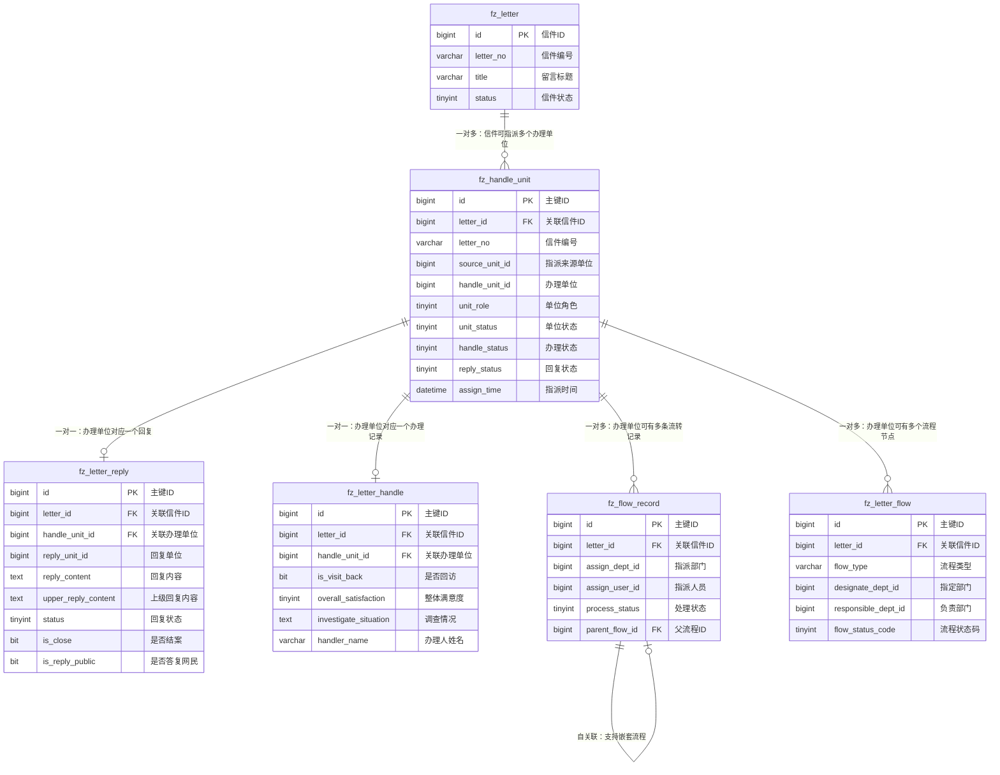

# M02 信箱管理模块 - 数据库设计

## 文档信息

**产品名称：** gaxx-pro 信件处理系统
**模块名称：** M02 信箱管理模块
**文档版本：** v1.0
**创建日期：** 2026-04-13
**技术栈：** Java/Spring Boot + MyBatis Plus + MySQL 8.0
**状态：** 草稿

---

## 1. 表结构设计

### 1.1 办理单位表（fz_handle_unit）

**表名：** `fz_handle_unit`
**表说明：** 记录信件的办理单位信息，包括主办、督办、协办角色。

```sql
CREATE TABLE `fz_handle_unit` (
    `id` BIGINT NOT NULL AUTO_INCREMENT COMMENT '主键ID',
    `letter_id` BIGINT NOT NULL COMMENT '关联信件ID（fz_letter.id）',
    `letter_no` VARCHAR(32) NOT NULL COMMENT '关联信件编号（冗余字段，便于查询）',
    `source_unit_id` BIGINT NOT NULL COMMENT '指派来源单位ID（发起指派的单位）',
    `source_unit_name` VARCHAR(100) NOT NULL COMMENT '指派来源单位名称（冗余字段）',
    `handle_unit_id` BIGINT NOT NULL COMMENT '办理单位ID（被指派的单位）',
    `handle_unit_name` VARCHAR(100) NOT NULL COMMENT '办理单位名称（冗余字段）',
    `unit_role` TINYINT NOT NULL DEFAULT 0 COMMENT '单位角色：0-主办，1-督办，2-协办',
    `assign_time` DATETIME NOT NULL COMMENT '指派时间',
    `unit_status` TINYINT NOT NULL DEFAULT 0 COMMENT '单位状态：0-启用，1-禁用',
    `handle_status` TINYINT NOT NULL DEFAULT 0 COMMENT '办理状态：0-未提交，1-已提交，2-已退回',
    `reply_status` TINYINT NOT NULL DEFAULT 0 COMMENT '回复状态：0-未提交，1-已提交，2-已退回',
    `flow_status` TINYINT DEFAULT NULL COMMENT '流程状态（备用字段）',
    `flow_result` VARCHAR(500) DEFAULT NULL COMMENT '流程处理结果',
    `reply_time` DATETIME DEFAULT NULL COMMENT '答复时间',
    `handle_table_id` BIGINT DEFAULT NULL COMMENT '关联办理表ID（fz_letter_handle.id）',
    `reply_table_id` BIGINT DEFAULT NULL COMMENT '关联回复表ID（fz_letter_reply.id）',
    `source_flow_id` BIGINT DEFAULT NULL COMMENT '源部门最新流程ID',
    `assign_flow_id` BIGINT DEFAULT NULL COMMENT '指派部门最新流程ID',
    
    -- 租户与审计字段（继承TenantBaseDO）
    `tenant_id` BIGINT NOT NULL DEFAULT 0 COMMENT '租户ID',
    `creator` VARCHAR(64) DEFAULT NULL COMMENT '创建者',
    `create_time` DATETIME NOT NULL DEFAULT CURRENT_TIMESTAMP COMMENT '创建时间',
    `updater` VARCHAR(64) DEFAULT NULL COMMENT '更新者',
    `update_time` DATETIME NOT NULL DEFAULT CURRENT_TIMESTAMP ON UPDATE CURRENT_TIMESTAMP COMMENT '更新时间',
    `deleted` BIT(1) NOT NULL DEFAULT 0 COMMENT '是否删除：0-未删除，1-已删除（软删除）',
    
    PRIMARY KEY (`id`),
    UNIQUE KEY `uk_letter_unit` (`letter_id`, `handle_unit_id`, `deleted`) COMMENT '同一信件同一部门唯一性约束',
    KEY `idx_letter_id` (`letter_id`) COMMENT '信件ID索引',
    KEY `idx_letter_no` (`letter_no`) COMMENT '信件编号索引',
    KEY `idx_handle_unit_id` (`handle_unit_id`) COMMENT '办理单位ID索引',
    KEY `idx_unit_role` (`unit_role`) COMMENT '单位角色索引',
    KEY `idx_handle_status` (`handle_status`) COMMENT '办理状态索引',
    KEY `idx_assign_time` (`assign_time`) COMMENT '指派时间索引',
    KEY `idx_tenant_id` (`tenant_id`) COMMENT '租户ID索引'
) ENGINE=InnoDB DEFAULT CHARSET=utf8mb4 COLLATE=utf8mb4_unicode_ci COMMENT='办理单位表';
```

---

### 1.2 信件回复表（fz_letter_reply）

**表名：** `fz_letter_reply`
**表说明：** 办理单位提交的回复内容，包含草稿和正式提交的回复。

```sql
CREATE TABLE `fz_letter_reply` (
    `id` BIGINT NOT NULL AUTO_INCREMENT COMMENT '主键ID',
    `letter_id` BIGINT NOT NULL COMMENT '关联信件ID（fz_letter.id）',
    `letter_no` VARCHAR(32) NOT NULL COMMENT '关联信件编号（冗余字段）',
    `handle_unit_id` BIGINT DEFAULT NULL COMMENT '关联办理单位ID（fz_handle_unit.id）',
    `reply_unit_id` BIGINT NOT NULL COMMENT '回复单位ID',
    `reply_unit_name` VARCHAR(100) NOT NULL COMMENT '回复单位名称（冗余字段）',
    `receive_unit_id` BIGINT DEFAULT NULL COMMENT '接收回复单位ID',
    `receive_unit_name` VARCHAR(100) DEFAULT NULL COMMENT '接收回复单位名称（冗余字段）',
    `reply_unit_type` TINYINT DEFAULT NULL COMMENT '回复部门类别',
    `reply_content` TEXT NOT NULL COMMENT '给网民的回复内容',
    `upper_reply_content` TEXT DEFAULT NULL COMMENT '上级回复内容（内部说明，不对网民展示）',
    `is_close` BIT(1) NOT NULL DEFAULT 0 COMMENT '是否结案：0-否，1-是',
    `is_reply_public` BIT(1) NOT NULL DEFAULT 0 COMMENT '是否答复网民：0-否，1-是',
    `is_upper_adopted` BIT(1) NOT NULL DEFAULT 0 COMMENT '是否上级采纳：0-否，1-是',
    `suggest_letter_type` VARCHAR(50) DEFAULT NULL COMMENT '建议信件类型',
    `is_suggest_close` BIT(1) NOT NULL DEFAULT 0 COMMENT '是否建议结案：0-否，1-是',
    `status` TINYINT NOT NULL DEFAULT 0 COMMENT '回复状态：0-草稿，1-待审核，2-审核通过，3-审核不通过，4-重新修改，5-已答复',
    `remark` VARCHAR(500) DEFAULT NULL COMMENT '备注信息',
    
    -- 租户与审计字段
    `tenant_id` BIGINT NOT NULL DEFAULT 0 COMMENT '租户ID',
    `creator` VARCHAR(64) DEFAULT NULL COMMENT '创建者',
    `create_time` DATETIME NOT NULL DEFAULT CURRENT_TIMESTAMP COMMENT '创建时间',
    `updater` VARCHAR(64) DEFAULT NULL COMMENT '更新者',
    `update_time` DATETIME NOT NULL DEFAULT CURRENT_TIMESTAMP ON UPDATE CURRENT_TIMESTAMP COMMENT '更新时间',
    `deleted` BIT(1) NOT NULL DEFAULT 0 COMMENT '是否删除',
    
    PRIMARY KEY (`id`),
    KEY `idx_letter_id` (`letter_id`) COMMENT '信件ID索引',
    KEY `idx_letter_no` (`letter_no`) COMMENT '信件编号索引',
    KEY `idx_handle_unit_id` (`handle_unit_id`) COMMENT '办理单位ID索引',
    KEY `idx_reply_unit_id` (`reply_unit_id`) COMMENT '回复单位ID索引',
    KEY `idx_status` (`status`) COMMENT '回复状态索引',
    KEY `idx_tenant_id` (`tenant_id`) COMMENT '租户ID索引'
) ENGINE=InnoDB DEFAULT CHARSET=utf8mb4 COLLATE=utf8mb4_unicode_ci COMMENT='信件回复表';
```

---

### 1.3 信件办理表（fz_letter_handle）

**表名：** `fz_letter_handle`
**表说明：** 办理过程中的详细信息，包含回访信息、满意度评价、调查情况等。

```sql
CREATE TABLE `fz_letter_handle` (
    `id` BIGINT NOT NULL AUTO_INCREMENT COMMENT '主键ID',
    `letter_id` BIGINT NOT NULL COMMENT '关联信件ID',
    `letter_no` VARCHAR(32) NOT NULL COMMENT '关联信件编号（冗余字段）',
    `handle_unit_id` BIGINT DEFAULT NULL COMMENT '关联办理单位ID',
    `dept_type` TINYINT DEFAULT NULL COMMENT '部门类型',
    `reply_dept_id` BIGINT DEFAULT NULL COMMENT '回复部门ID',
    `reply_dept_name` VARCHAR(100) DEFAULT NULL COMMENT '回复部门名称（冗余字段）',
    
    -- 回访信息
    `is_visit_back` BIT(1) NOT NULL DEFAULT 0 COMMENT '是否回访：0-否，1-是',
    `no_visit_reason` VARCHAR(500) DEFAULT NULL COMMENT '未回访原因',
    `visit_back_situation` TEXT DEFAULT NULL COMMENT '回访情况说明',
    `public_phone_reflect` TEXT DEFAULT NULL COMMENT '群众电话回访反映内容',
    `is_need_reply_again` BIT(1) NOT NULL DEFAULT 0 COMMENT '是否需要再次回复：0-否，1-是',
    
    -- 满意度评价
    `demand_solve_satisfaction` TINYINT DEFAULT NULL COMMENT '诉求解决满意度：1-满意，2-基本满意，3-不满意',
    `response_speed_satisfaction` TINYINT DEFAULT NULL COMMENT '响应速度满意度',
    `service_attitude_satisfaction` TINYINT DEFAULT NULL COMMENT '服务态度满意度',
    `ability_satisfaction` TINYINT DEFAULT NULL COMMENT '办事能力满意度',
    `follow_service_satisfaction` TINYINT DEFAULT NULL COMMENT '跟进服务满意度',
    `overall_satisfaction` TINYINT DEFAULT NULL COMMENT '整体满意度',
    
    -- 调查情况
    `is_statement_consistent` BIT(1) DEFAULT NULL COMMENT '说法是否一致：0-否，1-是',
    `investigate_situation` TEXT DEFAULT NULL COMMENT '调查情况说明',
    `no_investigate_reason` VARCHAR(500) DEFAULT NULL COMMENT '无法开展调查原因',
    `no_investigate_option` VARCHAR(100) DEFAULT NULL COMMENT '无法调查选项',
    `no_solve_condition_reason` VARCHAR(500) DEFAULT NULL COMMENT '不具备解决条件原因',
    `no_solve_condition_option` VARCHAR(100) DEFAULT NULL COMMENT '不具备解决条件选项',
    `unsolved_type` VARCHAR(50) DEFAULT NULL COMMENT '未解决类型',
    `solve_situation` TEXT DEFAULT NULL COMMENT '解决情况说明',
    `verify_situation` TEXT DEFAULT NULL COMMENT '查实情况说明',
    `no_verify_reason` VARCHAR(500) DEFAULT NULL COMMENT '无法查实原因',
    `no_verify_option` VARCHAR(100) DEFAULT NULL COMMENT '无法查实选项',
    `unreasonable_demand_reason` VARCHAR(500) DEFAULT NULL COMMENT '不合理诉求原因',
    `unreasonable_demand_option` VARCHAR(100) DEFAULT NULL COMMENT '不合理诉求选项',
    `check_handle_situation` TEXT DEFAULT NULL COMMENT '核查办理情况',
    
    -- 审核信息
    `is_audit` BIT(1) NOT NULL DEFAULT 0 COMMENT '是否审核：0-否，1-是',
    `audit_opinion` TEXT DEFAULT NULL COMMENT '审核意见',
    `auditor_name` VARCHAR(50) DEFAULT NULL COMMENT '审核人姓名',
    `auditor_id_card` VARCHAR(32) DEFAULT NULL COMMENT '审核人身份证号',
    `no_audit_reason` VARCHAR(500) DEFAULT NULL COMMENT '未审核原因',
    
    -- 接访信息
    `is_interview` BIT(1) NOT NULL DEFAULT 0 COMMENT '是否接访：0-否，1-是',
    `interview_way` VARCHAR(50) DEFAULT NULL COMMENT '接访方式',
    `interview_leader` VARCHAR(50) DEFAULT NULL COMMENT '接访领导',
    `interview_time` DATETIME DEFAULT NULL COMMENT '接访时间',
    `no_interview_reason` VARCHAR(500) DEFAULT NULL COMMENT '未接访原因',
    `visitor_tag` VARCHAR(200) DEFAULT NULL COMMENT '来访人员标签',
    
    -- 办理人信息
    `handler_name` VARCHAR(50) DEFAULT NULL COMMENT '主办民警姓名',
    `handler_id_card` VARCHAR(32) DEFAULT NULL COMMENT '主办民警身份证号',
    `handler_unit_id` BIGINT DEFAULT NULL COMMENT '主办民警所在单位ID',
    `handler_unit_name` VARCHAR(100) DEFAULT NULL COMMENT '主办民警所在单位名称',
    
    -- 批示意见
    `main_unit_opinion` TEXT DEFAULT NULL COMMENT '主办单位批示意见',
    `district_bureau_opinion` TEXT DEFAULT NULL COMMENT '区县分局批示意见',
    `city_bureau_opinion` TEXT DEFAULT NULL COMMENT '市局/厅直批示意见',
    `hall_leader_opinion` TEXT DEFAULT NULL COMMENT '厅领导批示意见',
    
    -- 其他信息
    `handle_reason` VARCHAR(500) DEFAULT NULL COMMENT '办理原因',
    `public_reflect_reason` VARCHAR(500) DEFAULT NULL COMMENT '群众反映原因',
    `reply_content` TEXT DEFAULT NULL COMMENT '回复内容',
    `reason` VARCHAR(500) DEFAULT NULL COMMENT '原因说明',
    `remark` VARCHAR(500) DEFAULT NULL COMMENT '备注信息',
    
    -- 租户与审计字段
    `tenant_id` BIGINT NOT NULL DEFAULT 0 COMMENT '租户ID',
    `creator` VARCHAR(64) DEFAULT NULL COMMENT '创建者',
    `create_time` DATETIME NOT NULL DEFAULT CURRENT_TIMESTAMP COMMENT '创建时间',
    `updater` VARCHAR(64) DEFAULT NULL COMMENT '更新者',
    `update_time` DATETIME NOT NULL DEFAULT CURRENT_TIMESTAMP ON UPDATE CURRENT_TIMESTAMP COMMENT '更新时间',
    `deleted` BIT(1) NOT NULL DEFAULT 0 COMMENT '是否删除',
    
    PRIMARY KEY (`id`),
    KEY `idx_letter_id` (`letter_id`) COMMENT '信件ID索引',
    KEY `idx_letter_no` (`letter_no`) COMMENT '信件编号索引',
    KEY `idx_handle_unit_id` (`handle_unit_id`) COMMENT '办理单位ID索引',
    KEY `idx_tenant_id` (`tenant_id`) COMMENT '租户ID索引'
) ENGINE=InnoDB DEFAULT CHARSET=utf8mb4 COLLATE=utf8mb4_unicode_ci COMMENT='信件办理表';
```

---

### 1.4 流转记录表（fz_flow_record）

**表名：** `fz_flow_record`
**表说明：** 信件流转处理的流程记录，记录各环节的操作信息。

```sql
CREATE TABLE `fz_flow_record` (
    `id` BIGINT NOT NULL AUTO_INCREMENT COMMENT '主键ID',
    `letter_id` BIGINT NOT NULL COMMENT '关联信件ID',
    `letter_no` VARCHAR(32) NOT NULL COMMENT '关联信件编号（冗余字段）',
    `handle_type` VARCHAR(50) NOT NULL COMMENT '处理类型：投诉/建议/咨询/求助/举报等',
    `assign_dept_id` BIGINT NOT NULL COMMENT '指派处理部门ID',
    `assign_dept_name` VARCHAR(100) NOT NULL COMMENT '指派处理部门名称（冗余字段）',
    `assign_user_id` BIGINT NOT NULL COMMENT '指派处理人员ID',
    `assign_user_name` VARCHAR(50) NOT NULL COMMENT '指派处理人员姓名（冗余字段）',
    `source_assign_dept_id` BIGINT DEFAULT NULL COMMENT '源指派部门ID',
    `source_assign_dept_name` VARCHAR(100) DEFAULT NULL COMMENT '源指派部门名称（冗余字段）',
    `parent_flow_id` BIGINT DEFAULT NULL COMMENT '父流程记录ID（支持嵌套）',
    `dept_type` TINYINT DEFAULT NULL COMMENT '部门类型',
    `process_status` TINYINT NOT NULL DEFAULT 0 COMMENT '处理状态：0-待处理，1-处理中，2-已回复，3-已完结，4-已退回',
    `process_content` TEXT DEFAULT NULL COMMENT '处理内容/过程记录',
    `process_result` TEXT DEFAULT NULL COMMENT '处理结果',
    
    -- 时限信息
    `require_reply_time` DATETIME DEFAULT NULL COMMENT '要求回复截止时间',
    `actual_reply_time` DATETIME DEFAULT NULL COMMENT '实际回复时间',
    `is_overdue` BIT(1) NOT NULL DEFAULT 0 COMMENT '是否超期：0-否，1-是',
    `overdue_days` INT DEFAULT NULL COMMENT '超期天数',
    
    -- 延期信息
    `delay_count` INT NOT NULL DEFAULT 0 COMMENT '延期次数',
    `delay_reason` VARCHAR(500) DEFAULT NULL COMMENT '延期原因说明',
    `last_delay_time` DATETIME DEFAULT NULL COMMENT '最后延期时间',
    
    -- 催办信息
    `urge_count` INT NOT NULL DEFAULT 0 COMMENT '催办次数',
    `last_urge_time` DATETIME DEFAULT NULL COMMENT '最后催办时间',
    
    -- 评价信息
    `quality_score` TINYINT DEFAULT NULL COMMENT '质量评分（1-5分）',
    `quality_opinion` TEXT DEFAULT NULL COMMENT '质量评价意见',
    `public_feedback_opinion` TEXT DEFAULT NULL COMMENT '市民反馈意见',
    `public_satisfaction` TINYINT DEFAULT NULL COMMENT '市民满意度：1-满意，2-基本满意，3-不满意',
    
    -- 租户与审计字段
    `tenant_id` BIGINT NOT NULL DEFAULT 0 COMMENT '租户ID',
    `creator` VARCHAR(64) DEFAULT NULL COMMENT '创建者',
    `create_time` DATETIME NOT NULL DEFAULT CURRENT_TIMESTAMP COMMENT '创建时间',
    `updater` VARCHAR(64) DEFAULT NULL COMMENT '更新者',
    `update_time` DATETIME NOT NULL DEFAULT CURRENT_TIMESTAMP ON UPDATE CURRENT_TIMESTAMP COMMENT '更新时间',
    `deleted` BIT(1) NOT NULL DEFAULT 0 COMMENT '是否删除',
    
    PRIMARY KEY (`id`),
    KEY `idx_letter_id` (`letter_id`) COMMENT '信件ID索引',
    KEY `idx_letter_no` (`letter_no`) COMMENT '信件编号索引',
    KEY `idx_assign_dept_id` (`assign_dept_id`) COMMENT '指派部门ID索引',
    KEY `idx_assign_user_id` (`assign_user_id`) COMMENT '指派人员ID索引',
    KEY `idx_parent_flow_id` (`parent_flow_id`) COMMENT '父流程ID索引',
    KEY `idx_process_status` (`process_status`) COMMENT '处理状态索引',
    KEY `idx_tenant_id` (`tenant_id`) COMMENT '租户ID索引'
) ENGINE=InnoDB DEFAULT CHARSET=utf8mb4 COLLATE=utf8mb4_unicode_ci COMMENT='流转记录表';
```

---

### 1.5 信件流程表（fz_letter_flow）

**表名：** `fz_letter_flow`
**表说明：** 信件处理流程节点记录，记录每个处理环节的详细信息。

```sql
CREATE TABLE `fz_letter_flow` (
    `id` BIGINT NOT NULL AUTO_INCREMENT COMMENT '主键ID',
    `letter_id` BIGINT NOT NULL COMMENT '关联信件ID',
    `letter_no` VARCHAR(32) NOT NULL COMMENT '关联信件编号（冗余字段）',
    `flow_type` VARCHAR(50) NOT NULL COMMENT '流程类型',
    `designate_dept_id` BIGINT NOT NULL COMMENT '指定流程部门ID',
    `designate_dept_name` VARCHAR(100) NOT NULL COMMENT '指定流程部门名称（冗余字段）',
    `responsible_dept_id` BIGINT NOT NULL COMMENT '负责流程部门ID',
    `responsible_dept_name` VARCHAR(100) NOT NULL COMMENT '负责流程部门名称（冗余字段）',
    `operator_dept_id` BIGINT NOT NULL COMMENT '操作部门ID（创建流程的部门）',
    `operator_dept_name` VARCHAR(100) NOT NULL COMMENT '操作部门名称（冗余字段）',
    `flow_status_code` TINYINT NOT NULL COMMENT '流程状态码',
    `source_dept_flow_status` TINYINT DEFAULT NULL COMMENT '源部门流程状态码（备用）',
    `responsible_dept_flow_status` TINYINT DEFAULT NULL COMMENT '负责部门流程状态码（备用）',
    `handle_unit_type` TINYINT DEFAULT NULL COMMENT '处理单位类型',
    `designate_time` DATETIME DEFAULT NULL COMMENT '指定处理时间',
    `actual_handle_time` DATETIME DEFAULT NULL COMMENT '实际处理时间',
    `handle_content` TEXT DEFAULT NULL COMMENT '处理内容',
    `handle_result` TEXT DEFAULT NULL COMMENT '处理结果',
    `parent_flow_id` BIGINT DEFAULT NULL COMMENT '父流程ID（备用）',
    `remark` VARCHAR(500) DEFAULT NULL COMMENT '备注信息',
    
    -- 租户与审计字段
    `tenant_id` BIGINT NOT NULL DEFAULT 0 COMMENT '租户ID',
    `creator` VARCHAR(64) DEFAULT NULL COMMENT '创建者',
    `create_time` DATETIME NOT NULL DEFAULT CURRENT_TIMESTAMP COMMENT '创建时间',
    `updater` VARCHAR(64) DEFAULT NULL COMMENT '更新者',
    `update_time` DATETIME NOT NULL DEFAULT CURRENT_TIMESTAMP ON UPDATE CURRENT_TIMESTAMP COMMENT '更新时间',
    `deleted` BIT(1) NOT NULL DEFAULT 0 COMMENT '是否删除',
    
    PRIMARY KEY (`id`),
    KEY `idx_letter_id` (`letter_id`) COMMENT '信件ID索引',
    KEY `idx_letter_no` (`letter_no`) COMMENT '信件编号索引',
    KEY `idx_designate_dept_id` (`designate_dept_id`) COMMENT '指定部门ID索引',
    KEY `idx_responsible_dept_id` (`responsible_dept_id`) COMMENT '负责部门ID索引',
    KEY `idx_operator_dept_id` (`operator_dept_id`) COMMENT '操作部门ID索引',
    KEY `idx_flow_type` (`flow_type`) COMMENT '流程类型索引',
    KEY `idx_flow_status_code` (`flow_status_code`) COMMENT '流程状态码索引',
    KEY `idx_tenant_id` (`tenant_id`) COMMENT '租户ID索引'
) ENGINE=InnoDB DEFAULT CHARSET=utf8mb4 COLLATE=utf8mb4_unicode_ci COMMENT='信件流程表';
```

---

## 2. ER图（实体关系图）



---

## 3. 索引设计说明

### 3.1 主键索引

所有表均使用 `BIGINT AUTO_INCREMENT` 作为主键，便于分布式场景下的ID生成（可切换为雪花算法）。

### 3.2 业务索引

| 表名 | 索引名 | 索引字段 | 索引类型 | 说明 |
|------|--------|----------|----------|------|
| fz_handle_unit | uk_letter_unit | letter_id, handle_unit_id, deleted | UNIQUE | 保证同一信件同一部门唯一性 |
| fz_handle_unit | idx_letter_id | letter_id | NORMAL | 按信件查询办理单位 |
| fz_handle_unit | idx_handle_unit_id | handle_unit_id | NORMAL | 按办理单位查询 |
| fz_handle_unit | idx_unit_role | unit_role | NORMAL | 按角色筛选 |
| fz_handle_unit | idx_handle_status | handle_status | NORMAL | 按办理状态筛选 |
| fz_letter_reply | idx_letter_id | letter_id | NORMAL | 按信件查询回复 |
| fz_letter_reply | idx_handle_unit_id | handle_unit_id | NORMAL | 按办理单位查询回复 |
| fz_letter_reply | idx_status | status | NORMAL | 按回复状态筛选 |
| fz_flow_record | idx_letter_id | letter_id | NORMAL | 按信件查询流转记录 |
| fz_flow_record | idx_parent_flow_id | parent_flow_id | NORMAL | 查询子流程 |
| fz_letter_flow | idx_letter_id | letter_id | NORMAL | 按信件查询流程 |

### 3.3 联合索引建议

对于高频查询场景，建议添加以下联合索引：

```sql
-- 办理单位表：按信件+角色查询
ALTER TABLE fz_handle_unit ADD INDEX idx_letter_role (letter_id, unit_role);

-- 办理单位表：按办理单位+状态查询（用于单位工作台）
ALTER TABLE fz_handle_unit ADD INDEX idx_unit_status (handle_unit_id, handle_status, unit_status);

-- 流转记录表：按部门+状态查询（用于部门工作台）
ALTER TABLE fz_flow_record ADD INDEX idx_dept_status (assign_dept_id, process_status);
```

---

## 4. 字段说明

### 4.1 办理单位表字段说明

| 字段名 | 数据类型 | 是否必填 | 默认值 | 说明 |
|--------|----------|----------|--------|------|
| id | BIGINT | 是 | AUTO_INCREMENT | 主键ID |
| letter_id | BIGINT | 是 | - | 关联信件ID |
| letter_no | VARCHAR(32) | 是 | - | 信件编号（冗余字段，便于查询和展示） |
| source_unit_id | BIGINT | 是 | - | 指派来源单位ID |
| source_unit_name | VARCHAR(100) | 是 | - | 指派来源单位名称（冗余字段） |
| handle_unit_id | BIGINT | 是 | - | 办理单位ID |
| handle_unit_name | VARCHAR(100) | 是 | - | 办理单位名称（冗余字段） |
| unit_role | TINYINT | 是 | 0 | 单位角色：0-主办，1-督办，2-协办 |
| assign_time | DATETIME | 是 | - | 指派时间（自动记录） |
| unit_status | TINYINT | 是 | 0 | 单位状态：0-启用，1-禁用 |
| handle_status | TINYINT | 是 | 0 | 办理状态：0-未提交，1-已提交，2-已退回 |
| reply_status | TINYINT | 是 | 0 | 回复状态：0-未提交，1-已提交，2-已退回 |
| flow_status | TINYINT | 否 | NULL | 流程状态（备用字段） |
| flow_result | VARCHAR(500) | 否 | NULL | 流程处理结果 |
| reply_time | DATETIME | 否 | NULL | 答复时间 |
| handle_table_id | BIGINT | 否 | NULL | 关联办理表ID |
| reply_table_id | BIGINT | 否 | NULL | 关联回复表ID |
| tenant_id | BIGINT | 是 | 0 | 租户ID（多租户隔离） |
| deleted | BIT(1) | 是 | 0 | 软删除标记 |

### 4.2 信件回复表字段说明

| 字段名 | 数据类型 | 是否必填 | 默认值 | 说明 |
|--------|----------|----------|--------|------|
| id | BIGINT | 是 | AUTO_INCREMENT | 主键ID |
| letter_id | BIGINT | 是 | - | 关联信件ID |
| letter_no | VARCHAR(32) | 是 | - | 信件编号（冗余字段） |
| handle_unit_id | BIGINT | 否 | NULL | 关联办理单位ID |
| reply_unit_id | BIGINT | 是 | - | 回复单位ID |
| reply_unit_name | VARCHAR(100) | 是 | - | 回复单位名称（冗余字段） |
| receive_unit_id | BIGINT | 否 | NULL | 接收回复单位ID |
| receive_unit_name | VARCHAR(100) | 否 | NULL | 接收回复单位名称 |
| reply_unit_type | TINYINT | 否 | NULL | 回复部门类别 |
| reply_content | TEXT | 是 | - | 给网民的回复内容（最长5000字符） |
| upper_reply_content | TEXT | 否 | NULL | 上级回复内容（内部说明） |
| is_close | BIT(1) | 是 | 0 | 是否结案 |
| is_reply_public | BIT(1) | 是 | 0 | 是否已答复网民 |
| is_upper_adopted | BIT(1) | 是 | 0 | 是否上级采纳 |
| suggest_letter_type | VARCHAR(50) | 否 | NULL | 建议信件类型 |
| is_suggest_close | BIT(1) | 是 | 0 | 是否建议结案 |
| status | TINYINT | 是 | 0 | 回复状态：0-草稿，1-待审核，2-审核通过，3-审核不通过，4-重新修改，5-已答复 |
| remark | VARCHAR(500) | 否 | NULL | 备注信息 |

### 4.3 信件办理表字段说明

| 字段名 | 数据类型 | 是否必填 | 默认值 | 说明 |
|--------|----------|----------|--------|------|
| id | BIGINT | 是 | AUTO_INCREMENT | 主键ID |
| letter_id | BIGINT | 是 | - | 关联信件ID |
| letter_no | VARCHAR(32) | 是 | - | 信件编号 |
| handle_unit_id | BIGINT | 否 | NULL | 关联办理单位ID |
| dept_type | TINYINT | 否 | NULL | 部门类型 |
| is_visit_back | BIT(1) | 是 | 0 | 是否回访 |
| no_visit_reason | VARCHAR(500) | 否 | NULL | 未回访原因 |
| visit_back_situation | TEXT | 否 | NULL | 回访情况说明 |
| is_need_reply_again | BIT(1) | 是 | 0 | 是否需要再次回复 |
| overall_satisfaction | TINYINT | 否 | NULL | 整体满意度：1-满意，2-基本满意，3-不满意 |
| is_statement_consistent | BIT(1) | 否 | NULL | 说法是否一致 |
| investigate_situation | TEXT | 否 | NULL | 调查情况说明 |
| is_audit | BIT(1) | 是 | 0 | 是否审核 |
| auditor_name | VARCHAR(50) | 否 | NULL | 审核人姓名 |
| is_interview | BIT(1) | 是 | 0 | 是否接访 |
| interview_way | VARCHAR(50) | 否 | NULL | 接访方式 |
| handler_name | VARCHAR(50) | 否 | NULL | 主办民警姓名 |
| handler_id_card | VARCHAR(32) | 否 | NULL | 主办民警身份证号 |

---

## 5. 数据约束与业务规则

### 5.1 业务约束

| 约束名称 | 约束说明 | 实现方式 |
|----------|----------|----------|
| 主办唯一性 | 每封信件必须有且仅有一个主办单位 | 业务逻辑校验 + 数据库约束 |
| 部门唯一性 | 同一信件同一部门只能被指派一次 | UNIQUE KEY uk_letter_unit |
| 指派状态限制 | 仅"待处理"状态的信件可首次指派主办单位 | 业务逻辑校验 |
| 删除条件限制 | 已提交回复的办理单位不可删除 | 业务逻辑校验 |
| 回复权限限制 | 仅主办单位可提交正式回复 | 业务逻辑校验 |
| 修改时机限制 | 已答复网民的回复不可修改 | 业务逻辑校验 |

### 5.2 状态枚举定义

**单位角色（unit_role）：**
- 0：主办（主要办理单位）
- 1：督办（监督办理进度）
- 2：协办（协助办理）

**单位状态（unit_status）：**
- 0：启用
- 1：禁用

**办理状态（handle_status）：**
- 0：未提交
- 1：已提交
- 2：已退回

**回复状态（reply_status）：**
- 0：未提交
- 1：已提交
- 2：已退回

**回复记录状态（status）：**
- 0：草稿
- 1：待审核
- 2：审核通过
- 3：审核不通过
- 4：重新修改
- 5：已答复

**处理状态（process_status）：**
- 0：待处理
- 1：处理中
- 2：已回复
- 3：已完结
- 4：已退回

---

## 6. 分表分库策略（可选）

### 6.1 数据量预估

| 表名 | 年增长量 | 分表阈值 | 建议 |
|------|----------|----------|------|
| fz_handle_unit | ~10万/年 | 100万 | 暂不分表 |
| fz_letter_reply | ~10万/年 | 100万 | 暂不分表 |
| fz_letter_handle | ~10万/年 | 100万 | 暂不分表 |
| fz_flow_record | ~50万/年 | 500万 | 按租户分表 |
| fz_letter_flow | ~100万/年 | 1000万 | 按租户分表 |

### 6.2 分表策略建议

当数据量达到阈值时，可采用以下分表策略：
- 按 `tenant_id` 分表：适用于多租户场景
- 按 `letter_id` 范围分表：适用于单租户大数据量场景

---

## 变更历史

| 版本 | 日期 | 变更内容 | 变更人 |
|-----|------|---------|--------|
| v1.0 | 2026-04-13 | 初始版本，完成M02信箱管理模块数据库设计 | 后端架构设计师 |