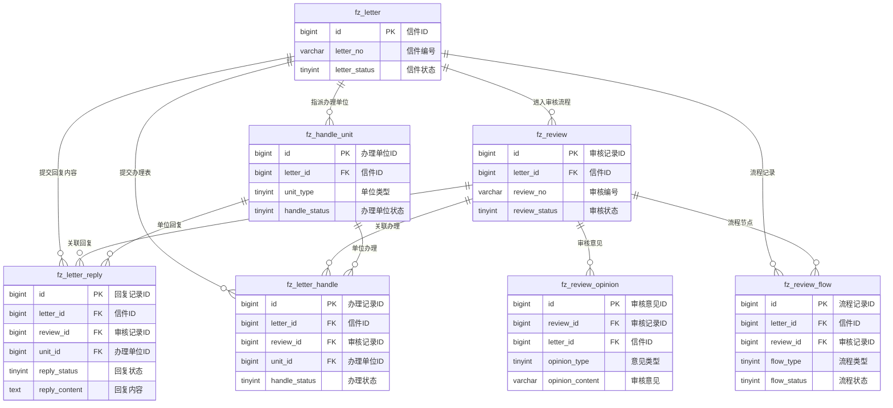

# M03 审核流程模块 - 数据库设计

## 文档信息

**产品名称：** gaxx-pro 信件处理系统
**模块编号：** M03
**文档版本：** v1.0
**创建日期：** 2026-04-13
**状态：** 草稿

---

## 1. 表结构设计

### 1.1 审核记录表 (fz_review)

审核记录表用于记录信件的审核流程状态，每次信件进入审核流程时创建一条记录。

```sql
CREATE TABLE `fz_review` (
    `id` bigint NOT NULL AUTO_INCREMENT COMMENT '主键ID',
    `letter_id` bigint NOT NULL COMMENT '信件ID',
    `review_no` varchar(32) NOT NULL COMMENT '审核编号',
    `review_status` tinyint NOT NULL DEFAULT 0 COMMENT '审核状态：0-待一审、1-一审通过待终审、2-终审通过、3-审核不通过、4-已回复',
    `submit_time` datetime NOT NULL COMMENT '提交审核时间',
    `first_review_time` datetime DEFAULT NULL COMMENT '一审时间',
    `first_reviewer_id` bigint DEFAULT NULL COMMENT '一审人ID',
    `first_reviewer_name` varchar(64) DEFAULT NULL COMMENT '一审人姓名',
    `final_review_time` datetime DEFAULT NULL COMMENT '终审时间',
    `final_reviewer_id` bigint DEFAULT NULL COMMENT '终审人ID',
    `final_reviewer_name` varchar(64) DEFAULT NULL COMMENT '终审人姓名',
    `reject_count` int NOT NULL DEFAULT 0 COMMENT '驳回次数',
    `modify_count` int NOT NULL DEFAULT 0 COMMENT '重新修改次数',
    `rehandle_count` int NOT NULL DEFAULT 0 COMMENT '重新办理次数',
    `version` int NOT NULL DEFAULT 1 COMMENT '回复版本号',
    `tenant_id` bigint NOT NULL DEFAULT 0 COMMENT '租户编号',
    `creator` varchar(64) DEFAULT '' COMMENT '创建者',
    `create_time` datetime NOT NULL DEFAULT CURRENT_TIMESTAMP COMMENT '创建时间',
    `updater` varchar(64) DEFAULT '' COMMENT '更新者',
    `update_time` datetime NOT NULL DEFAULT CURRENT_TIMESTAMP ON UPDATE CURRENT_TIMESTAMP COMMENT '更新时间',
    `deleted` bit(1) NOT NULL DEFAULT b'0' COMMENT '是否删除',
    PRIMARY KEY (`id`),
    UNIQUE KEY `uk_review_no` (`review_no`),
    KEY `idx_letter_id` (`letter_id`),
    KEY `idx_review_status` (`review_status`),
    KEY `idx_submit_time` (`submit_time`),
    KEY `idx_tenant_id` (`tenant_id`)
) ENGINE=InnoDB DEFAULT CHARSET=utf8mb4 COMMENT='审核记录表';
```

### 1.2 审核意见表 (fz_review_opinion)

审核意见表记录每次审核操作的意见详情，包括通过、不通过、退回等操作。

```sql
CREATE TABLE `fz_review_opinion` (
    `id` bigint NOT NULL AUTO_INCREMENT COMMENT '主键ID',
    `review_id` bigint NOT NULL COMMENT '审核记录ID',
    `letter_id` bigint NOT NULL COMMENT '信件ID',
    `opinion_type` tinyint NOT NULL COMMENT '意见类型：1-一审通过、2-一审不通过、3-终审通过、4-终审不通过、5-直接终审通过、6-退回重新修改、7-退回重新办理',
    `review_level` tinyint NOT NULL COMMENT '审核层级：1-一审、2-终审',
    `opinion_content` varchar(1000) DEFAULT NULL COMMENT '审核意见内容',
    `result_type` tinyint NOT NULL COMMENT '处理结果：1-通过、2-不通过重新修改、3-不通过重新办理、4-退回下级',
    `operator_id` bigint NOT NULL COMMENT '操作人ID',
    `operator_name` varchar(64) NOT NULL COMMENT '操作人姓名',
    `operator_unit_id` bigint NOT NULL COMMENT '操作人单位ID',
    `operator_unit_name` varchar(128) NOT NULL COMMENT '操作人单位名称',
    `operator_role` tinyint NOT NULL COMMENT '操作角色：1-接收单位、2-督办单位、3-主办单位、4-协办单位',
    `operate_time` datetime NOT NULL COMMENT '操作时间',
    `tenant_id` bigint NOT NULL DEFAULT 0 COMMENT '租户编号',
    `creator` varchar(64) DEFAULT '' COMMENT '创建者',
    `create_time` datetime NOT NULL DEFAULT CURRENT_TIMESTAMP COMMENT '创建时间',
    `updater` varchar(64) DEFAULT '' COMMENT '更新者',
    `update_time` datetime NOT NULL DEFAULT CURRENT_TIMESTAMP ON UPDATE CURRENT_TIMESTAMP COMMENT '更新时间',
    `deleted` bit(1) NOT NULL DEFAULT b'0' COMMENT '是否删除',
    PRIMARY KEY (`id`),
    KEY `idx_review_id` (`review_id`),
    KEY `idx_letter_id` (`letter_id`),
    KEY `idx_opinion_type` (`opinion_type`),
    KEY `idx_operator_id` (`operator_id`),
    KEY `idx_operate_time` (`operate_time`),
    KEY `idx_tenant_id` (`tenant_id`)
) ENGINE=InnoDB DEFAULT CHARSET=utf8mb4 COMMENT='审核意见表';
```

### 1.3 审核流程表 (fz_review_flow)

审核流程表记录信件的审核流程节点信息，展示完整的审核进度。

```sql
CREATE TABLE `fz_review_flow` (
    `id` bigint NOT NULL AUTO_INCREMENT COMMENT '主键ID',
    `letter_id` bigint NOT NULL COMMENT '信件ID',
    `review_id` bigint NOT NULL COMMENT '审核记录ID',
    `flow_no` varchar(32) NOT NULL COMMENT '流程编号',
    `flow_type` tinyint NOT NULL COMMENT '流程类型：1-提交回复、2-提交办理表、3-下级退回、4-上级退回重新修改、5-上级退回重新办理、6-一审通过、7-终审通过、8-直接终审通过、9-审核不通过、10-改派处室、11-重新提交',
    `flow_status` tinyint NOT NULL DEFAULT 0 COMMENT '流程状态：0-待处理、1-处理中、2-已完成、3-已取消',
    `flow_name` varchar(64) NOT NULL COMMENT '流程名称',
    `flow_description` varchar(500) DEFAULT NULL COMMENT '流程描述',
    `from_node` varchar(64) DEFAULT NULL COMMENT '来源节点',
    `to_node` varchar(64) DEFAULT NULL COMMENT '目标节点',
    `from_status` tinyint DEFAULT NULL COMMENT '来源信件状态',
    `to_status` tinyint DEFAULT NULL COMMENT '目标信件状态',
    `operator_id` bigint DEFAULT NULL COMMENT '操作人ID',
    `operator_name` varchar(64) DEFAULT NULL COMMENT '操作人姓名',
    `operator_unit_id` bigint DEFAULT NULL COMMENT '操作人单位ID',
    `operator_unit_name` varchar(128) DEFAULT NULL COMMENT '操作人单位名称',
    `start_time` datetime DEFAULT NULL COMMENT '流程开始时间',
    `end_time` datetime DEFAULT NULL COMMENT '流程结束时间',
    `duration_minutes` int DEFAULT NULL COMMENT '流程耗时（分钟）',
    `remark` varchar(500) DEFAULT NULL COMMENT '备注',
    `tenant_id` bigint NOT NULL DEFAULT 0 COMMENT '租户编号',
    `creator` varchar(64) DEFAULT '' COMMENT '创建者',
    `create_time` datetime NOT NULL DEFAULT CURRENT_TIMESTAMP COMMENT '创建时间',
    `updater` varchar(64) DEFAULT '' COMMENT '更新者',
    `update_time` datetime NOT NULL DEFAULT CURRENT_TIMESTAMP ON UPDATE CURRENT_TIMESTAMP COMMENT '更新时间',
    `deleted` bit(1) NOT NULL DEFAULT b'0' COMMENT '是否删除',
    PRIMARY KEY (`id`),
    UNIQUE KEY `uk_flow_no` (`flow_no`),
    KEY `idx_letter_id` (`letter_id`),
    KEY `idx_review_id` (`review_id`),
    KEY `idx_flow_type` (`flow_type`),
    KEY `idx_flow_status` (`flow_status`),
    KEY `idx_operator_id` (`operator_id`),
    KEY `idx_create_time` (`create_time`),
    KEY `idx_tenant_id` (`tenant_id`)
) ENGINE=InnoDB DEFAULT CHARSET=utf8mb4 COMMENT='审核流程表';
```

### 1.4 信件回复表 (fz_letter_reply)

信件回复表记录办理单位提交的回复内容，支持版本管理。

```sql
CREATE TABLE `fz_letter_reply` (
    `id` bigint NOT NULL AUTO_INCREMENT COMMENT '主键ID',
    `letter_id` bigint NOT NULL COMMENT '信件ID',
    `review_id` bigint DEFAULT NULL COMMENT '审核记录ID',
    `unit_id` bigint NOT NULL COMMENT '办理单位ID',
    `unit_name` varchar(128) NOT NULL COMMENT '办理单位名称',
    `unit_type` tinyint NOT NULL COMMENT '单位类型：1-主办单位、2-协办单位、3-督办单位',
    `reply_type` tinyint NOT NULL DEFAULT 1 COMMENT '回复类型：1-正式回复、2-协办意见',
    `reply_status` tinyint NOT NULL DEFAULT 0 COMMENT '回复状态：0-草稿、1-待审核、2-审核通过、3-审核不通过、4-已退回修改',
    `reply_content` text NOT NULL COMMENT '回复内容',
    `reply_version` int NOT NULL DEFAULT 1 COMMENT '回复版本号',
    `is_current` bit(1) NOT NULL DEFAULT b'1' COMMENT '是否当前版本',
    `submit_time` datetime DEFAULT NULL COMMENT '提交时间',
    `review_pass_time` datetime DEFAULT NULL COMMENT '审核通过时间',
    `reply_send_time` datetime DEFAULT NULL COMMENT '回复发送时间',
    `reject_reason` varchar(500) DEFAULT NULL COMMENT '驳回原因',
    `tenant_id` bigint NOT NULL DEFAULT 0 COMMENT '租户编号',
    `creator` varchar(64) DEFAULT '' COMMENT '创建者',
    `create_time` datetime NOT NULL DEFAULT CURRENT_TIMESTAMP COMMENT '创建时间',
    `updater` varchar(64) DEFAULT '' COMMENT '更新者',
    `update_time` datetime NOT NULL DEFAULT CURRENT_TIMESTAMP ON UPDATE CURRENT_TIMESTAMP COMMENT '更新时间',
    `deleted` bit(1) NOT NULL DEFAULT b'0' COMMENT '是否删除',
    PRIMARY KEY (`id`),
    KEY `idx_letter_id` (`letter_id`),
    KEY `idx_review_id` (`review_id`),
    KEY `idx_unit_id` (`unit_id`),
    KEY `idx_reply_status` (`reply_status`),
    KEY `idx_is_current` (`is_current`),
    KEY `idx_tenant_id` (`tenant_id`)
) ENGINE=InnoDB DEFAULT CHARSET=utf8mb4 COMMENT='信件回复表';
```

### 1.5 信件办理表 (fz_letter_handle)

信件办理表记录办理单位的办理详情，包括调查情况、满意度评价等。

```sql
CREATE TABLE `fz_letter_handle` (
    `id` bigint NOT NULL AUTO_INCREMENT COMMENT '主键ID',
    `letter_id` bigint NOT NULL COMMENT '信件ID',
    `review_id` bigint DEFAULT NULL COMMENT '审核记录ID',
    `unit_id` bigint NOT NULL COMMENT '办理单位ID',
    `unit_name` varchar(128) NOT NULL COMMENT '办理单位名称',
    `handle_no` varchar(32) NOT NULL COMMENT '办理编号',
    `handle_status` tinyint NOT NULL DEFAULT 0 COMMENT '办理状态：0-待办理、1-办理中、2-已提交、3-已退回',
    `handle_version` int NOT NULL DEFAULT 1 COMMENT '办理版本号',
    `is_current` bit(1) NOT NULL DEFAULT b'1' COMMENT '是否当前版本',
    -- 办理人信息
    `handler_name` varchar(64) DEFAULT NULL COMMENT '办理人姓名',
    `handler_id_card` varchar(128) DEFAULT NULL COMMENT '办理人身份证号（加密）',
    `handler_phone` varchar(64) DEFAULT NULL COMMENT '办理人联系电话',
    `handler_unit` varchar(128) DEFAULT NULL COMMENT '办理人所在单位',
    -- 回访信息
    `is_revisited` bit(1) DEFAULT b'0' COMMENT '是否已回访',
    `visit_time` datetime DEFAULT NULL COMMENT '回访时间',
    `visit_situation` varchar(1000) DEFAULT NULL COMMENT '回访情况',
    `public_reflect` varchar(1000) DEFAULT NULL COMMENT '群众反映',
    `no_visit_reason` varchar(500) DEFAULT NULL COMMENT '未回访原因',
    -- 接访信息
    `is_received` bit(1) DEFAULT b'0' COMMENT '是否已接访',
    `receive_leader` varchar(64) DEFAULT NULL COMMENT '接访领导',
    `receive_time` datetime DEFAULT NULL COMMENT '接访时间',
    `receive_type` tinyint DEFAULT NULL COMMENT '接访方式：1-现场接访、2-电话接访、3-视频接访',
    `receive_situation` varchar(1000) DEFAULT NULL COMMENT '接访情况',
    -- 调查信息
    `investigation_situation` varchar(2000) DEFAULT NULL COMMENT '调查情况',
    `no_investigation_reason` varchar(500) DEFAULT NULL COMMENT '无法调查原因',
    -- 满意度评价
    `satisfaction_resolve` tinyint DEFAULT NULL COMMENT '诉求解决满意度（1-5分）',
    `satisfaction_response` tinyint DEFAULT NULL COMMENT '响应速度满意度（1-5分）',
    `satisfaction_attitude` tinyint DEFAULT NULL COMMENT '办理态度满意度（1-5分）',
    `satisfaction_overall` tinyint DEFAULT NULL COMMENT '整体满意度（1-5分）',
    `satisfaction_remark` varchar(500) DEFAULT NULL COMMENT '满意度备注',
    -- 提交信息
    `submit_time` datetime DEFAULT NULL COMMENT '提交时间',
    `submitter_id` bigint DEFAULT NULL COMMENT '提交人ID',
    `submitter_name` varchar(64) DEFAULT NULL COMMENT '提交人姓名',
    `tenant_id` bigint NOT NULL DEFAULT 0 COMMENT '租户编号',
    `creator` varchar(64) DEFAULT '' COMMENT '创建者',
    `create_time` datetime NOT NULL DEFAULT CURRENT_TIMESTAMP COMMENT '创建时间',
    `updater` varchar(64) DEFAULT '' COMMENT '更新者',
    `update_time` datetime NOT NULL DEFAULT CURRENT_TIMESTAMP ON UPDATE CURRENT_TIMESTAMP COMMENT '更新时间',
    `deleted` bit(1) NOT NULL DEFAULT b'0' COMMENT '是否删除',
    PRIMARY KEY (`id`),
    UNIQUE KEY `uk_handle_no` (`handle_no`),
    KEY `idx_letter_id` (`letter_id`),
    KEY `idx_review_id` (`review_id`),
    KEY `idx_unit_id` (`unit_id`),
    KEY `idx_handle_status` (`handle_status`),
    KEY `idx_is_current` (`is_current`),
    KEY `idx_tenant_id` (`tenant_id`)
) ENGINE=InnoDB DEFAULT CHARSET=utf8mb4 COMMENT='信件办理表';
```

---

## 2. ER图



---

## 3. 索引设计

### 3.1 主键索引

所有表均使用 `id` 作为自增主键，确保数据唯一性和查询效率。

### 3.2 业务唯一索引

| 表名 | 索引名 | 索引字段 | 说明 |
|------|--------|----------|------|
| fz_review | uk_review_no | review_no | 审核编号唯一 |
| fz_review_flow | uk_flow_no | flow_no | 流程编号唯一 |
| fz_letter_handle | uk_handle_no | handle_no | 办理编号唯一 |

### 3.3 外键关联索引

| 表名 | 索引名 | 索引字段 | 说明 |
|------|--------|----------|------|
| fz_review | idx_letter_id | letter_id | 信件ID查询 |
| fz_review_opinion | idx_review_id | review_id | 审核记录ID查询 |
| fz_review_opinion | idx_letter_id | letter_id | 信件ID查询 |
| fz_review_flow | idx_letter_id | letter_id | 信件ID查询 |
| fz_review_flow | idx_review_id | review_id | 审核记录ID查询 |
| fz_letter_reply | idx_letter_id | letter_id | 信件ID查询 |
| fz_letter_reply | idx_review_id | review_id | 审核记录ID查询 |
| fz_letter_reply | idx_unit_id | unit_id | 办理单位ID查询 |
| fz_letter_handle | idx_letter_id | letter_id | 信件ID查询 |
| fz_letter_handle | idx_review_id | review_id | 审核记录ID查询 |
| fz_letter_handle | idx_unit_id | unit_id | 办理单位ID查询 |

### 3.4 状态查询索引

| 表名 | 索引名 | 索引字段 | 说明 |
|------|--------|----------|------|
| fz_review | idx_review_status | review_status | 审核状态筛选 |
| fz_review_opinion | idx_opinion_type | opinion_type | 意见类型筛选 |
| fz_review_flow | idx_flow_type | flow_type | 流程类型筛选 |
| fz_review_flow | idx_flow_status | flow_status | 流程状态筛选 |
| fz_letter_reply | idx_reply_status | reply_status | 回复状态筛选 |
| fz_letter_reply | idx_is_current | is_current | 当前版本筛选 |
| fz_letter_handle | idx_handle_status | handle_status | 办理状态筛选 |
| fz_letter_handle | idx_is_current | is_current | 当前版本筛选 |

### 3.5 时间查询索引

| 表名 | 索引名 | 索引字段 | 说明 |
|------|--------|----------|------|
| fz_review | idx_submit_time | submit_time | 提交时间排序 |
| fz_review_opinion | idx_operate_time | operate_time | 操作时间排序 |
| fz_review_flow | idx_create_time | create_time | 创建时间排序 |

### 3.6 租户索引

所有表均包含 `idx_tenant_id` 索引，支持多租户数据隔离查询。

---

## 4. 字段说明

### 4.1 审核状态枚举 (ReviewStatusEnum)

| 状态码 | 状态名称 | 说明 |
|--------|----------|------|
| 0 | 待一审 | 信件已提交回复，等待一审 |
| 1 | 一审通过待终审 | 一审已通过，等待终审 |
| 2 | 终审通过 | 终审已通过，可回复网民 |
| 3 | 审核不通过 | 审核未通过，等待后续处理 |
| 4 | 已回复 | 已正式回复网民 |

### 4.2 意见类型枚举 (OpinionTypeEnum)

| 类型码 | 类型名称 | 说明 |
|--------|----------|------|
| 1 | 一审通过 | 一审审核通过 |
| 2 | 一审不通过 | 一审审核不通过 |
| 3 | 终审通过 | 终审审核通过 |
| 4 | 终审不通过 | 终审审核不通过 |
| 5 | 直接终审通过 | 跳过一审直接终审通过 |
| 6 | 退回重新修改 | 上级退回要求修改回复 |
| 7 | 退回重新办理 | 上级退回要求重新办理 |
| 8 | 下级退回 | 下级单位退回无法处理 |
| 9 | 改派处室 | 改派办理单位 |

### 4.3 流程类型枚举 (FlowTypeEnum)

| 类型码 | 类型名称 | 说明 |
|--------|----------|------|
| 1 | 提交回复 | 主办单位提交回复内容 |
| 2 | 提交办理表 | 主办单位提交办理表 |
| 3 | 下级退回 | 下级单位退回信件 |
| 4 | 上级退回重新修改 | 上级退回要求修改 |
| 5 | 上级退回重新办理 | 上级退回要求重新办理 |
| 6 | 一审通过 | 一审审核通过 |
| 7 | 终审通过 | 终审审核通过 |
| 8 | 直接终审通过 | 跳过一审终审通过 |
| 9 | 审核不通过 | 审核未通过 |
| 10 | 改派处室 | 改派办理单位 |
| 11 | 重新提交 | 重新提交审核 |

### 4.4 回复状态枚举 (ReplyStatusEnum)

| 状态码 | 状态名称 | 说明 |
|--------|----------|------|
| 0 | 草稿 | 回复草稿状态 |
| 1 | 待审核 | 提交审核等待审核 |
| 2 | 审核通过 | 审核已通过 |
| 3 | 审核不通过 | 审核未通过 |
| 4 | 已退回修改 | 被退回要求修改 |

### 4.5 办理状态枚举 (HandleStatusEnum)

| 状态码 | 状态名称 | 说明 |
|--------|----------|------|
| 0 | 待办理 | 等待办理 |
| 1 | 办理中 | 正在办理 |
| 2 | 已提交 | 已提交办理表 |
| 3 | 已退回 | 被退回重新办理 |

### 4.6 操作角色枚举 (OperatorRoleEnum)

| 角色码 | 角色名称 | 说明 |
|--------|----------|------|
| 1 | 接收单位 | 信件接收单位 |
| 2 | 督办单位 | 督办单位 |
| 3 | 主办单位 | 主办办理单位 |
| 4 | 协办单位 | 协办单位 |

---

## 5. 数据关系说明

### 5.1 信件与审核关系

- 一封信件可有多条审核记录（每次重新提交创建新记录）
- 当前有效的审核记录通过 `version` 和 `review_status` 区分
- 审核记录通过 `letter_id` 关联信件

### 5.2 审核与意见关系

- 一条审核记录可有多条审核意见
- 审核意见记录每次审核操作的详情
- 审核意见通过 `review_id` 关联审核记录

### 5.3 审核与流程关系

- 一条审核记录可有多条流程节点
- 流程节点记录审核过程中的各个状态变化
- 流程节点通过 `review_id` 关联审核记录

### 5.4 信件与回复关系

- 一封信件可有多条回复记录（版本管理）
- 当前有效回复通过 `is_current` 标识
- 回复记录通过 `letter_id` 关联信件

### 5.5 信件与办理关系

- 一封信件可有多条办理记录（版本管理）
- 当前有效办理通过 `is_current` 标识
- 办理记录通过 `letter_id` 关联信件

---

## 变更历史

| 版本 | 日期 | 变更内容 | 变更人 |
|-----|------|---------|--------|
| v1.0 | 2026-04-13 | 初始版本，完成审核流程相关表设计 | Claude |