# M04 标签分类模块 - 实体设计

## 文档信息

**产品名称：** gaxx-pro 信件处理系统
**文档版本：** v1.0
**创建日期：** 2026-04-13
**技术栈：** Java 8 + Spring Boot + MyBatis Plus

---

## 1. DO实体类设计

### 1.1 基类说明

所有实体类均继承 `TenantBaseDO`，该基类提供以下通用字段：

```java
// TenantBaseDO 基类字段
public abstract class TenantBaseDO {
    private Long tenantId;      // 租户编号
    private String creator;     // 创建者
    private LocalDateTime createTime;  // 创建时间
    private String updater;     // 更新者
    private LocalDateTime updateTime;  // 更新时间
    private Boolean deleted;    // 是否删除（逻辑删除）
}
```

### 1.2 标签分组实体 TagGroupDO

**文件路径：** `cn.iocoder.yudao.module.fz.dal.dataobject.tag.TagGroupDO`

```java
package cn.iocoder.yudao.module.fz.dal.dataobject.tag;

import cn.iocoder.yudao.framework.mybatis.core.dataobject.TenantBaseDO;
import com.baomidou.mybatisplus.annotation.KeySequence;
import com.baomidou.mybatisplus.annotation.TableId;
import com.baomidou.mybatisplus.annotation.TableName;
import lombok.AllArgsConstructor;
import lombok.Builder;
import lombok.Data;
import lombok.EqualsAndHashCode;
import lombok.NoArgsConstructor;

/**
 * 标签分组 DO
 *
 * 用于管理标签分组信息，支持标签的分组展示和组织
 */
@TableName("fz_tag_group")
@KeySequence("fz_tag_group_seq")
@Data
@EqualsAndHashCode(callSuper = true)
@Builder
@NoArgsConstructor
@AllArgsConstructor
public class TagGroupDO extends TenantBaseDO {

    /**
     * 分组编号（主键）
     */
    @TableId
    private Long id;

    /**
     * 分组编码（唯一）
     * 示例：GRP_001
     */
    private String groupCode;

    /**
     * 分组名称
     * 示例：信访类、督办类
     */
    private String groupName;

    /**
     * 排序号
     * 数值越小越靠前
     */
    private Integer sort;

    /**
     * 状态
     * 0=禁用，1=启用
     */
    private Integer status;
}
```

### 1.3 标签实体 TagDO

**文件路径：** `cn.iocoder.yudao.module.fz.dal.dataobject.tag.TagDO`

```java
package cn.iocoder.yudao.module.fz.dal.dataobject.tag;

import cn.iocoder.yudao.framework.mybatis.core.dataobject.TenantBaseDO;
import com.baomidou.mybatisplus.annotation.KeySequence;
import com.baomidou.mybatisplus.annotation.TableId;
import com.baomidou.mybatisplus.annotation.TableName;
import lombok.AllArgsConstructor;
import lombok.Builder;
import lombok.Data;
import lombok.EqualsAndHashCode;
import lombok.NoArgsConstructor;

/**
 * 标签 DO
 *
 * 用户自定义标签实体，用于对信件进行个性化分类标记
 */
@TableName("fz_tag")
@KeySequence("fz_tag_seq")
@Data
@EqualsAndHashCode(callSuper = true)
@Builder
@NoArgsConstructor
@AllArgsConstructor
public class TagDO extends TenantBaseDO {

    /**
     * 标签编号（主键）
     */
    @TableId
    private Long id;

    /**
     * 标签编码（唯一）
     * 示例：TAG_001
     */
    private String tagCode;

    /**
     * 标签名称
     * 长度限制：2-20字符
     * 示例：重点信访、紧急处理
     */
    private String tagName;

    /**
     * 标签颜色
     * HEX格式：#RRGGBB 或 #RGB
     * 默认值：#1890FF
     */
    private String tagColor;

    /**
     * 状态
     * 0=禁用，1=启用
     * 默认值：1（启用）
     */
    private Integer status;

    /**
     * 是否重点
     * 0=否，1=是
     * 默认值：0（否）
     */
    private Boolean isCritical;

    /**
     * 列表可见
     * 0=否，1=是
     * 默认值：1（是）
     */
    private Boolean isListVisible;

    /**
     * 可见范围级别
     * 0=全局可见
     * 1=本单位可见
     * 2=本部门可见
     * 3=仅自己可见
     * 默认值：0（全局）
     */
    private Integer visibilityScope;

    /**
     * 可见部门ID列表
     * 逗号分隔，如：100,101,102
     * 空字符串表示全局可见
     */
    private String visibleDeptIds;

    /**
     * 所属分组ID
     * 可为空（不分组）
     */
    private Long groupId;

    /**
     * 使用频次统计
     * 添加标签时+1，移除时-1
     */
    private Integer useCount;

    /**
     * 排序号
     * 数值越小越靠前
     */
    private Integer sort;
}
```

### 1.4 信件标签关联实体 LetterTagDO

**文件路径：** `cn.iocoder.yudao.module.fz.dal.dataobject.tag.LetterTagDO`

```java
package cn.iocoder.yudao.module.fz.dal.dataobject.tag;

import cn.iocoder.yudao.framework.mybatis.core.dataobject.TenantBaseDO;
import com.baomidou.mybatisplus.annotation.KeySequence;
import com.baomidou.mybatisplus.annotation.TableId;
import com.baomidou.mybatisplus.annotation.TableName;
import lombok.AllArgsConstructor;
import lombok.Builder;
import lombok.Data;
import lombok.EqualsAndHashCode;
import lombok.NoArgsConstructor;

/**
 * 信件标签关联 DO
 *
 * 记录信件与标签的关联关系
 */
@TableName("fz_letter_tag")
@KeySequence("fz_letter_tag_seq")
@Data
@EqualsAndHashCode(callSuper = true)
@Builder
@NoArgsConstructor
@AllArgsConstructor
public class LetterTagDO extends TenantBaseDO {

    /**
     * 关联编号（主键）
     */
    @TableId
    private Long id;

    /**
     * 信件ID
     * 关联信件主表 fz_letter.id
     */
    private Long letterId;

    /**
     * 标签ID
     * 关联标签表 fz_tag.id
     */
    private Long tagId;

    /**
     * 所属部门ID
     * 记录添加标签的部门
     */
    private Long ownerDeptId;

    /**
     * 所属部门名称
     * 冗余存储便于查询展示
     */
    private String ownerDeptName;
}
```

---

## 2. VO类设计

### 2.1 标签分组VO类

#### 2.1.1 TagGroupSaveReqVO（新增/修改请求）

**文件路径：** `cn.iocoder.yudao.module.fz.controller.admin.tag.vo.TagGroupSaveReqVO`

```java
package cn.iocoder.yudao.module.fz.controller.admin.tag.vo;

import io.swagger.v3.oas.annotations.media.Schema;
import lombok.Data;

import javax.validation.constraints.NotBlank;
import javax.validation.constraints.Size;

/**
 * 标签分组新增/修改 Request VO
 */
@Schema(description = "管理后台 - 标签分组新增/修改 Request VO")
@Data
public class TagGroupSaveReqVO {

    @Schema(description = "分组编号（修改时必填）", example = "1")
    private Long id;

    @Schema(description = "分组编码（可选，不填则自动生成）", example = "GRP_001")
    @Size(max = 32, message = "分组编码长度不能超过32个字符")
    private String groupCode;

    @Schema(description = "分组名称（必填）", requiredMode = Schema.RequiredMode.REQUIRED, example = "信访类")
    @NotBlank(message = "分组名称不能为空")
    @Size(min = 2, max = 50, message = "分组名称长度必须在2-50个字符之间")
    private String groupName;

    @Schema(description = "排序号", example = "1")
    private Integer sort;

    @Schema(description = "状态（0禁用/1启用）", example = "1")
    private Integer status;
}
```

#### 2.1.2 TagGroupRespVO（响应对象）

**文件路径：** `cn.iocoder.yudao.module.fz.controller.admin.tag.vo.TagGroupRespVO`

```java
package cn.iocoder.yudao.module.fz.controller.admin.tag.vo;

import io.swagger.v3.oas.annotations.media.Schema;
import lombok.Data;

import java.time.LocalDateTime;

/**
 * 标签分组 Response VO
 */
@Schema(description = "管理后台 - 标签分组 Response VO")
@Data
public class TagGroupRespVO {

    @Schema(description = "分组编号", example = "1")
    private Long id;

    @Schema(description = "分组编码", example = "GRP_001")
    private String groupCode;

    @Schema(description = "分组名称", example = "信访类")
    private String groupName;

    @Schema(description = "排序号", example = "1")
    private Integer sort;

    @Schema(description = "状态（0禁用/1启用）", example = "1")
    private Integer status;

    @Schema(description = "分组下标签数量", example = "5")
    private Integer tagCount;

    @Schema(description = "创建时间")
    private LocalDateTime createTime;

    @Schema(description = "创建者")
    private String creator;
}
```

### 2.2 标签VO类

#### 2.2.1 TagSaveReqVO（新增/修改请求）

**文件路径：** `cn.iocoder.yudao.module.fz.controller.admin.tag.vo.TagSaveReqVO`

```java
package cn.iocoder.yudao.module.fz.controller.admin.tag.vo;

import io.swagger.v3.oas.annotations.media.Schema;
import lombok.Data;

import javax.validation.constraints.NotBlank;
import javax.validation.constraints.Pattern;
import javax.validation.constraints.Size;

/**
 * 标签新增/修改 Request VO
 */
@Schema(description = "管理后台 - 标签新增/修改 Request VO")
@Data
public class TagSaveReqVO {

    @Schema(description = "标签编号（修改时必填）", example = "1")
    private Long id;

    @Schema(description = "标签编码（可选，不填则自动生成）", example = "TAG_001")
    @Size(max = 32, message = "标签编码长度不能超过32个字符")
    private String tagCode;

    @Schema(description = "标签名称（必填）", requiredMode = Schema.RequiredMode.REQUIRED, example = "重点信访")
    @NotBlank(message = "标签名称不能为空")
    @Size(min = 2, max = 20, message = "标签名称长度必须在2-20个字符之间")
    private String tagName;

    @Schema(description = "标签颜色（HEX格式）", example = "#FF0000")
    @Pattern(regexp = "^#([A-Fa-f0-9]{6}|[A-Fa-f0-9]{3})$", message = "标签颜色格式不正确，需为HEX格式")
    private String tagColor;

    @Schema(description = "状态（0禁用/1启用）", example = "1")
    private Integer status;

    @Schema(description = "是否重点", example = "true")
    private Boolean isCritical;

    @Schema(description = "列表可见", example = "true")
    private Boolean isListVisible;

    @Schema(description = "可见范围级别（0全局/1本单位/2本部门/3仅自己）", example = "0")
    private Integer visibilityScope;

    @Schema(description = "可见部门ID列表（逗号分隔）", example = "100,101")
    private String visibleDeptIds;

    @Schema(description = "所属分组ID", example = "1")
    private Long groupId;

    @Schema(description = "排序号", example = "1")
    private Integer sort;
}
```

#### 2.2.2 TagPageReqVO（分页查询请求）

**文件路径：** `cn.iocoder.yudao.module.fz.controller.admin.tag.vo.TagPageReqVO`

```java
package cn.iocoder.yudao.module.fz.controller.admin.tag.vo;

import cn.iocoder.yudao.framework.common.pojo.PageParam;
import io.swagger.v3.oas.annotations.media.Schema;
import lombok.Data;
import lombok.EqualsAndHashCode;
import lombok.ToString;

import org.springframework.format.annotation.DateTimeFormat;

import java.time.LocalDateTime;

/**
 * 标签分页查询 Request VO
 */
@Schema(description = "管理后台 - 标签分页查询 Request VO")
@Data
@EqualsAndHashCode(callSuper = true)
@ToString(callSuper = true)
public class TagPageReqVO extends PageParam {

    @Schema(description = "标签名称（模糊搜索）", example = "重点")
    private String tagName;

    @Schema(description = "标签编码（模糊搜索）", example = "TAG")
    private String tagCode;

    @Schema(description = "状态（0禁用/1启用）", example = "1")
    private Integer status;

    @Schema(description = "是否重点", example = "true")
    private Boolean isCritical;

    @Schema(description = "可见范围级别", example = "0")
    private Integer visibilityScope;

    @Schema(description = "分组ID", example = "1")
    private Long groupId;

    @Schema(description = "创建时间范围")
    @DateTimeFormat(pattern = "yyyy-MM-dd HH:mm:ss")
    private LocalDateTime[] createTime;
}
```

#### 2.2.3 TagRespVO（响应对象）

**文件路径：** `cn.iocoder.yudao.module.fz.controller.admin.tag.vo.TagRespVO`

```java
package cn.iocoder.yudao.module.fz.controller.admin.tag.vo;

import io.swagger.v3.oas.annotations.media.Schema;
import lombok.Data;

import java.time.LocalDateTime;

/**
 * 标签 Response VO
 */
@Schema(description = "管理后台 - 标签 Response VO")
@Data
public class TagRespVO {

    @Schema(description = "标签编号", example = "1")
    private Long id;

    @Schema(description = "标签编码", example = "TAG_001")
    private String tagCode;

    @Schema(description = "标签名称", example = "重点信访")
    private String tagName;

    @Schema(description = "标签颜色", example = "#FF0000")
    private String tagColor;

    @Schema(description = "状态（0禁用/1启用）", example = "1")
    private Integer status;

    @Schema(description = "是否重点", example = "true")
    private Boolean isCritical;

    @Schema(description = "列表可见", example = "true")
    private Boolean isListVisible;

    @Schema(description = "可见范围级别", example = "0")
    private Integer visibilityScope;

    @Schema(description = "可见范围名称", example = "全局可见")
    private String visibilityScopeName;

    @Schema(description = "可见部门ID列表", example = "100,101")
    private String visibleDeptIds;

    @Schema(description = "可见部门名称列表", example = "信访处,办公室")
    private String visibleDeptNames;

    @Schema(description = "所属分组ID", example = "1")
    private Long groupId;

    @Schema(description = "所属分组名称", example = "信访类")
    private String groupName;

    @Schema(description = "使用频次", example = "5")
    private Integer useCount;

    @Schema(description = "排序号", example = "1")
    private Integer sort;

    @Schema(description = "创建时间")
    private LocalDateTime createTime;

    @Schema(description = "创建者")
    private String creator;
}
```

#### 2.2.4 TagSimpleRespVO（简化响应对象）

**文件路径：** `cn.iocoder.yudao.module.fz.controller.admin.tag.vo.TagSimpleRespVO`

```java
package cn.iocoder.yudao.module.fz.controller.admin.tag.vo;

import io.swagger.v3.oas.annotations.media.Schema;
import lombok.Data;

/**
 * 标签简化 Response VO（用于标签选择列表）
 */
@Schema(description = "管理后台 - 标签简化 Response VO")
@Data
public class TagSimpleRespVO {

    @Schema(description = "标签编号", example = "1")
    private Long id;

    @Schema(description = "标签名称", example = "重点信访")
    private String tagName;

    @Schema(description = "标签颜色", example = "#FF0000")
    private String tagColor;

    @Schema(description = "是否重点", example = "true")
    private Boolean isCritical;

    @Schema(description = "是否已关联（用于信件标签选择）", example = "false")
    private Boolean isLinked;

    @Schema(description = "使用频次", example = "5")
    private Integer useCount;
}
```

### 2.3 标签关联VO类

#### 2.3.1 LetterTagAddReqVO（添加标签请求）

**文件路径：** `cn.iocoder.yudao.module.fz.controller.admin.tag.vo.LetterTagAddReqVO`

```java
package cn.iocoder.yudao.module.fz.controller.admin.tag.vo;

import io.swagger.v3.oas.annotations.media.Schema;
import lombok.Data;

import javax.validation.constraints.NotNull;
import java.util.List;

/**
 * 信件标签添加 Request VO
 */
@Schema(description = "管理后台 - 信件标签添加 Request VO")
@Data
public class LetterTagAddReqVO {

    @Schema(description = "信件ID", requiredMode = Schema.RequiredMode.REQUIRED, example = "1")
    @NotNull(message = "信件ID不能为空")
    private Long letterId;

    @Schema(description = "标签ID（单个添加）", example = "1")
    private Long tagId;

    @Schema(description = "标签ID列表（批量添加）", example = "[1, 2, 3]")
    private List<Long> tagIds;
}
```

#### 2.3.2 LetterTagAddResultRespVO（批量添加结果响应）

**文件路径：** `cn.iocoder.yudao.module.fz.controller.admin.tag.vo.LetterTagAddResultRespVO`

```java
package cn.iocoder.yudao.module.fz.controller.admin.tag.vo;

import io.swagger.v3.oas.annotations.media.Schema;
import lombok.Data;

import java.util.List;

/**
 * 信件标签批量添加结果 Response VO
 */
@Schema(description = "管理后台 - 信件标签批量添加结果 Response VO")
@Data
public class LetterTagAddResultRespVO {

    @Schema(description = "成功添加数量", example = "3")
    private Integer successCount;

    @Schema(description = "失败数量", example = "1")
    private Integer failedCount;

    @Schema(description = "失败的标签信息")
    private List<FailedTagInfo> failedTags;

    @Schema(description = "失败的标签信息")
    @Data
    public static class FailedTagInfo {
        @Schema(description = "标签ID", example = "4")
        private Long tagId;

        @Schema(description = "标签名称", example = "测试标签")
        private String tagName;

        @Schema(description = "失败原因", example = "标签已禁用")
        private String reason;
    }
}
```

#### 2.3.3 LetterTagRespVO（信件标签响应）

**文件路径：** `cn.iocoder.yudao.module.fz.controller.admin.tag.vo.LetterTagRespVO`

```java
package cn.iocoder.yudao.module.fz.controller.admin.tag.vo;

import io.swagger.v3.oas.annotations.media.Schema;
import lombok.Data;

import java.time.LocalDateTime;

/**
 * 信件标签关联 Response VO
 */
@Schema(description = "管理后台 - 信件标签关联 Response VO")
@Data
public class LetterTagRespVO {

    @Schema(description = "关联编号", example = "1")
    private Long id;

    @Schema(description = "标签ID", example = "1")
    private Long tagId;

    @Schema(description = "标签名称", example = "重点信访")
    private String tagName;

    @Schema(description = "标签颜色", example = "#FF0000")
    private String tagColor;

    @Schema(description = "是否重点", example = "true")
    private Boolean isCritical;

    @Schema(description = "所属部门ID", example = "100")
    private Long ownerDeptId;

    @Schema(description = "所属部门名称", example = "信访处")
    private String ownerDeptName;

    @Schema(description = "关联时间")
    private LocalDateTime createTime;

    @Schema(description = "添加人")
    private String creator;
}
```

#### 2.3.4 LetterTagPageReqVO（分页查询请求）

**文件路径：** `cn.iocoder.yudao.module.fz.controller.admin.tag.vo.LetterTagPageReqVO`

```java
package cn.iocoder.yudao.module.fz.controller.admin.tag.vo;

import cn.iocoder.yudao.framework.common.pojo.PageParam;
import io.swagger.v3.oas.annotations.media.Schema;
import lombok.Data;
import lombok.EqualsAndHashCode;
import lombok.ToString;

import org.springframework.format.annotation.DateTimeFormat;

import java.time.LocalDateTime;

/**
 * 标签关联信件分页查询 Request VO
 */
@Schema(description = "管理后台 - 标签关联信件分页查询 Request VO")
@Data
@EqualsAndHashCode(callSuper = true)
@ToString(callSuper = true)
public class LetterTagPageReqVO extends PageParam {

    @Schema(description = "标签ID", requiredMode = Schema.RequiredMode.REQUIRED, example = "1")
    private Long tagId;

    @Schema(description = "所属部门ID", example = "100")
    private Long ownerDeptId;

    @Schema(description = "关联时间范围")
    @DateTimeFormat(pattern = "yyyy-MM-dd HH:mm:ss")
    private LocalDateTime[] createTime;
}
```

#### 2.3.5 LetterTagLetterRespVO（标签关联信件响应）

**文件路径：** `cn.iocoder.yudao.module.fz.controller.admin.tag.vo.LetterTagLetterRespVO`

```java
package cn.iocoder.yudao.module.fz.controller.admin.tag.vo;

import io.swagger.v3.oas.annotations.media.Schema;
import lombok.Data;

import java.time.LocalDateTime;

/**
 * 标签关联信件 Response VO
 */
@Schema(description = "管理后台 - 标签关联信件 Response VO")
@Data
public class LetterTagLetterRespVO {

    @Schema(description = "信件ID", example = "1")
    private Long letterId;

    @Schema(description = "信件编码", example = "XX202604001")
    private String letterCode;

    @Schema(description = "信件标题", example = "关于某某问题的信访")
    private String letterTitle;

    @Schema(description = "所属部门ID", example = "100")
    private Long ownerDeptId;

    @Schema(description = "所属部门名称", example = "信访处")
    private String ownerDeptName;

    @Schema(description = "关联时间")
    private LocalDateTime linkTime;
}
```

---

## 3. 枚举类设计

### 3.1 可见范围级别枚举 VisibilityScopeEnum

**文件路径：** `cn.iocoder.yudao.module.fz.enums.tag.VisibilityScopeEnum`

```java
package cn.iocoder.yudao.module.fz.enums.tag;

import cn.iocoder.yudao.framework.common.core.IntArrayValuable;
import lombok.AllArgsConstructor;
import lombok.Getter;

import java.util.Arrays;

/**
 * 标签可见范围级别枚举
 */
@Getter
@AllArgsConstructor
public enum VisibilityScopeEnum implements IntArrayValuable {

    GLOBAL(0, "全局可见"),
    UNIT(1, "本单位可见"),
    DEPARTMENT(2, "本部门可见"),
    SELF(3, "仅自己可见");

    /**
     * 所有枚举值数组
     */
    public static final int[] ARRAYS = Arrays.stream(values()).mapToInt(VisibilityScopeEnum::getValue).toArray();

    /**
     * 范围级别值
     */
    private final Integer value;

    /**
     * 范围名称
     */
    private final String name;

    /**
     * 根据值获取枚举
     */
    public static VisibilityScopeEnum valueOf(Integer value) {
        return Arrays.stream(values())
                .filter(e -> e.getValue().equals(value))
                .findFirst()
                .orElse(null);
    }

    /**
     * 根据值获取名称
     */
    public static String getNameByValue(Integer value) {
        VisibilityScopeEnum e = valueOf(value);
        return e != null ? e.getName() : "未知";
    }

    @Override
    public int[] array() {
        return ARRAYS;
    }
}
```

### 3.2 标签状态枚举 TagStatusEnum

**文件路径：** `cn.iocoder.yudao.module.fz.enums.tag.TagStatusEnum`

```java
package cn.iocoder.yudao.module.fz.enums.tag;

import cn.iocoder.yudao.framework.common.core.IntArrayValuable;
import lombok.AllArgsConstructor;
import lombok.Getter;

import java.util.Arrays;

/**
 * 标签状态枚举
 */
@Getter
@AllArgsConstructor
public enum TagStatusEnum implements IntArrayValuable {

    DISABLED(0, "禁用"),
    ENABLED(1, "启用");

    /**
     * 所有枚举值数组
     */
    public static final int[] ARRAYS = Arrays.stream(values()).mapToInt(TagStatusEnum::getValue).toArray();

    /**
     * 状态值
     */
    private final Integer value;

    /**
     * 状态名称
     */
    private final String name;

    /**
     * 根据值获取枚举
     */
    public static TagStatusEnum valueOf(Integer value) {
        return Arrays.stream(values())
                .filter(e -> e.getValue().equals(value))
                .findFirst()
                .orElse(null);
    }

    /**
     * 根据值获取名称
     */
    public static String getNameByValue(Integer value) {
        TagStatusEnum e = valueOf(value);
        return e != null ? e.getName() : "未知";
    }

    @Override
    public int[] array() {
        return ARRAYS;
    }
}
```

---

## 4. Mapper接口设计

### 4.1 TagGroupMapper

**文件路径：** `cn.iocoder.yudao.module.fz.dal.mysql.tag.TagGroupMapper`

```java
package cn.iocoder.yudao.module.fz.dal.mysql.tag;

import cn.iocoder.yudao.framework.mybatis.core.mapper.BaseMapperX;
import cn.iocoder.yudao.module.fz.dal.dataobject.tag.TagGroupDO;
import org.apache.ibatis.annotations.Mapper;

import java.util.List;

/**
 * 标签分组 Mapper
 */
@Mapper
public interface TagGroupMapper extends BaseMapperX<TagGroupDO> {

    /**
     * 查询启用的分组列表
     */
    default List<TagGroupDO> selectListByStatus(Integer status) {
        return selectList(TagGroupDO::getStatus, status);
    }

    /**
     * 根据编码查询分组
     */
    default TagGroupDO selectByGroupCode(String groupCode) {
        return selectOne(TagGroupDO::getGroupCode, groupCode);
    }

    /**
     * 根据名称查询分组
     */
    default TagGroupDO selectByGroupName(String groupName) {
        return selectOne(TagGroupDO::getGroupName, groupName);
    }
}
```

### 4.2 TagMapper

**文件路径：** `cn.iocoder.yudao.module.fz.dal.mysql.tag.TagMapper`

```java
package cn.iocoder.yudao.module.fz.dal.mysql.tag;

import cn.iocoder.yudao.framework.common.pojo.PageResult;
import cn.iocoder.yudao.framework.mybatis.core.mapper.BaseMapperX;
import cn.iocoder.yudao.framework.mybatis.core.query.LambdaQueryWrapperX;
import cn.iocoder.yudao.module.fz.controller.admin.tag.vo.TagPageReqVO;
import cn.iocoder.yudao.module.fz.dal.dataobject.tag.TagDO;
import org.apache.ibatis.annotations.Mapper;

import java.util.List;

/**
 * 标签 Mapper
 */
@Mapper
public interface TagMapper extends BaseMapperX<TagDO> {

    /**
     * 分页查询标签列表
     */
    default PageResult<TagDO> selectPage(TagPageReqVO reqVO) {
        return selectPage(reqVO, new LambdaQueryWrapperX<TagDO>()
                .likeIfPresent(TagDO::getTagName, reqVO.getTagName())
                .likeIfPresent(TagDO::getTagCode, reqVO.getTagCode())
                .eqIfPresent(TagDO::getStatus, reqVO.getStatus())
                .eqIfPresent(TagDO::getIsCritical, reqVO.getIsCritical())
                .eqIfPresent(TagDO::getVisibilityScope, reqVO.getVisibilityScope())
                .eqIfPresent(TagDO::getGroupId, reqVO.getGroupId())
                .betweenIfPresent(TagDO::getCreateTime, reqVO.getCreateTime())
                .orderByAsc(TagDO::getSort)
                .orderByDesc(TagDO::getCreateTime));
    }

    /**
     * 查询启用的标签列表
     */
    default List<TagDO> selectListByStatus(Integer status) {
        return selectList(new LambdaQueryWrapperX<TagDO>()
                .eq(TagDO::getStatus, status)
                .orderByAsc(TagDO::getSort));
    }

    /**
     * 根据分组ID查询标签列表
     */
    default List<TagDO> selectListByGroupId(Long groupId) {
        return selectList(new LambdaQueryWrapperX<TagDO>()
                .eq(TagDO::getGroupId, groupId)
                .orderByAsc(TagDO::getSort));
    }

    /**
     * 根据编码查询标签
     */
    default TagDO selectByTagCode(String tagCode) {
        return selectOne(TagDO::getTagCode, tagCode);
    }

    /**
     * 根据名称查询标签
     */
    default TagDO selectByTagName(String tagName) {
        return selectOne(TagDO::getTagName, tagName);
    }

    /**
     * 根据可见范围级别查询标签列表
     */
    default List<TagDO> selectListByVisibilityScope(Integer visibilityScope) {
        return selectList(new LambdaQueryWrapperX<TagDO>()
                .eq(TagDO::getVisibilityScope, visibilityScope)
                .eq(TagDO::getStatus, TagStatusEnum.ENABLED.getValue())
                .orderByDesc(TagDO::getUseCount));
    }

    /**
     * 更新使用频次
     */
    default int updateUseCount(Long id, int delta) {
        return update(new TagDO().setUseCount(delta), 
                new LambdaQueryWrapperX<TagDO>().eq(TagDO::getId, id));
    }
}
```

### 4.3 LetterTagMapper

**文件路径：** `cn.iocoder.yudao.module.fz.dal.mysql.tag.LetterTagMapper`

```java
package cn.iocoder.yudao.module.fz.dal.mysql.tag;

import cn.iocoder.yudao.framework.common.pojo.PageResult;
import cn.iocoder.yudao.framework.mybatis.core.mapper.BaseMapperX;
import cn.iocoder.yudao.framework.mybatis.core.query.LambdaQueryWrapperX;
import cn.iocoder.yudao.module.fz.controller.admin.tag.vo.LetterTagPageReqVO;
import cn.iocoder.yudao.module.fz.dal.dataobject.tag.LetterTagDO;
import org.apache.ibatis.annotations.Mapper;

import java.util.List;

/**
 * 信件标签关联 Mapper
 */
@Mapper
public interface LetterTagMapper extends BaseMapperX<LetterTagDO> {

    /**
     * 根据信件ID查询关联列表
     */
    default List<LetterTagDO> selectListByLetterId(Long letterId) {
        return selectList(LetterTagDO::getLetterId, letterId);
    }

    /**
     * 根据标签ID查询关联列表
     */
    default List<LetterTagDO> selectListByTagId(Long tagId) {
        return selectList(LetterTagDO::getTagId, tagId);
    }

    /**
     * 分页查询标签关联信件
     */
    default PageResult<LetterTagDO> selectPage(LetterTagPageReqVO reqVO) {
        return selectPage(reqVO, new LambdaQueryWrapperX<LetterTagDO>()
                .eq(LetterTagDO::getTagId, reqVO.getTagId())
                .eqIfPresent(LetterTagDO::getOwnerDeptId, reqVO.getOwnerDeptId())
                .betweenIfPresent(LetterTagDO::getCreateTime, reqVO.getCreateTime())
                .orderByDesc(LetterTagDO::getCreateTime));
    }

    /**
     * 查询信件是否已关联标签
     */
    default LetterTagDO selectByLetterIdAndTagId(Long letterId, Long tagId) {
        return selectOne(new LambdaQueryWrapperX<LetterTagDO>()
                .eq(LetterTagDO::getLetterId, letterId)
                .eq(LetterTagDO::getTagId, tagId));
    }

    /**
     * 统计信件关联标签数量
     */
    default int countByLetterId(Long letterId) {
        return selectCount(LetterTagDO::getLetterId, letterId).intValue();
    }

    /**
     * 统计标签关联信件数量
     */
    default int countByTagId(Long tagId) {
        return selectCount(LetterTagDO::getTagId, tagId).intValue();
    }

    /**
     * 删除信件的所有标签关联
     */
    default int deleteByLetterId(Long letterId) {
        return delete(LetterTagDO::getLetterId, letterId);
    }

    /**
     * 删除标签的所有信件关联
     */
    default int deleteByTagId(Long tagId) {
        return delete(LetterTagDO::getTagId, tagId);
    }
}
```

---

## 5. 类结构关系图

```mermaid
classDiagram
    TenantBaseDO <|-- TagGroupDO
    TenantBaseDO <|-- TagDO
    TenantBaseDO <|-- LetterTagDO
    PageParam <|-- TagPageReqVO
    PageParam <|-- LetterTagPageReqVO
    IntArrayValuable <|-- VisibilityScopeEnum
    IntArrayValuable <|-- TagStatusEnum

    class TenantBaseDO {
        Long tenantId
        String creator
        LocalDateTime createTime
        String updater
        LocalDateTime updateTime
        Boolean deleted
    }

    class TagGroupDO {
        Long id
        String groupCode
        String groupName
        Integer sort
        Integer status
    }

    class TagDO {
        Long id
        String tagCode
        String tagName
        String tagColor
        Integer status
        Boolean isCritical
        Boolean isListVisible
        Integer visibilityScope
        String visibleDeptIds
        Long groupId
        Integer useCount
        Integer sort
    }

    class LetterTagDO {
        Long id
        Long letterId
        Long tagId
        Long ownerDeptId
        String ownerDeptName
    }

    class TagGroupSaveReqVO {
        Long id
        String groupCode
        String groupName
        Integer sort
        Integer status
    }

    class TagGroupRespVO {
        Long id
        String groupCode
        String groupName
        Integer sort
        Integer status
        Integer tagCount
        LocalDateTime createTime
    }

    class TagSaveReqVO {
        Long id
        String tagCode
        String tagName
        String tagColor
        Integer status
        Boolean isCritical
        Boolean isListVisible
        Integer visibilityScope
        String visibleDeptIds
        Long groupId
        Integer sort
    }

    class TagPageReqVO {
        String tagName
        String tagCode
        Integer status
        Boolean isCritical
        Integer visibilityScope
        Long groupId
        LocalDateTime[] createTime
    }

    class TagRespVO {
        Long id
        String tagCode
        String tagName
        String tagColor
        Integer status
        Boolean isCritical
        Boolean isListVisible
        Integer visibilityScope
        String visibilityScopeName
        String visibleDeptIds
        String visibleDeptNames
        Long groupId
        String groupName
        Integer useCount
        Integer sort
        LocalDateTime createTime
    }

    class LetterTagAddReqVO {
        Long letterId
        Long tagId
        List~Long~ tagIds
    }

    class LetterTagRespVO {
        Long id
        Long tagId
        String tagName
        String tagColor
        Boolean isCritical
        Long ownerDeptId
        String ownerDeptName
        LocalDateTime createTime
    }

    class VisibilityScopeEnum {
        <<enumeration>>
        GLOBAL = 0
        UNIT = 1
        DEPARTMENT = 2
        SELF = 3
        Integer value
        String name
    }

    class TagStatusEnum {
        <<enumeration>>
        DISABLED = 0
        ENABLED = 1
        Integer value
        String name
    }
```



---

## 变更历史

| 版本 | 日期 | 变更内容 | 变更人 |
|-----|------|---------|--------|
| v1.0 | 2026-04-13 | 初始版本，包含DO、VO、枚举、Mapper设计 | Claude |