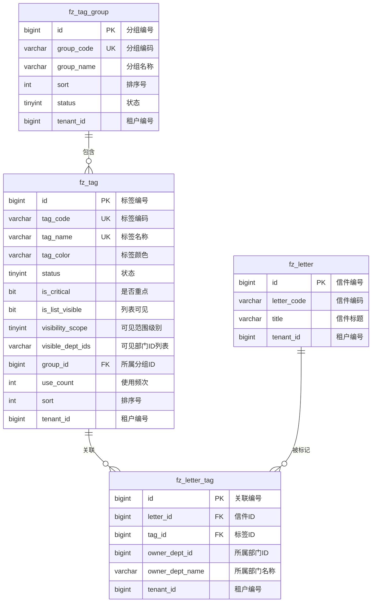

# M04 标签分类模块 - 数据库设计

## 文档信息

**产品名称：** gaxx-pro 信件处理系统
**文档版本：** v1.0
**创建日期：** 2026-04-13
**技术栈：** MySQL 8.0 + MyBatis Plus

---

## 1. 数据库表结构设计

### 1.1 标签分组表 (fz_tag_group)

用于管理标签分组信息，支持标签的分组展示和组织。

```sql
CREATE TABLE `fz_tag_group` (
    `id`              BIGINT       NOT NULL AUTO_INCREMENT COMMENT '分组编号（主键）',
    `group_code`      VARCHAR(32)  NOT NULL COMMENT '分组编码（唯一）',
    `group_name`      VARCHAR(50)  NOT NULL COMMENT '分组名称',
    `sort`            INT          DEFAULT 0 COMMENT '排序号',
    `status`          TINYINT      DEFAULT 1 COMMENT '状态（0禁用/1启用）',
    `tenant_id`       BIGINT       NOT NULL DEFAULT 0 COMMENT '租户编号',
    `creator`         VARCHAR(64)  DEFAULT '' COMMENT '创建者',
    `create_time`     DATETIME     NOT NULL DEFAULT CURRENT_TIMESTAMP COMMENT '创建时间',
    `updater`         VARCHAR(64)  DEFAULT '' COMMENT '更新者',
    `update_time`     DATETIME     NOT NULL DEFAULT CURRENT_TIMESTAMP ON UPDATE CURRENT_TIMESTAMP COMMENT '更新时间',
    `deleted`         BIT          NOT NULL DEFAULT b'0' COMMENT '是否删除',
    PRIMARY KEY (`id`),
    UNIQUE KEY `uk_group_code` (`group_code`, `tenant_id`, `deleted`)
) ENGINE=InnoDB DEFAULT CHARSET=utf8mb4 COMMENT='标签分组表';
```

### 1.2 标签表 (fz_tag)

用于存储用户自定义标签的定义信息。

```sql
CREATE TABLE `fz_tag` (
    `id`              BIGINT       NOT NULL AUTO_INCREMENT COMMENT '标签编号（主键）',
    `tag_code`        VARCHAR(32)  NOT NULL COMMENT '标签编码（唯一）',
    `tag_name`        VARCHAR(50)  NOT NULL COMMENT '标签名称',
    `tag_color`       VARCHAR(10)  DEFAULT '#1890FF' COMMENT '标签颜色（HEX格式，如#FF0000）',
    `status`          TINYINT      DEFAULT 1 COMMENT '状态（0禁用/1启用）',
    `is_critical`     BIT          DEFAULT b'0' COMMENT '是否重点（0否/1是）',
    `is_list_visible` BIT          DEFAULT b'1' COMMENT '列表可见（0否/1是）',
    `visibility_scope` TINYINT     DEFAULT 0 COMMENT '可见范围级别（0全局/1本单位/2本部门/3仅自己）',
    `visible_dept_ids` VARCHAR(500) DEFAULT '' COMMENT '可见部门ID列表（逗号分隔，空表示全局可见）',
    `group_id`        BIGINT       DEFAULT NULL COMMENT '所属分组ID',
    `use_count`       INT          DEFAULT 0 COMMENT '使用频次统计',
    `sort`            INT          DEFAULT 0 COMMENT '排序号',
    `tenant_id`       BIGINT       NOT NULL DEFAULT 0 COMMENT '租户编号',
    `creator`         VARCHAR(64)  DEFAULT '' COMMENT '创建者',
    `create_time`     DATETIME     NOT NULL DEFAULT CURRENT_TIMESTAMP COMMENT '创建时间',
    `updater`         VARCHAR(64)  DEFAULT '' COMMENT '更新者',
    `update_time`     DATETIME     NOT NULL DEFAULT CURRENT_TIMESTAMP ON UPDATE CURRENT_TIMESTAMP COMMENT '更新时间',
    `deleted`         BIT          NOT NULL DEFAULT b'0' COMMENT '是否删除',
    PRIMARY KEY (`id`),
    UNIQUE KEY `uk_tag_code` (`tag_code`, `tenant_id`, `deleted`),
    UNIQUE KEY `uk_tag_name` (`tag_name`, `tenant_id`, `deleted`),
    KEY `idx_group_id` (`group_id`),
    KEY `idx_status` (`status`),
    KEY `idx_visibility_scope` (`visibility_scope`)
) ENGINE=InnoDB DEFAULT CHARSET=utf8mb4 COMMENT='标签表';
```

### 1.3 信件标签关联表 (fz_letter_tag)

记录信件与标签的关联关系。

```sql
CREATE TABLE `fz_letter_tag` (
    `id`              BIGINT       NOT NULL AUTO_INCREMENT COMMENT '关联编号（主键）',
    `letter_id`       BIGINT       NOT NULL COMMENT '信件ID',
    `tag_id`          BIGINT       NOT NULL COMMENT '标签ID',
    `owner_dept_id`   BIGINT       DEFAULT NULL COMMENT '所属部门ID（添加标签的部门）',
    `owner_dept_name` VARCHAR(100) DEFAULT '' COMMENT '所属部门名称',
    `tenant_id`       BIGINT       NOT NULL DEFAULT 0 COMMENT '租户编号',
    `creator`         VARCHAR(64)  DEFAULT '' COMMENT '创建者',
    `create_time`     DATETIME     NOT NULL DEFAULT CURRENT_TIMESTAMP COMMENT '创建时间',
    `updater`         VARCHAR(64)  DEFAULT '' COMMENT '更新者',
    `update_time`     DATETIME     NOT NULL DEFAULT CURRENT_TIMESTAMP ON UPDATE CURRENT_TIMESTAMP COMMENT '更新时间',
    `deleted`         BIT          NOT NULL DEFAULT b'0' COMMENT '是否删除',
    PRIMARY KEY (`id`),
    UNIQUE KEY `uk_letter_tag` (`letter_id`, `tag_id`, `tenant_id`, `deleted`),
    KEY `idx_letter_id` (`letter_id`),
    KEY `idx_tag_id` (`tag_id`),
    KEY `idx_owner_dept_id` (`owner_dept_id`)
) ENGINE=InnoDB DEFAULT CHARSET=utf8mb4 COMMENT='信件标签关联表';
```

---

## 2. ER图



---

## 3. 索引设计说明

### 3.1 主键索引

| 表名 | 索引名 | 索引字段 | 说明 |
|------|--------|----------|------|
| fz_tag_group | PRIMARY | id | 自增主键 |
| fz_tag | PRIMARY | id | 自增主键 |
| fz_letter_tag | PRIMARY | id | 自增主键 |

### 3.2 唯一索引

| 表名 | 索引名 | 索引字段 | 说明 |
|------|--------|----------|------|
| fz_tag_group | uk_group_code | group_code, tenant_id, deleted | 分组编码唯一（租户隔离+逻辑删除） |
| fz_tag | uk_tag_code | tag_code, tenant_id, deleted | 标签编码唯一 |
| fz_tag | uk_tag_name | tag_name, tenant_id, deleted | 标签名称唯一 |
| fz_letter_tag | uk_letter_tag | letter_id, tag_id, tenant_id, deleted | 信件-标签关联唯一 |

### 3.3 普通索引

| 表名 | 索引名 | 索引字段 | 用途说明 |
|------|--------|----------|----------|
| fz_tag | idx_group_id | group_id | 按分组查询标签 |
| fz_tag | idx_status | status | 按状态过滤（启用/禁用） |
| fz_tag | idx_visibility_scope | visibility_scope | 按可见范围级别查询 |
| fz_letter_tag | idx_letter_id | letter_id | 查询信件的所有标签 |
| fz_letter_tag | idx_tag_id | tag_id | 查询标签关联的所有信件 |
| fz_letter_tag | idx_owner_dept_id | owner_dept_id | 查询某部门添加的标签关联 |

---

## 4. 字段详细说明

### 4.1 标签分组表字段说明

| 字段名 | 类型 | 必填 | 默认值 | 说明 |
|--------|------|------|--------|------|
| id | BIGINT | 是 | AUTO | 分组编号，系统自动生成 |
| group_code | VARCHAR(32) | 是 | - | 分组编码，全局唯一，如"GRP_001" |
| group_name | VARCHAR(50) | 是 | - | 分组名称，如"信访类"、"督办类" |
| sort | INT | 否 | 0 | 排序号，数值越小越靠前 |
| status | TINYINT | 否 | 1 | 状态：0=禁用，1=启用 |
| tenant_id | BIGINT | 是 | 0 | 租户编号，用于多租户隔离 |
| creator | VARCHAR(64) | 否 | '' | 创建者用户名 |
| create_time | DATETIME | 是 | NOW | 创建时间 |
| updater | VARCHAR(64) | 否 | '' | 更新者用户名 |
| update_time | DATETIME | 是 | NOW | 更新时间（自动更新） |
| deleted | BIT | 是 | 0 | 逻辑删除标记：0=未删除，1=已删除 |

### 4.2 标签表字段说明

| 字段名 | 类型 | 必填 | 默认值 | 说明 |
|--------|------|------|--------|------|
| id | BIGINT | 是 | AUTO | 标签编号，系统自动生成 |
| tag_code | VARCHAR(32) | 是 | - | 标签编码，全局唯一，如"TAG_001" |
| tag_name | VARCHAR(50) | 是 | - | 标签名称，2-20字符，全局唯一 |
| tag_color | VARCHAR(10) | 否 | '#1890FF' | 标签颜色，HEX格式（#RRGGBB或#RGB） |
| status | TINYINT | 否 | 1 | 状态：0=禁用，1=启用 |
| is_critical | BIT | 否 | 0 | 是否重点标记：0=否，1=是 |
| is_list_visible | BIT | 否 | 1 | 列表可见：0=否，1=是 |
| visibility_scope | TINYINT | 否 | 0 | 可见范围级别，详见枚举说明 |
| visible_dept_ids | VARCHAR(500) | 否 | '' | 可见部门ID列表（逗号分隔），空表示全局可见 |
| group_id | BIGINT | 否 | NULL | 所属分组ID，可为空（不分组） |
| use_count | INT | 否 | 0 | 使用频次统计，添加标签时+1，移除时-1 |
| sort | INT | 否 | 0 | 排序号，数值越小越靠前 |
| tenant_id | BIGINT | 是 | 0 | 租户编号，用于多租户隔离 |
| creator | VARCHAR(64) | 否 | '' | 创建者用户名 |
| create_time | DATETIME | 是 | NOW | 创建时间 |
| updater | VARCHAR(64) | 否 | '' | 更新者用户名 |
| update_time | DATETIME | 是 | NOW | 更新时间（自动更新） |
| deleted | BIT | 是 | 0 | 逻辑删除标记：0=未删除，1=已删除 |

### 4.3 信件标签关联表字段说明

| 字段名 | 类型 | 必填 | 默认值 | 说明 |
|--------|------|------|--------|------|
| id | BIGINT | 是 | AUTO | 关联编号，系统自动生成 |
| letter_id | BIGINT | 是 | - | 信件ID，关联信件主表 |
| tag_id | BIGINT | 是 | - | 标签ID，关联标签表 |
| owner_dept_id | BIGINT | 否 | NULL | 所属部门ID，记录添加标签的部门 |
| owner_dept_name | VARCHAR(100) | 否 | '' | 所属部门名称，冗余存储便于查询展示 |
| tenant_id | BIGINT | 是 | 0 | 租户编号，用于多租户隔离 |
| creator | VARCHAR(64) | 否 | '' | 创建者用户名（添加标签的操作人） |
| create_time | DATETIME | 是 | NOW | 创建时间（添加标签的时间） |
| updater | VARCHAR(64) | 否 | '' | 更新者用户名 |
| update_time | DATETIME | 是 | NOW | 更新时间（自动更新） |
| deleted | BIT | 是 | 0 | 逻辑删除标记：0=未删除，1=已删除 |

---

## 5. 可见范围级别枚举说明

| 级别值 | 名称 | 说明 | 适用场景 |
|--------|------|------|----------|
| 0 | 全局可见 | 所有用户可见 | 公共标签如"重点信访"、"紧急处理" |
| 1 | 本单位可见 | 同单位用户可见 | 单位内部协作标签 |
| 2 | 本部门可见 | 同部门用户可见 | 部门内部管理标签 |
| 3 | 仅自己可见 | 仅创建者可见 | 个人工作标记 |

---

## 6. 数据约束规则

### 6.1 业务约束

| 约束项 | 规则说明 |
|--------|----------|
| 标签名称长度 | 限制在2-20字符之间 |
| 标签颜色格式 | 必须为有效的HEX格式（#RRGGBB或#RGB） |
| 标签唯一性 | 同一租户内标签编码、标签名称不能重复 |
| 关联唯一性 | 同一信件不能重复关联同一标签 |
| 标签数量限制 | 单封信件可关联标签数量建议不超过10个 |
| 分组层级限制 | 分组为扁平结构，不支持嵌套分组 |

### 6.2 状态约束

| 约束项 | 规则说明 |
|--------|----------|
| 禁用标签影响 | 禁用标签后，新信件无法添加该标签，已有标签关联保持不变 |
| 删除标签影响 | 删除标签将同时删除所有标签关联记录 |
| 分组禁用影响 | 分组禁用后，分组下的标签仍可单独使用 |

---

## 7. 表关系说明

```
信件（主实体 fz_letter）
    │
    └── 信件标签关联（一对多 fz_letter_tag）
            │
            └── 标签（多对一 fz_tag）
                    │
                    └── 标签分组（多对一 fz_tag_group）
```

- **fz_tag_group → fz_tag**：一对多关系，一个分组可包含多个标签
- **fz_tag → fz_letter_tag**：一对多关系，一个标签可关联多个信件
- **fz_letter → fz_letter_tag**：一对多关系，一个信件可关联多个标签

---

## 变更历史

| 版本 | 日期 | 变更内容 | 变更人 |
|-----|------|---------|--------|
| v1.0 | 2026-04-13 | 初始版本，包含标签分组表、标签表、信件标签关联表设计 | Claude |