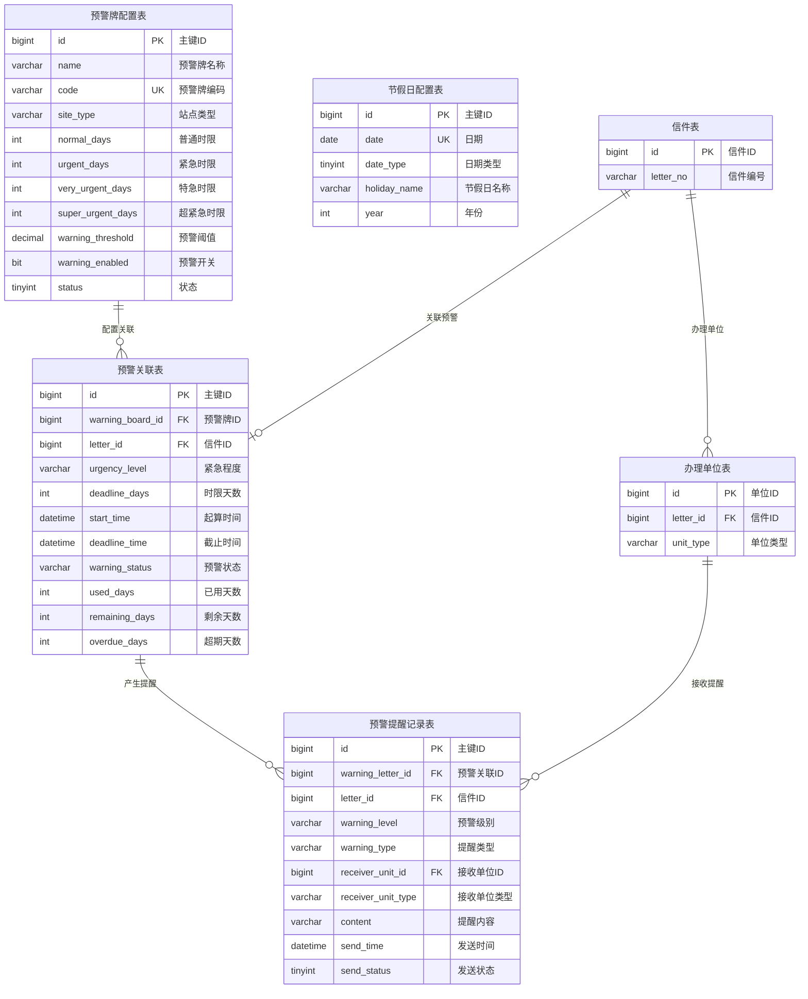

# M05 预警牌模块 - 数据库设计

## 1. 数据库表设计

### 1.1 预警牌配置表 (fz_warning_board)

用于配置预警时限，定义不同紧急程度的办理时限要求。

```sql
CREATE TABLE `fz_warning_board` (
    `id` BIGINT NOT NULL AUTO_INCREMENT COMMENT '主键ID',
    `name` VARCHAR(100) NOT NULL COMMENT '预警牌名称',
    `code` VARCHAR(50) NOT NULL COMMENT '预警牌编码（唯一）',
    `site_type` VARCHAR(50) NOT NULL COMMENT '站点类型（如：平安厅、信访室）',
    `normal_days` INT NOT NULL DEFAULT 5 COMMENT '普通工作日时限（单位：工作日）',
    `urgent_days` INT NOT NULL DEFAULT 3 COMMENT '紧急时限（单位：工作日）',
    `very_urgent_days` INT NOT NULL DEFAULT 2 COMMENT '特急时限（单位：工作日）',
    `super_urgent_days` INT NOT NULL DEFAULT 1 COMMENT '超紧急时限（单位：工作日）',
    `warning_threshold` DECIMAL(5,2) NOT NULL DEFAULT 80.00 COMMENT '预警阈值比例（百分比，如80表示时限的80%时预警）',
    `warning_enabled` BIT(1) NOT NULL DEFAULT b'1' COMMENT '预警开关（0关闭 1开启）',
    `status` TINYINT NOT NULL DEFAULT 0 COMMENT '状态（0启用 1停用）',
    `remark` VARCHAR(500) DEFAULT NULL COMMENT '备注',
    `creator` VARCHAR(64) DEFAULT '' COMMENT '创建者',
    `create_time` DATETIME NOT NULL DEFAULT CURRENT_TIMESTAMP COMMENT '创建时间',
    `updater` VARCHAR(64) DEFAULT '' COMMENT '更新者',
    `update_time` DATETIME NOT NULL DEFAULT CURRENT_TIMESTAMP ON UPDATE CURRENT_TIMESTAMP COMMENT '更新时间',
    `deleted` BIT(1) NOT NULL DEFAULT b'0' COMMENT '是否删除',
    `tenant_id` BIGINT NOT NULL DEFAULT 0 COMMENT '租户编号',
    PRIMARY KEY (`id`),
    UNIQUE KEY `uk_code` (`code`, `tenant_id`),
    KEY `idx_site_type` (`site_type`),
    KEY `idx_status` (`status`)
) ENGINE=InnoDB DEFAULT CHARSET=utf8mb4 COLLATE=utf8mb4_unicode_ci COMMENT='预警牌配置表';
```

### 1.2 预警关联表 (fz_warning_letter)

记录信件与预警牌的关联关系，以及信件的预警状态。

```sql
CREATE TABLE `fz_warning_letter` (
    `id` BIGINT NOT NULL AUTO_INCREMENT COMMENT '主键ID',
    `warning_board_id` BIGINT NOT NULL COMMENT '预警牌配置ID',
    `letter_id` BIGINT NOT NULL COMMENT '信件ID',
    `urgency_level` VARCHAR(20) NOT NULL COMMENT '紧急程度（normal-普通、urgent-紧急、very_urgent-特急、super_urgent-超紧急）',
    `deadline_days` INT NOT NULL COMMENT '时限天数（根据紧急程度确定）',
    `start_time` DATETIME NOT NULL COMMENT '时限起算时间（信件登记时间或指派时间）',
    `deadline_time` DATETIME NOT NULL COMMENT '时限截止时间（工作日计算后的截止日期）',
    `warning_status` VARCHAR(20) NOT NULL DEFAULT 'normal' COMMENT '预警状态（normal-正常、warning-预警、overdue-超期、completed-已完成）',
    `used_days` INT NOT NULL DEFAULT 0 COMMENT '已用工作日天数',
    `remaining_days` INT DEFAULT NULL COMMENT '剩余工作日天数（预警/超期时计算）',
    `overdue_days` INT DEFAULT NULL COMMENT '超期天数（超期时计算）',
    `last_check_time` DATETIME DEFAULT NULL COMMENT '最后检测时间',
    `complete_time` DATETIME DEFAULT NULL COMMENT '完成时间',
    `actual_days` INT DEFAULT NULL COMMENT '实际办理天数（完成时计算）',
    `creator` VARCHAR(64) DEFAULT '' COMMENT '创建者',
    `create_time` DATETIME NOT NULL DEFAULT CURRENT_TIMESTAMP COMMENT '创建时间',
    `updater` VARCHAR(64) DEFAULT '' COMMENT '更新者',
    `update_time` DATETIME NOT NULL DEFAULT CURRENT_TIMESTAMP ON UPDATE CURRENT_TIMESTAMP COMMENT '更新时间',
    `deleted` BIT(1) NOT NULL DEFAULT b'0' COMMENT '是否删除',
    `tenant_id` BIGINT NOT NULL DEFAULT 0 COMMENT '租户编号',
    PRIMARY KEY (`id`),
    UNIQUE KEY `uk_letter` (`letter_id`, `tenant_id`),
    KEY `idx_warning_board_id` (`warning_board_id`),
    KEY `idx_warning_status` (`warning_status`),
    KEY `idx_deadline_time` (`deadline_time`),
    KEY `idx_urgency_level` (`urgency_level`)
) ENGINE=InnoDB DEFAULT CHARSET=utf8mb4 COLLATE=utf8mb4_unicode_ci COMMENT='预警关联表';
```

### 1.3 预警提醒记录表 (fz_warning_record)

记录预警提醒的发送历史。

```sql
CREATE TABLE `fz_warning_record` (
    `id` BIGINT NOT NULL AUTO_INCREMENT COMMENT '主键ID',
    `warning_letter_id` BIGINT NOT NULL COMMENT '预警关联ID',
    `letter_id` BIGINT NOT NULL COMMENT '信件ID',
    `warning_level` VARCHAR(30) NOT NULL COMMENT '预警级别（warning-预警、overdue-超期、serious_overdue-严重超期、critical_overdue-极严重超期、major_overdue-重大超期）',
    `warning_type` VARCHAR(20) NOT NULL COMMENT '提醒类型（message-站内消息、email-邮件、sms-短信）',
    `receiver_unit_id` BIGINT NOT NULL COMMENT '接收单位ID',
    `receiver_unit_type` VARCHAR(20) NOT NULL COMMENT '接收单位类型（host-主办、supervisor-督办、receiver-接收、parent-上级）',
    `content` VARCHAR(500) NOT NULL COMMENT '提醒内容',
    `send_time` DATETIME NOT NULL COMMENT '发送时间',
    `send_status` TINYINT NOT NULL DEFAULT 0 COMMENT '发送状态（0待发送 1已发送 2发送失败）',
    `send_result` VARCHAR(200) DEFAULT NULL COMMENT '发送结果描述',
    `creator` VARCHAR(64) DEFAULT '' COMMENT '创建者',
    `create_time` DATETIME NOT NULL DEFAULT CURRENT_TIMESTAMP COMMENT '创建时间',
    `updater` VARCHAR(64) DEFAULT '' COMMENT '更新者',
    `update_time` DATETIME NOT NULL DEFAULT CURRENT_TIMESTAMP ON UPDATE CURRENT_TIMESTAMP COMMENT '更新时间',
    `deleted` BIT(1) NOT NULL DEFAULT b'0' COMMENT '是否删除',
    `tenant_id` BIGINT NOT NULL DEFAULT 0 COMMENT '租户编号',
    PRIMARY KEY (`id`),
    KEY `idx_warning_letter_id` (`warning_letter_id`),
    KEY `idx_letter_id` (`letter_id`),
    KEY `idx_send_time` (`send_time`),
    KEY `idx_send_status` (`send_status`),
    KEY `idx_receiver_unit_id` (`receiver_unit_id`)
) ENGINE=InnoDB DEFAULT CHARSET=utf8mb4 COLLATE=utf8mb4_unicode_ci COMMENT='预警提醒记录表';
```

### 1.4 节假日配置表 (fz_holiday_calendar)

用于工作日计算，排除法定节假日和特殊工作日。

```sql
CREATE TABLE `fz_holiday_calendar` (
    `id` BIGINT NOT NULL AUTO_INCREMENT COMMENT '主键ID',
    `date` DATE NOT NULL COMMENT '日期',
    `date_type` TINYINT NOT NULL COMMENT '日期类型（0-工作日、1-节假日、2-调休工作日）',
    `holiday_name` VARCHAR(50) DEFAULT NULL COMMENT '节假日名称（如：春节、国庆）',
    `remark` VARCHAR(200) DEFAULT NULL COMMENT '备注',
    `year` INT NOT NULL COMMENT '年份',
    `creator` VARCHAR(64) DEFAULT '' COMMENT '创建者',
    `create_time` DATETIME NOT NULL DEFAULT CURRENT_TIMESTAMP COMMENT '创建时间',
    `updater` VARCHAR(64) DEFAULT '' COMMENT '更新者',
    `update_time` DATETIME NOT NULL DEFAULT CURRENT_TIMESTAMP ON UPDATE CURRENT_TIMESTAMP COMMENT '更新时间',
    `deleted` BIT(1) NOT NULL DEFAULT b'0' COMMENT '是否删除',
    `tenant_id` BIGINT NOT NULL DEFAULT 0 COMMENT '租户编号',
    PRIMARY KEY (`id`),
    UNIQUE KEY `uk_date` (`date`, `tenant_id`),
    KEY `idx_year` (`year`),
    KEY `idx_date_type` (`date_type`)
) ENGINE=InnoDB DEFAULT CHARSET=utf8mb4 COLLATE=utf8mb4_unicode_ci COMMENT='节假日配置表';
```

---

## 2. ER图



---

## 3. 索引设计说明

### 3.1 主键索引
所有表均使用 BIGINT 自增主键，支持高并发写入。

### 3.2 唯一索引

| 表名 | 索引名 | 索引字段 | 说明 |
|------|--------|----------|------|
| fz_warning_board | uk_code | code + tenant_id | 预警牌编码唯一，多租户隔离 |
| fz_warning_letter | uk_letter | letter_id + tenant_id | 同一信件只能关联一个预警牌 |
| fz_holiday_calendar | uk_date | date + tenant_id | 同一日期不能重复配置 |

### 3.3 普通索引

| 表名 | 索引名 | 索引字段 | 用途说明 |
|------|--------|----------|----------|
| fz_warning_board | idx_site_type | site_type | 按站点类型查询预警牌配置 |
| fz_warning_board | idx_status | status | 查询启用状态的预警牌 |
| fz_warning_letter | idx_warning_board_id | warning_board_id | 查询某预警牌关联的所有信件 |
| fz_warning_letter | idx_warning_status | warning_status | 查询预警/超期状态的信件 |
| fz_warning_letter | idx_deadline_time | deadline_time | 查询即将到期的信件 |
| fz_warning_letter | idx_urgency_level | urgency_level | 按紧急程度查询 |
| fz_warning_record | idx_warning_letter_id | warning_letter_id | 查询某信件的预警记录 |
| fz_warning_record | idx_letter_id | letter_id | 查询某信件的预警记录 |
| fz_warning_record | idx_send_time | send_time | 查询某时间段的预警记录 |
| fz_warning_record | idx_send_status | send_status | 查询待发送/已发送的记录 |
| fz_warning_record | idx_receiver_unit_id | receiver_unit_id | 查询某单位接收的预警 |
| fz_holiday_calendar | idx_year | year | 查询某年的节假日配置 |
| fz_holiday_calendar | idx_date_type | date_type | 查询节假日/调休工作日 |

---

## 4. 字段详细说明

### 4.1 预警牌配置表字段说明

| 字段名 | 类型 | 必填 | 默认值 | 说明 |
|--------|------|------|--------|------|
| id | BIGINT | 是 | 自增 | 主键ID |
| name | VARCHAR(100) | 是 | - | 预警牌名称，如"平安厅预警牌" |
| code | VARCHAR(50) | 是 | - | 预警牌编码，唯一标识，创建后不可修改 |
| site_type | VARCHAR(50) | 是 | - | 站点类型，对应系统字典中的站点类型 |
| normal_days | INT | 是 | 5 | 普通工作日时限，单位：工作日，必须大于0 |
| urgent_days | INT | 是 | 3 | 紧急时限，单位：工作日，必须大于0且小于normal_days |
| very_urgent_days | INT | 是 | 2 | 特急时限，单位：工作日，必须大于0且小于urgent_days |
| super_urgent_days | INT | 是 | 1 | 超紧急时限，单位：工作日，必须大于0且小于very_urgent_days |
| warning_threshold | DECIMAL(5,2) | 是 | 80.00 | 预警阈值比例，如80表示达到时限80%时开始预警 |
| warning_enabled | BIT(1) | 是 | 1 | 预警开关，关闭时停止发送预警提醒 |
| status | TINYINT | 是 | 0 | 状态：0启用、1停用 |
| remark | VARCHAR(500) | 否 | NULL | 备注 |

### 4.2 预警关联表字段说明

| 字段名 | 类型 | 必填 | 默认值 | 说明 |
|--------|------|------|--------|------|
| id | BIGINT | 是 | 自增 | 主键ID |
| warning_board_id | BIGINT | 是 | - | 关联的预警牌配置ID |
| letter_id | BIGINT | 是 | - | 关联的信件ID |
| urgency_level | VARCHAR(20) | 是 | - | 紧急程度：normal、urgent、very_urgent、super_urgent |
| deadline_days | INT | 是 | - | 时限天数，根据紧急程度从预警牌配置中获取 |
| start_time | DATETIME | 是 | - | 时限起算时间，信件登记时间或指派办理单位时间 |
| deadline_time | DATETIME | 是 | - | 时限截止时间，根据工作日计算后的截止日期时间 |
| warning_status | VARCHAR(20) | 是 | normal | 预警状态：normal、warning、overdue、completed |
| used_days | INT | 是 | 0 | 已用工作日天数，从起算时间到当前的工作日数 |
| remaining_days | INT | 否 | NULL | 剩余工作日天数，预警时计算 |
| overdue_days | INT | 否 | NULL | 超期工作日天数，超期时计算 |
| last_check_time | DATETIME | 否 | NULL | 最后检测时间，定时任务检测时更新 |
| complete_time | DATETIME | 否 | NULL | 完成时间，信件办结时记录 |
| actual_days | INT | 否 | NULL | 实际办理天数，完成时计算 |

### 4.3 预警提醒记录表字段说明

| 字段名 | 类型 | 必填 | 默认值 | 说明 |
|--------|------|------|--------|------|
| id | BIGINT | 是 | 自增 | 主键ID |
| warning_letter_id | BIGINT | 是 | - | 关联的预警关联记录ID |
| letter_id | BIGINT | 是 | - | 信件ID，方便直接查询 |
| warning_level | VARCHAR(30) | 是 | - | 预警级别：warning、overdue、serious_overdue、critical_overdue、major_overdue |
| warning_type | VARCHAR(20) | 是 | - | 提醒类型：message（站内消息）、email（邮件）、sms（短信） |
| receiver_unit_id | BIGINT | 是 | - | 接收单位ID |
| receiver_unit_type | VARCHAR(20) | 是 | - | 接收单位类型：host、supervisor、receiver、parent |
| content | VARCHAR(500) | 是 | - | 提醒内容，包含信件编号、预警级别、剩余/超期天数等 |
| send_time | DATETIME | 是 | - | 发送时间 |
| send_status | TINYINT | 是 | 0 | 发送状态：0待发送、1已发送、2发送失败 |
| send_result | VARCHAR(200) | 否 | NULL | 发送结果描述，失败时记录原因 |

### 4.4 节假日配置表字段说明

| 字段名 | 类型 | 必填 | 默认值 | 说明 |
|--------|------|------|--------|------|
| id | BIGINT | 是 | 自增 | 主键ID |
| date | DATE | 是 | - | 配置的日期 |
| date_type | TINYINT | 是 | - | 日期类型：0工作日、1节假日、2调休工作日 |
| holiday_name | VARCHAR(50) | 否 | NULL | 节假日名称，如"春节"、"国庆节" |
| remark | VARCHAR(200) | 否 | NULL | 备注 |
| year | INT | 是 | - | 年份，方便按年查询 |

---

## 5. 数据关系说明

### 5.1 预警牌配置与信件关联关系
- 一个预警牌配置可以关联多个信件（一对多）
- 一个信件只能关联一个预警牌配置（一对一）
- 通过预警关联表 `fz_warning_letter` 实现关联

### 5.2 预警关联与预警记录关系
- 一个预警关联可以产生多条预警记录（一对多）
- 预警记录表记录每次预警提醒的发送历史

### 5.3 节假日配置的作用
- 节假日配置表独立存在，用于工作日计算
- 计算时限时排除节假日（date_type=1）
- 调休工作日（date_type=2）作为工作日计算

---

## 6. 数据库设计约束

### 6.1 时限配置约束
```sql
-- 业务约束：时限递增规则
-- 超紧急时限 < 特急时限 < 紧急时限 < 普通时限
-- 该约束在Service层实现，数据库层不做强制约束
```

### 6.2 预警状态流转
```
正常(normal) → 预警(warning) → 超期(overdue) → 完成(completed)
              ↘ 完成(completed)  ↘ 完成(completed)
```

---

## 变更历史

| 版本 | 日期 | 变更内容 | 变更人 |
|-----|------|---------|--------|
| v1.0 | 2026-04-13 | 初始版本，完成M05预警牌模块数据库设计 | Claude |