# M06 模板管理模块 - 实体设计

## 文档信息

**产品名称：** gaxx-pro 信件处理系统
**模块编号：** M06
**文档版本：** v1.0
**创建日期：** 2026-04-13
**状态：** 草稿

---

## 1. DO实体类设计

### 1.1 基类说明

所有DO实体类继承 `TenantBaseDO`，已包含以下基础字段：

| 字段名 | 类型 | 说明 |
|--------|------|------|
| tenantId | Long | 租户编号（多租户隔离） |
| createTime | LocalDateTime | 创建时间 |
| updateTime | LocalDateTime | 更新时间 |
| creator | String | 创建者 |
| updater | String | 更新者 |
| deleted | Boolean | 是否删除（软删除标记） |

---

### 1.2 回复模板DO (ReplyTemplateDO)

```java
package cn.iocoder.yudao.module.fz.dal.dataobject.template;

import cn.iocoder.yudao.framework.mybatis.core.dataobject.BaseDO;
import cn.iocoder.yudao.framework.tenant.core.db.TenantBaseDO;
import com.baomidou.mybatisplus.annotation.KeySequence;
import com.baomidou.mybatisplus.annotation.TableId;
import com.baomidou.mybatisplus.annotation.TableName;
import lombok.Data;
import lombok.EqualsAndHashCode;

/**
 * 回复模板 DO
 *
 * @TableName fz_reply_template
 */
@TableName("fz_reply_template")
@KeySequence("fz_reply_template_seq")
@Data
@EqualsAndHashCode(callSuper = true)
public class ReplyTemplateDO extends TenantBaseDO {

    /**
     * 主键编号
     */
    @TableId
    private Long id;

    /**
     * 模板名称
     */
    private String name;

    /**
     * 模板类型
     *
     * 枚举 {@link cn.iocoder.yudao.module.fz.enums.TemplateTypeEnum}
     */
    private Integer type;

    /**
     * 模板内容
     */
    private String content;

    /**
     * 适用单位编号列表，多个用逗号分隔
     */
    private String orgIds;

    /**
     * 适用业务类型编号列表，多个用逗号分隔
     */
    private String businessTypeIds;

    /**
     * 状态
     *
     * 枚举 {@link cn.iocoder.yudao.module.fz.enums.TemplateStatusEnum}
     */
    private Integer status;

    /**
     * 使用次数
     */
    private Integer useCount;

    /**
     * 排序
     */
    private Integer sort;

    /**
     * 备注
     */
    private String remark;
}
```

---

### 1.3 AI模板DO (AiTemplateDO)

```java
package cn.iocoder.yudao.module.fz.dal.dataobject.template;

import cn.iocoder.yudao.framework.tenant.core.db.TenantBaseDO;
import com.baomidou.mybatisplus.annotation.KeySequence;
import com.baomidou.mybatisplus.annotation.TableId;
import com.baomidou.mybatisplus.annotation.TableName;
import lombok.Data;
import lombok.EqualsAndHashCode;

import java.math.BigDecimal;

/**
 * AI模板 DO
 *
 * @TableName fz_ai_template
 */
@TableName("fz_ai_template")
@KeySequence("fz_ai_template_seq")
@Data
@EqualsAndHashCode(callSuper = true)
public class AiTemplateDO extends TenantBaseDO {

    /**
     * 主键编号
     */
    @TableId
    private Long id;

    /**
     * AI模板名称
     */
    private String name;

    /**
     * 适用信件类型编号列表，多个用逗号分隔
     */
    private String letterTypeIds;

    /**
     * 适用单位编号列表，多个用逗号分隔
     */
    private String orgIds;

    /**
     * 回复风格
     *
     * 枚举 {@link cn.iocoder.yudao.module.fz.enums.AiReplyStyleEnum}
     */
    private String replyStyle;

    /**
     * 内容要点配置
     */
    private String contentPoints;

    /**
     * 字数范围最小值
     */
    private Integer wordCountMin;

    /**
     * 字数范围最大值
     */
    private Integer wordCountMax;

    /**
     * AI最大token数
     */
    private Integer maxTokens;

    /**
     * AI温度参数（0-1）
     */
    private BigDecimal temperature;

    /**
     * 是否参考历史回复
     */
    private Boolean referenceHistory;

    /**
     * AI提示词模板
     */
    private String promptTemplate;

    /**
     * 状态
     *
     * 枚举 {@link cn.iocoder.yudao.module.fz.enums.TemplateStatusEnum}
     */
    private Integer status;

    /**
     * 使用次数
     */
    private Integer useCount;

    /**
     * 排序
     */
    private Integer sort;

    /**
     * 备注
     */
    private String remark;
}
```

---

### 1.4 快捷填入模板DO (QuickFillTemplateDO)

```java
package cn.iocoder.yudao.module.fz.dal.dataobject.template;

import cn.iocoder.yudao.framework.tenant.core.db.TenantBaseDO;
import com.baomidou.mybatisplus.annotation.KeySequence;
import com.baomidou.mybatisplus.annotation.TableId;
import com.baomidou.mybatisplus.annotation.TableName;
import lombok.Data;
import lombok.EqualsAndHashCode;

/**
 * 快捷填入模板 DO
 *
 * @TableName fz_quick_fill_template
 */
@TableName("fz_quick_fill_template")
@KeySequence("fz_quick_fill_template_seq")
@Data
@EqualsAndHashCode(callSuper = true)
public class QuickFillTemplateDO extends TenantBaseDO {

    /**
     * 主键编号
     */
    @TableId
    private Long id;

    /**
     * 模板名称
     */
    private String name;

    /**
     * 适用字段
     *
     * 枚举 {@link cn.iocoder.yudao.module.fz.enums.QuickFillTargetFieldEnum}
     */
    private String targetField;

    /**
     * 填入内容
     */
    private String fillValue;

    /**
     * 适用单位编号列表，多个用逗号分隔
     */
    private String orgIds;

    /**
     * 状态
     *
     * 枚举 {@link cn.iocoder.yudao.module.fz.enums.TemplateStatusEnum}
     */
    private Integer status;

    /**
     * 使用次数
     */
    private Integer useCount;

    /**
     * 排序
     */
    private Integer sort;

    /**
     * 备注
     */
    private String remark;
}
```

---

## 2. VO类设计

### 2.1 回复模板VO

#### 2.1.1 保存请求VO (ReplyTemplateSaveReqVO)

```java
package cn.iocoder.yudao.module.fz.controller.admin.template.reply.vo;

import io.swagger.v3.oas.annotations.media.Schema;
import lombok.Data;

import javax.validation.constraints.NotBlank;
import javax.validation.constraints.NotNull;
import javax.validation.constraints.Size;

@Schema(description = "管理后台 - 回复模板新增/修改 Request VO")
@Data
public class ReplyTemplateSaveReqVO {

    @Schema(description = "编号，修改时必填", example = "1")
    private Long id;

    @Schema(description = "模板名称", requiredMode = Schema.RequiredMode.REQUIRED, example = "标准咨询回复模板")
    @NotBlank(message = "模板名称不能为空")
    @Size(min = 1, max = 50, message = "模板名称长度必须在1-50字符之间")
    private String name;

    @Schema(description = "模板类型：1-公共模板 2-业务模板 3-单位模板", requiredMode = Schema.RequiredMode.REQUIRED, example = "1")
    @NotNull(message = "模板类型不能为空")
    private Integer type;

    @Schema(description = "模板内容", requiredMode = Schema.RequiredMode.REQUIRED, example = "尊敬的来信人：您好！")
    @NotBlank(message = "模板内容不能为空")
    @Size(min = 1, max = 10000, message = "模板内容长度必须在1-10000字符之间")
    private String content;

    @Schema(description = "适用单位编号列表，多个用逗号分隔", example = "1,2,3")
    private String orgIds;

    @Schema(description = "适用业务类型编号列表，多个用逗号分隔", example = "1,2")
    private String businessTypeIds;

    @Schema(description = "状态：0-启用 1-禁用", example = "0")
    private Integer status;

    @Schema(description = "排序", example = "0")
    private Integer sort;

    @Schema(description = "备注", example = "用于咨询类信件的通用回复")
    @Size(max = 200, message = "备注长度不能超过200字符")
    private String remark;
}
```

#### 2.1.2 分页查询请求VO (ReplyTemplatePageReqVO)

```java
package cn.iocoder.yudao.module.fz.controller.admin.template.reply.vo;

import cn.iocoder.yudao.framework.common.pojo.PageParam;
import io.swagger.v3.oas.annotations.media.Schema;
import lombok.Data;
import lombok.EqualsAndHashCode;

@Schema(description = "管理后台 - 回复模板分页 Request VO")
@Data
@EqualsAndHashCode(callSuper = true)
public class ReplyTemplatePageReqVO extends PageParam {

    @Schema(description = "模板名称，模糊匹配", example = "咨询")
    private String name;

    @Schema(description = "模板类型", example = "1")
    private Integer type;

    @Schema(description = "状态", example = "0")
    private Integer status;

    @Schema(description = "适用单位编号", example = "1")
    private Long orgId;
}
```

#### 2.1.3 响应VO (ReplyTemplateRespVO)

```java
package cn.iocoder.yudao.module.fz.controller.admin.template.reply.vo;

import io.swagger.v3.oas.annotations.media.Schema;
import lombok.Data;

import java.time.LocalDateTime;

@Schema(description = "管理后台 - 回复模板 Response VO")
@Data
public class ReplyTemplateRespVO {

    @Schema(description = "编号", example = "1")
    private Long id;

    @Schema(description = "模板名称", example = "标准咨询回复模板")
    private String name;

    @Schema(description = "模板类型：1-公共模板 2-业务模板 3-单位模板", example = "1")
    private Integer type;

    @Schema(description = "模板内容", example = "尊敬的来信人：您好！")
    private String content;

    @Schema(description = "适用单位编号列表", example = "1,2,3")
    private String orgIds;

    @Schema(description = "适用单位名称列表", example = "市局办公室,区县分局")
    private String orgNames;

    @Schema(description = "适用业务类型编号列表", example = "1,2")
    private String businessTypeIds;

    @Schema(description = "适用业务类型名称列表", example = "交通管理,户籍管理")
    private String businessTypeNames;

    @Schema(description = "状态：0-启用 1-禁用", example = "0")
    private Integer status;

    @Schema(description = "使用次数", example = "200")
    private Integer useCount;

    @Schema(description = "排序", example = "0")
    private Integer sort;

    @Schema(description = "备注", example = "用于咨询类信件的通用回复")
    private String remark;

    @Schema(description = "创建时间")
    private LocalDateTime createTime;
}
```

---

### 2.2 AI模板VO

#### 2.2.1 保存请求VO (AiTemplateSaveReqVO)

```java
package cn.iocoder.yudao.module.fz.controller.admin.template.ai.vo;

import io.swagger.v3.oas.annotations.media.Schema;
import lombok.Data;

import javax.validation.constraints.NotBlank;
import javax.validation.constraints.NotNull;
import javax.validation.constraints.Size;
import java.math.BigDecimal;

@Schema(description = "管理后台 - AI模板新增/修改 Request VO")
@Data
public class AiTemplateSaveReqVO {

    @Schema(description = "编号，修改时必填", example = "1")
    private Long id;

    @Schema(description = "AI模板名称", requiredMode = Schema.RequiredMode.REQUIRED, example = "信访类AI回复模板")
    @NotBlank(message = "AI模板名称不能为空")
    @Size(min = 1, max = 50, message = "AI模板名称长度必须在1-50字符之间")
    private String name;

    @Schema(description = "适用信件类型编号列表，多个用逗号分隔", example = "1,2")
    private String letterTypeIds;

    @Schema(description = "适用单位编号列表，多个用逗号分隔", example = "1,2")
    private String orgIds;

    @Schema(description = "回复风格：formal/casual/standard", requiredMode = Schema.RequiredMode.REQUIRED, example = "formal")
    @NotBlank(message = "回复风格不能为空")
    private String replyStyle;

    @Schema(description = "内容要点配置", example = "事实核查+处理结果+后续跟进")
    private String contentPoints;

    @Schema(description = "字数范围最小值", example = "300")
    private Integer wordCountMin;

    @Schema(description = "字数范围最大值", example = "500")
    private Integer wordCountMax;

    @Schema(description = "AI最大token数", example = "2000")
    private Integer maxTokens;

    @Schema(description = "AI温度参数（0-1）", example = "0.7")
    private BigDecimal temperature;

    @Schema(description = "是否参考历史回复", example = "true")
    private Boolean referenceHistory;

    @Schema(description = "AI提示词模板", example = "请根据信件内容生成回复...")
    private String promptTemplate;

    @Schema(description = "状态：0-启用 1-禁用", example = "0")
    private Integer status;

    @Schema(description = "排序", example = "0")
    private Integer sort;

    @Schema(description = "备注", example = "用于信访类信件的AI回复生成")
    @Size(max = 200, message = "备注长度不能超过200字符")
    private String remark;
}
```

#### 2.2.2 分页查询请求VO (AiTemplatePageReqVO)

```java
package cn.iocoder.yudao.module.fz.controller.admin.template.ai.vo;

import cn.iocoder.yudao.framework.common.pojo.PageParam;
import io.swagger.v3.oas.annotations.media.Schema;
import lombok.Data;
import lombok.EqualsAndHashCode;

@Schema(description = "管理后台 - AI模板分页 Request VO")
@Data
@EqualsAndHashCode(callSuper = true)
public class AiTemplatePageReqVO extends PageParam {

    @Schema(description = "模板名称，模糊匹配", example = "信访")
    private String name;

    @Schema(description = "回复风格", example = "formal")
    private String replyStyle;

    @Schema(description = "状态", example = "0")
    private Integer status;
}
```

#### 2.2.3 响应VO (AiTemplateRespVO)

```java
package cn.iocoder.yudao.module.fz.controller.admin.template.ai.vo;

import io.swagger.v3.oas.annotations.media.Schema;
import lombok.Data;

import java.math.BigDecimal;
import java.time.LocalDateTime;

@Schema(description = "管理后台 - AI模板 Response VO")
@Data
public class AiTemplateRespVO {

    @Schema(description = "编号", example = "1")
    private Long id;

    @Schema(description = "AI模板名称", example = "信访类AI回复模板")
    private String name;

    @Schema(description = "适用信件类型编号列表", example = "1,2")
    private String letterTypeIds;

    @Schema(description = "适用信件类型名称列表", example = "信访,咨询")
    private String letterTypeNames;

    @Schema(description = "适用单位编号列表", example = "1,2")
    private String orgIds;

    @Schema(description = "适用单位名称列表", example = "市局办公室,区县分局")
    private String orgNames;

    @Schema(description = "回复风格", example = "formal")
    private String replyStyle;

    @Schema(description = "内容要点配置", example = "事实核查+处理结果+后续跟进")
    private String contentPoints;

    @Schema(description = "字数范围最小值", example = "300")
    private Integer wordCountMin;

    @Schema(description = "字数范围最大值", example = "500")
    private Integer wordCountMax;

    @Schema(description = "AI最大token数", example = "2000")
    private Integer maxTokens;

    @Schema(description = "AI温度参数", example = "0.7")
    private BigDecimal temperature;

    @Schema(description = "是否参考历史回复", example = "true")
    private Boolean referenceHistory;

    @Schema(description = "AI提示词模板", example = "请根据信件内容生成回复...")
    private String promptTemplate;

    @Schema(description = "状态：0-启用 1-禁用", example = "0")
    private Integer status;

    @Schema(description = "使用次数", example = "50")
    private Integer useCount;

    @Schema(description = "排序", example = "0")
    private Integer sort;

    @Schema(description = "备注", example = "用于信访类信件的AI回复生成")
    private String remark;

    @Schema(description = "创建时间")
    private LocalDateTime createTime;
}
```

#### 2.2.4 预览请求VO (AiTemplatePreviewReqVO)

```java
package cn.iocoder.yudao.module.fz.controller.admin.template.ai.vo;

import io.swagger.v3.oas.annotations.media.Schema;
import lombok.Data;

import javax.validation.constraints.NotBlank;
import javax.validation.constraints.NotNull;

@Schema(description = "管理后台 - AI模板预览 Request VO")
@Data
public class AiTemplatePreviewReqVO {

    @Schema(description = "AI模板编号", requiredMode = Schema.RequiredMode.REQUIRED, example = "1")
    @NotNull(message = "AI模板编号不能为空")
    private Long id;

    @Schema(description = "示例信件内容", requiredMode = Schema.RequiredMode.REQUIRED, example = "您好，我想咨询一下户籍迁移的相关政策...")
    @NotBlank(message = "示例信件内容不能为空")
    private String sampleLetterContent;
}
```

#### 2.2.5 预览响应VO (AiTemplatePreviewRespVO)

```java
package cn.iocoder.yudao.module.fz.controller.admin.template.ai.vo;

import io.swagger.v3.oas.annotations.media.Schema;
import lombok.Data;

@Schema(description = "管理后台 - AI模板预览 Response VO")
@Data
public class AiTemplatePreviewRespVO {

    @Schema(description = "预览生成的回复内容", example = "尊敬的来信人：您好！关于您咨询的户籍迁移政策问题...")
    private String previewContent;
}
```

---

### 2.3 快捷填入模板VO

#### 2.3.1 保存请求VO (QuickFillTemplateSaveReqVO)

```java
package cn.iocoder.yudao.module.fz.controller.admin.template.quickfill.vo;

import io.swagger.v3.oas.annotations.media.Schema;
import lombok.Data;

import javax.validation.constraints.NotBlank;
import javax.validation.constraints.NotNull;
import javax.validation.constraints.Size;

@Schema(description = "管理后台 - 快捷填入模板新增/修改 Request VO")
@Data
public class QuickFillTemplateSaveReqVO {

    @Schema(description = "编号，修改时必填", example = "1")
    private Long id;

    @Schema(description = "模板名称", requiredMode = Schema.RequiredMode.REQUIRED, example = "来信类型默认")
    @NotBlank(message = "模板名称不能为空")
    @Size(min = 1, max = 50, message = "模板名称长度必须在1-50字符之间")
    private String name;

    @Schema(description = "适用字段", requiredMode = Schema.RequiredMode.REQUIRED, example = "letter_type")
    @NotBlank(message = "适用字段不能为空")
    private String targetField;

    @Schema(description = "填入内容", requiredMode = Schema.RequiredMode.REQUIRED, example = "投诉")
    @NotBlank(message = "填入内容不能为空")
    @Size(min = 1, max = 200, message = "填入内容长度必须在1-200字符之间")
    private String fillValue;

    @Schema(description = "适用单位编号列表，多个用逗号分隔", example = "1,2")
    private String orgIds;

    @Schema(description = "状态：0-启用 1-禁用", example = "0")
    private Integer status;

    @Schema(description = "排序", example = "0")
    private Integer sort;

    @Schema(description = "备注", example = "用于默认填入来信类型")
    @Size(max = 200, message = "备注长度不能超过200字符")
    private String remark;
}
```

#### 2.3.2 分页查询请求VO (QuickFillTemplatePageReqVO)

```java
package cn.iocoder.yudao.module.fz.controller.admin.template.quickfill.vo;

import cn.iocoder.yudao.framework.common.pojo.PageParam;
import io.swagger.v3.oas.annotations.media.Schema;
import lombok.Data;
import lombok.EqualsAndHashCode;

@Schema(description = "管理后台 - 快捷填入模板分页 Request VO")
@Data
@EqualsAndHashCode(callSuper = true)
public class QuickFillTemplatePageReqVO extends PageParam {

    @Schema(description = "模板名称，模糊匹配", example = "默认")
    private String name;

    @Schema(description = "适用字段", example = "letter_type")
    private String targetField;

    @Schema(description = "状态", example = "0")
    private Integer status;
}
```

#### 2.3.3 响应VO (QuickFillTemplateRespVO)

```java
package cn.iocoder.yudao.module.fz.controller.admin.template.quickfill.vo;

import io.swagger.v3.oas.annotations.media.Schema;
import lombok.Data;

import java.time.LocalDateTime;

@Schema(description = "管理后台 - 快捷填入模板 Response VO")
@Data
public class QuickFillTemplateRespVO {

    @Schema(description = "编号", example = "1")
    private Long id;

    @Schema(description = "模板名称", example = "来信类型默认")
    private String name;

    @Schema(description = "适用字段", example = "letter_type")
    private String targetField;

    @Schema(description = "适用字段名称", example = "来信类型")
    private String targetFieldName;

    @Schema(description = "填入内容", example = "投诉")
    private String fillValue;

    @Schema(description = "适用单位编号列表", example = "1,2")
    private String orgIds;

    @Schema(description = "适用单位名称列表", example = "市局办公室,区县分局")
    private String orgNames;

    @Schema(description = "状态：0-启用 1-禁用", example = "0")
    private Integer status;

    @Schema(description = "使用次数", example = "100")
    private Integer useCount;

    @Schema(description = "排序", example = "0")
    private Integer sort;

    @Schema(description = "备注", example = "用于默认填入来信类型")
    private String remark;

    @Schema(description = "创建时间")
    private LocalDateTime createTime;
}
```

---

## 3. 枚举类设计

### 3.1 模板类型枚举 (TemplateTypeEnum)

```java
package cn.iocoder.yudao.module.fz.enums;

import cn.iocoder.yudao.framework.common.core.ArrayValuable;
import lombok.AllArgsConstructor;
import lombok.Getter;

import java.util.Arrays;

/**
 * 模板类型枚举
 */
@Getter
@AllArgsConstructor
public enum TemplateTypeEnum implements ArrayValuable<Integer> {

    PUBLIC(1, "公共模板"),
    BUSINESS(2, "业务模板"),
    ORG(3, "单位模板");

    public static final int[] ARRAYS = Arrays.stream(values()).mapToInt(TemplateTypeEnum::getType).toArray();

    /**
     * 类型值
     */
    private final Integer type;
    /**
     * 类型名称
     */
    private final String name;

    @Override
    public Integer[] array() {
        return Arrays.stream(values()).map(TemplateTypeEnum::getType).toArray(Integer[]::new);
    }

    public static TemplateTypeEnum valueOf(Integer type) {
        return Arrays.stream(values())
                .filter(e -> e.getType().equals(type))
                .findFirst()
                .orElse(null);
    }
}
```

### 3.2 模板状态枚举 (TemplateStatusEnum)

```java
package cn.iocoder.yudao.module.fz.enums;

import cn.iocoder.yudao.framework.common.core.ArrayValuable;
import lombok.AllArgsConstructor;
import lombok.Getter;

import java.util.Arrays;

/**
 * 模板状态枚举
 */
@Getter
@AllArgsConstructor
public enum TemplateStatusEnum implements ArrayValuable<Integer> {

    ENABLED(0, "启用"),
    DISABLED(1, "禁用");

    public static final int[] ARRAYS = Arrays.stream(values()).mapToInt(TemplateStatusEnum::getStatus).toArray();

    /**
     * 状态值
     */
    private final Integer status;
    /**
     * 状态名称
     */
    private final String name;

    @Override
    public Integer[] array() {
        return Arrays.stream(values()).map(TemplateStatusEnum::getStatus).toArray(Integer[]::new);
    }

    public static TemplateStatusEnum valueOf(Integer status) {
        return Arrays.stream(values())
                .filter(e -> e.getStatus().equals(status))
                .findFirst()
                .orElse(null);
    }
}
```

### 3.3 AI回复风格枚举 (AiReplyStyleEnum)

```java
package cn.iocoder.yudao.module.fz.enums;

import cn.iocoder.yudao.framework.common.core.ArrayValuable;
import lombok.AllArgsConstructor;
import lombok.Getter;

import java.util.Arrays;

/**
 * AI回复风格枚举
 */
@Getter
@AllArgsConstructor
public enum AiReplyStyleEnum implements ArrayValuable<String> {

    FORMAL("formal", "正式公文"),
    CASUAL("casual", "亲切回复"),
    STANDARD("standard", "标准回复");

    public static final String[] ARRAYS = Arrays.stream(values()).map(AiReplyStyleEnum::getStyle).toArray(String[]::new);

    /**
     * 风格值
     */
    private final String style;
    /**
     * 风格名称
     */
    private final String name;

    @Override
    public String[] array() {
        return ARRAYS;
    }

    public static AiReplyStyleEnum valueOf(String style) {
        return Arrays.stream(values())
                .filter(e -> e.getStyle().equals(style))
                .findFirst()
                .orElse(null);
    }
}
```

### 3.4 快捷填入适用字段枚举 (QuickFillTargetFieldEnum)

```java
package cn.iocoder.yudao.module.fz.enums;

import cn.iocoder.yudao.framework.common.core.ArrayValuable;
import lombok.AllArgsConstructor;
import lombok.Getter;

import java.util.Arrays;

/**
 * 快捷填入适用字段枚举
 */
@Getter
@AllArgsConstructor
public enum QuickFillTargetFieldEnum implements ArrayValuable<String> {

    LETTER_TYPE("letter_type", "来信类型"),
    BUSINESS_TYPE("business_type", "业务类型"),
    CASE_DIRECTION("case_direction", "案事件指向"),
    ADDRESS("address", "归属地址"),
    CUSTOM_TAG("custom_tag", "自定标签"),
    REMARK("remark", "留言备注");

    public static final String[] ARRAYS = Arrays.stream(values()).map(QuickFillTargetFieldEnum::getField).toArray(String[]::new);

    /**
     * 字段值
     */
    private final String field;
    /**
     * 字段名称
     */
    private final String name;

    @Override
    public String[] array() {
        return ARRAYS;
    }

    public static QuickFillTargetFieldEnum valueOf(String field) {
        return Arrays.stream(values())
                .filter(e -> e.getField().equals(field))
                .findFirst()
                .orElse(null);
    }
}
```

---

## 4. 类图

```mermaid
classDiagram
    class TenantBaseDO {
        +Long tenantId
        +LocalDateTime createTime
        +LocalDateTime updateTime
        +String creator
        +String updater
        +Boolean deleted
    }

    class ReplyTemplateDO {
        +Long id
        +String name
        +Integer type
        +String content
        +String orgIds
        +String businessTypeIds
        +Integer status
        +Integer useCount
        +Integer sort
        +String remark
    }

    class AiTemplateDO {
        +Long id
        +String name
        +String letterTypeIds
        +String orgIds
        +String replyStyle
        +String contentPoints
        +Integer wordCountMin
        +Integer wordCountMax
        +Integer maxTokens
        +BigDecimal temperature
        +Boolean referenceHistory
        +String promptTemplate
        +Integer status
        +Integer useCount
        +Integer sort
        +String remark
    }

    class QuickFillTemplateDO {
        +Long id
        +String name
        +String targetField
        +String fillValue
        +String orgIds
        +Integer status
        +Integer useCount
        +Integer sort
        +String remark
    }

    TenantBaseDO <|-- ReplyTemplateDO
    TenantBaseDO <|-- AiTemplateDO
    TenantBaseDO <|-- QuickFillTemplateDO

    class ReplyTemplateSaveReqVO {
        +Long id
        +String name
        +Integer type
        +String content
        +String orgIds
        +String businessTypeIds
        +Integer status
        +Integer sort
        +String remark
    }

    class ReplyTemplatePageReqVO {
        +String name
        +Integer type
        +Integer status
        +Long orgId
    }

    class ReplyTemplateRespVO {
        +Long id
        +String name
        +Integer type
        +String content
        +String orgIds
        +String orgNames
        +String businessTypeIds
        +String businessTypeNames
        +Integer status
        +Integer useCount
        +Integer sort
        +String remark
        +LocalDateTime createTime
    }

    class AiTemplateSaveReqVO {
        +Long id
        +String name
        +String letterTypeIds
        +String orgIds
        +String replyStyle
        +String contentPoints
        +Integer wordCountMin
        +Integer wordCountMax
        +Integer maxTokens
        +BigDecimal temperature
        +Boolean referenceHistory
        +String promptTemplate
        +Integer status
        +Integer sort
        +String remark
    }

    class AiTemplatePageReqVO {
        +String name
        +String replyStyle
        +Integer status
    }

    class AiTemplateRespVO {
        +Long id
        +String name
        +String letterTypeIds
        +String letterTypeNames
        +String orgIds
        +String orgNames
        +String replyStyle
        +String contentPoints
        +Integer wordCountMin
        +Integer wordCountMax
        +Integer maxTokens
        +BigDecimal temperature
        +Boolean referenceHistory
        +String promptTemplate
        +Integer status
        +Integer useCount
        +Integer sort
        +String remark
        +LocalDateTime createTime
    }

    class QuickFillTemplateSaveReqVO {
        +Long id
        +String name
        +String targetField
        +String fillValue
        +String orgIds
        +Integer status
        +Integer sort
        +String remark
    }

    class QuickFillTemplatePageReqVO {
        +String name
        +String targetField
        +Integer status
    }

    class QuickFillTemplateRespVO {
        +Long id
        +String name
        +String targetField
        +String targetFieldName
        +String fillValue
        +String orgIds
        +String orgNames
        +Integer status
        +Integer useCount
        +Integer sort
        +String remark
        +LocalDateTime createTime
    }

    class TemplateTypeEnum {
        +PUBLIC <<1>>
        +BUSINESS <<2>>
        +ORG <<3>>
    }

    class TemplateStatusEnum {
        +ENABLED <<0>>
        +DISABLED <<1>>
    }

    class AiReplyStyleEnum {
        +FORMAL <<formal>>
        +CASUAL <<casual>>
        +STANDARD <<standard>>
    }

    class QuickFillTargetFieldEnum {
        +LETTER_TYPE <<letter_type>>
        +BUSINESS_TYPE <<business_type>>
        +CASE_DIRECTION <<case_direction>>
        +ADDRESS <<address>>
        +CUSTOM_TAG <<custom_tag>>
        +REMARK <<remark>>
    }
```



---

## 5. 包结构

```
cn.iocoder.yudao.module.fz
├── controller
│   └── admin
│       └── template
│           ├── reply
│           │   ├── ReplyTemplateController.java
│           │   └── vo
│           │       ├── ReplyTemplateSaveReqVO.java
│           │       ├── ReplyTemplatePageReqVO.java
│           │       └── ReplyTemplateRespVO.java
│           ├── ai
│           │   ├── AiTemplateController.java
│           │   └── vo
│           │       ├── AiTemplateSaveReqVO.java
│           │       ├── AiTemplatePageReqVO.java
│           │       ├── AiTemplateRespVO.java
│           │       ├── AiTemplatePreviewReqVO.java
│           │       └── AiTemplatePreviewRespVO.java
│           └── quickfill
│               ├── QuickFillTemplateController.java
│               └── vo
│                   ├── QuickFillTemplateSaveReqVO.java
│                   ├── QuickFillTemplatePageReqVO.java
│                   └── QuickFillTemplateRespVO.java
├── dal
│   └── dataobject
│       └── template
│           ├── ReplyTemplateDO.java
│           ├── AiTemplateDO.java
│           └── QuickFillTemplateDO.java
│   └── mysql
│       └── template
│           ├── ReplyTemplateMapper.java
│           ├── AiTemplateMapper.java
│           └── QuickFillTemplateMapper.java
├── service
│   └── template
│       ├── reply
│       │   ├── ReplyTemplateService.java
│       │   └── ReplyTemplateServiceImpl.java
│       ├── ai
│       │   ├── AiTemplateService.java
│       │   └── AiTemplateServiceImpl.java
│       └── quickfill
│           ├── QuickFillTemplateService.java
│           └── QuickFillTemplateServiceImpl.java
├── enums
│   ├── TemplateTypeEnum.java
│   ├── TemplateStatusEnum.java
│   ├── AiReplyStyleEnum.java
│   └── QuickFillTargetFieldEnum.java
└── convert
    └── template
        ├── ReplyTemplateConvert.java
        ├── AiTemplateConvert.java
        └── QuickFillTemplateConvert.java
```

---

## 变更历史

| 版本 | 日期 | 变更内容 | 变更人 |
|-----|------|---------|--------|
| v1.0 | 2026-04-13 | 初始版本，包含DO、VO、枚举类设计 | Claude Agent |