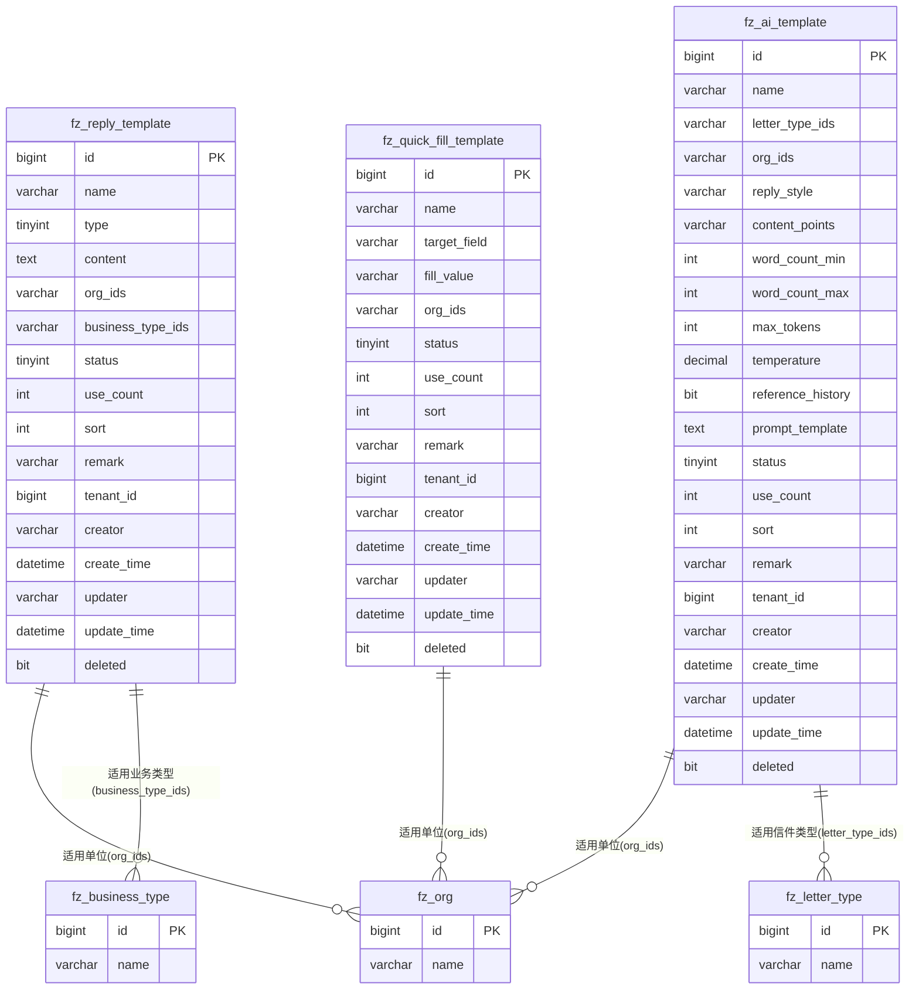

# M06 模板管理模块 - 数据库设计

## 文档信息

**产品名称：** gaxx-pro 信件处理系统
**模块编号：** M06
**文档版本：** v1.0
**创建日期：** 2026-04-13
**状态：** 草稿

---

## 1. 数据库表设计

### 1.1 表清单

| 序号 | 表名 | 中文名称 | 说明 |
|------|------|----------|------|
| 1 | fz_reply_template | 回复模板表 | 存储标准回复模板信息 |
| 2 | fz_ai_template | AI模板表 | 存储AI自动生成回复的配置模板 |
| 3 | fz_quick_fill_template | 快捷填入模板表 | 存储快捷填写信件字段的模板 |

---

## 2. 表结构设计

### 2.1 回复模板表 (fz_reply_template)

用于存储标准回复模板，办理单位在回复信件时可引用模板内容。

```sql
CREATE TABLE `fz_reply_template` (
  `id` bigint NOT NULL AUTO_INCREMENT COMMENT '主键编号',
  `name` varchar(50) NOT NULL COMMENT '模板名称',
  `type` tinyint NOT NULL DEFAULT 1 COMMENT '模板类型：1-公共模板 2-业务模板 3-单位模板',
  `content` text NOT NULL COMMENT '模板内容',
  `org_ids` varchar(1000) DEFAULT NULL COMMENT '适用单位编号列表，多个用逗号分隔，空表示全部单位',
  `business_type_ids` varchar(1000) DEFAULT NULL COMMENT '适用业务类型编号列表，多个用逗号分隔',
  `status` tinyint NOT NULL DEFAULT 0 COMMENT '状态：0-启用 1-禁用',
  `use_count` int NOT NULL DEFAULT 0 COMMENT '使用次数',
  `sort` int NOT NULL DEFAULT 0 COMMENT '排序',
  `remark` varchar(200) DEFAULT NULL COMMENT '备注',
  `tenant_id` bigint NOT NULL DEFAULT 0 COMMENT '租户编号',
  `creator` varchar(64) DEFAULT NULL COMMENT '创建者',
  `create_time` datetime NOT NULL DEFAULT CURRENT_TIMESTAMP COMMENT '创建时间',
  `updater` varchar(64) DEFAULT NULL COMMENT '更新者',
  `update_time` datetime NOT NULL DEFAULT CURRENT_TIMESTAMP ON UPDATE CURRENT_TIMESTAMP COMMENT '更新时间',
  `deleted` bit(1) NOT NULL DEFAULT b'0' COMMENT '是否删除',
  PRIMARY KEY (`id`),
  KEY `idx_tenant_id` (`tenant_id`),
  KEY `idx_name` (`name`),
  KEY `idx_type` (`type`),
  KEY `idx_status` (`status`)
) ENGINE=InnoDB DEFAULT CHARSET=utf8mb4 COLLATE=utf8mb4_unicode_ci COMMENT='回复模板表';
```

#### 字段说明

| 字段名 | 类型 | 必填 | 默认值 | 说明 |
|--------|------|------|--------|------|
| id | bigint | 是 | 自增 | 主键编号 |
| name | varchar(50) | 是 | - | 模板名称，同一租户下不可重复 |
| type | tinyint | 是 | 1 | 模板类型：1-公共模板（全部单位可用），2-业务模板（特定业务类型可用），3-单位模板（特定单位可用） |
| content | text | 是 | - | 模板内容，支持占位符如 {来信人姓名}、{信件编号}、{来信时间} 等 |
| org_ids | varchar(1000) | 否 | NULL | 适用单位编号列表，多个用逗号分隔；type=3时有效，空表示全部单位可用 |
| business_type_ids | varchar(1000) | 否 | NULL | 适用业务类型编号列表，多个用逗号分隔；type=2时有效 |
| status | tinyint | 是 | 0 | 状态：0-启用，1-禁用 |
| use_count | int | 是 | 0 | 使用次数统计，每次使用模板生成回复时累加 |
| sort | int | 是 | 0 | 排序值，用于列表显示顺序 |
| remark | varchar(200) | 否 | NULL | 备注信息 |
| tenant_id | bigint | 是 | 0 | 租户编号（多租户隔离） |
| creator | varchar(64) | 否 | NULL | 创建者用户编号 |
| create_time | datetime | 是 | CURRENT_TIMESTAMP | 创建时间 |
| updater | varchar(64) | 否 | NULL | 更新者用户编号 |
| update_time | datetime | 是 | CURRENT_TIMESTAMP | 更新时间 |
| deleted | bit(1) | 是 | 0 | 是否删除（软删除标记） |

---

### 2.2 AI模板表 (fz_ai_template)

用于存储AI自动生成回复的配置模板，包含AI参数配置。

```sql
CREATE TABLE `fz_ai_template` (
  `id` bigint NOT NULL AUTO_INCREMENT COMMENT '主键编号',
  `name` varchar(50) NOT NULL COMMENT 'AI模板名称',
  `letter_type_ids` varchar(1000) DEFAULT NULL COMMENT '适用信件类型编号列表，多个用逗号分隔',
  `org_ids` varchar(1000) DEFAULT NULL COMMENT '适用单位编号列表，多个用逗号分隔，空表示全部单位',
  `reply_style` varchar(50) NOT NULL COMMENT '回复风格：formal-正式公文 casual-亲切回复 standard-标准回复',
  `content_points` varchar(500) DEFAULT NULL COMMENT '内容要点配置，如：事实核查+处理结果+后续跟进',
  `word_count_min` int DEFAULT 300 COMMENT '字数范围最小值',
  `word_count_max` int DEFAULT 500 COMMENT '字数范围最大值',
  `max_tokens` int DEFAULT 2000 COMMENT 'AI最大token数',
  `temperature` decimal(3,2) DEFAULT 0.70 COMMENT 'AI温度参数（0-1）',
  `reference_history` bit(1) DEFAULT b'1' COMMENT '是否参考历史回复：0-否 1-是',
  `prompt_template` text DEFAULT NULL COMMENT 'AI提示词模板',
  `status` tinyint NOT NULL DEFAULT 0 COMMENT '状态：0-启用 1-禁用',
  `use_count` int NOT NULL DEFAULT 0 COMMENT '使用次数',
  `sort` int NOT NULL DEFAULT 0 COMMENT '排序',
  `remark` varchar(200) DEFAULT NULL COMMENT '备注',
  `tenant_id` bigint NOT NULL DEFAULT 0 COMMENT '租户编号',
  `creator` varchar(64) DEFAULT NULL COMMENT '创建者',
  `create_time` datetime NOT NULL DEFAULT CURRENT_TIMESTAMP COMMENT '创建时间',
  `updater` varchar(64) DEFAULT NULL COMMENT '更新者',
  `update_time` datetime NOT NULL DEFAULT CURRENT_TIMESTAMP ON UPDATE CURRENT_TIMESTAMP COMMENT '更新时间',
  `deleted` bit(1) NOT NULL DEFAULT b'0' COMMENT '是否删除',
  PRIMARY KEY (`id`),
  KEY `idx_tenant_id` (`tenant_id`),
  KEY `idx_name` (`name`),
  KEY `idx_status` (`status`)
) ENGINE=InnoDB DEFAULT CHARSET=utf8mb4 COLLATE=utf8mb4_unicode_ci COMMENT='AI模板表';
```

#### 字段说明

| 字段名 | 类型 | 必填 | 默认值 | 说明 |
|--------|------|------|--------|------|
| id | bigint | 是 | 自增 | 主键编号 |
| name | varchar(50) | 是 | - | AI模板名称，同一租户下不可重复 |
| letter_type_ids | varchar(1000) | 否 | NULL | 适用信件类型编号列表，多个用逗号分隔；空表示全部信件类型 |
| org_ids | varchar(1000) | 否 | NULL | 适用单位编号列表，多个用逗号分隔；空表示全部单位可用 |
| reply_style | varchar(50) | 是 | - | 回复风格：formal-正式公文，casual-亲切回复，standard-标准回复 |
| content_points | varchar(500) | 否 | NULL | 内容要点配置，描述回复应包含的内容要点 |
| word_count_min | int | 否 | 300 | 字数范围最小值 |
| word_count_max | int | 否 | 500 | 字数范围最大值 |
| max_tokens | int | 否 | 2000 | AI模型最大token数限制 |
| temperature | decimal(3,2) | 否 | 0.70 | AI温度参数，控制生成内容的随机性（0-1） |
| reference_history | bit(1) | 否 | 1 | 是否参考历史回复记录生成内容 |
| prompt_template | text | 否 | NULL | AI提示词模板，用于定制AI生成逻辑 |
| status | tinyint | 是 | 0 | 状态：0-启用，1-禁用 |
| use_count | int | 是 | 0 | 使用次数统计 |
| sort | int | 是 | 0 | 排序值 |
| remark | varchar(200) | 否 | NULL | 备注信息 |
| tenant_id | bigint | 是 | 0 | 租户编号 |
| creator | varchar(64) | 否 | NULL | 创建者用户编号 |
| create_time | datetime | 是 | CURRENT_TIMESTAMP | 创建时间 |
| updater | varchar(64) | 否 | NULL | 更新者用户编号 |
| update_time | datetime | 是 | CURRENT_TIMESTAMP | 更新时间 |
| deleted | bit(1) | 是 | 0 | 是否删除 |

---

### 2.3 快捷填入模板表 (fz_quick_fill_template)

用于存储快捷填写信件字段的模板配置。

```sql
CREATE TABLE `fz_quick_fill_template` (
  `id` bigint NOT NULL AUTO_INCREMENT COMMENT '主键编号',
  `name` varchar(50) NOT NULL COMMENT '模板名称',
  `target_field` varchar(50) NOT NULL COMMENT '适用字段：letter_type-来信类型 business_type-业务类型 case_direction-案事件指向 address-归属地址 custom_tag-自定标签 remark-留言备注',
  `fill_value` varchar(200) NOT NULL COMMENT '填入内容',
  `org_ids` varchar(1000) DEFAULT NULL COMMENT '适用单位编号列表，多个用逗号分隔，空表示全部单位',
  `status` tinyint NOT NULL DEFAULT 0 COMMENT '状态：0-启用 1-禁用',
  `use_count` int NOT NULL DEFAULT 0 COMMENT '使用次数',
  `sort` int NOT NULL DEFAULT 0 COMMENT '排序',
  `remark` varchar(200) DEFAULT NULL COMMENT '备注',
  `tenant_id` bigint NOT NULL DEFAULT 0 COMMENT '租户编号',
  `creator` varchar(64) DEFAULT NULL COMMENT '创建者',
  `create_time` datetime NOT NULL DEFAULT CURRENT_TIMESTAMP COMMENT '创建时间',
  `updater` varchar(64) DEFAULT NULL COMMENT '更新者',
  `update_time` datetime NOT NULL DEFAULT CURRENT_TIMESTAMP ON UPDATE CURRENT_TIMESTAMP COMMENT '更新时间',
  `deleted` bit(1) NOT NULL DEFAULT b'0' COMMENT '是否删除',
  PRIMARY KEY (`id`),
  KEY `idx_tenant_id` (`tenant_id`),
  KEY `idx_name` (`name`),
  KEY `idx_target_field` (`target_field`),
  KEY `idx_status` (`status`)
) ENGINE=InnoDB DEFAULT CHARSET=utf8mb4 COLLATE=utf8mb4_unicode_ci COMMENT='快捷填入模板表';
```

#### 字段说明

| 字段名 | 类型 | 必填 | 默认值 | 说明 |
|--------|------|------|--------|------|
| id | bigint | 是 | 自增 | 主键编号 |
| name | varchar(50) | 是 | - | 模板名称，同一租户+适用字段下不可重复 |
| target_field | varchar(50) | 是 | - | 适用字段类型，见枚举说明 |
| fill_value | varchar(200) | 是 | - | 填入内容，根据target_field存储对应的值或编号 |
| org_ids | varchar(1000) | 否 | NULL | 适用单位编号列表；空表示全部单位可用 |
| status | tinyint | 是 | 0 | 状态：0-启用，1-禁用 |
| use_count | int | 是 | 0 | 使用次数统计 |
| sort | int | 是 | 0 | 排序值 |
| remark | varchar(200) | 否 | NULL | 备注信息 |
| tenant_id | bigint | 是 | 0 | 租户编号 |
| creator | varchar(64) | 否 | NULL | 创建者用户编号 |
| create_time | datetime | 是 | CURRENT_TIMESTAMP | 创建时间 |
| updater | varchar(64) | 否 | NULL | 更新者用户编号 |
| update_time | datetime | 是 | CURRENT_TIMESTAMP | 更新时间 |
| deleted | bit(1) | 是 | 0 | 是否删除 |

---

## 3. ER图



---

## 4. 索引设计

### 4.1 回复模板表索引

| 索引名 | 索引字段 | 索引类型 | 说明 |
|--------|----------|----------|------|
| PRIMARY | id | 主键索引 | 主键自增 |
| idx_tenant_id | tenant_id | 普通索引 | 多租户查询优化 |
| idx_name | name | 普通索引 | 名称查询优化 |
| idx_type | type | 普通索引 | 类型筛选优化 |
| idx_status | status | 普通索引 | 状态筛选优化 |

### 4.2 AI模板表索引

| 索引名 | 索引字段 | 索引类型 | 说明 |
|--------|----------|----------|------|
| PRIMARY | id | 主键索引 | 主键自增 |
| idx_tenant_id | tenant_id | 普通索引 | 多租户查询优化 |
| idx_name | name | 普通索引 | 名称查询优化 |
| idx_status | status | 普通索引 | 状态筛选优化 |

### 4.3 快捷填入模板表索引

| 索引名 | 索引字段 | 索引类型 | 说明 |
|--------|----------|----------|------|
| PRIMARY | id | 主键索引 | 主键自增 |
| idx_tenant_id | tenant_id | 普通索引 | 多租户查询优化 |
| idx_name | name | 普通索引 | 名称查询优化 |
| idx_target_field | target_field | 普通索引 | 适用字段筛选优化 |
| idx_status | status | 普通索引 | 状态筛选优化 |

---

## 5. 枚举值定义

### 5.1 模板类型 (TemplateTypeEnum)

| 值 | 名称 | 说明 |
|----|------|------|
| 1 | PUBLIC | 公共模板，全部单位可用 |
| 2 | BUSINESS | 业务模板，特定业务类型可用 |
| 3 | ORG | 单位模板，特定单位可用 |

### 5.2 模板状态 (TemplateStatusEnum)

| 值 | 名称 | 说明 |
|----|------|------|
| 0 | ENABLED | 启用状态 |
| 1 | DISABLED | 禁用状态 |

### 5.3 AI回复风格 (AiReplyStyleEnum)

| 值 | 名称 | 说明 |
|----|------|------|
| formal | 正式公文 | 正式、规范的公文风格 |
| casual | 亲切回复 | 亲切、友好的回复风格 |
| standard | 标准回复 | 标准的回复风格 |

### 5.4 快捷填入适用字段 (QuickFillTargetFieldEnum)

| 值 | 名称 | 说明 |
|----|------|------|
| letter_type | 来信类型 | 信件来信类型字段 |
| business_type | 业务类型 | 信件业务类型字段 |
| case_direction | 案事件指向 | 信件案事件指向字段 |
| address | 归属地址 | 信件归属地址字段 |
| custom_tag | 自定标签 | 信件自定义标签 |
| remark | 留言备注 | 信件备注字段 |

---

## 6. 数据约束说明

### 6.1 回复模板表约束

- `name`：同一租户下模板名称不可重复
- `content`：长度限制为1-10000字符
- `type`：当type=2（业务模板）时，`business_type_ids`应有效；当type=3（单位模板）时，`org_ids`应有效

### 6.2 AI模板表约束

- `name`：同一租户下AI模板名称不可重复
- `reply_style`：必填，需为有效枚举值
- `temperature`：范围为0.00-1.00
- `word_count_min`/`word_count_max`：最小值应小于最大值

### 6.3 快捷填入模板表约束

- `name`：同一租户+target_field组合下名称不可重复
- `target_field`：必填，需为有效枚举值
- `fill_value`：根据target_field类型存储对应的值（编号或文本）

---

## 变更历史

| 版本 | 日期 | 变更内容 | 变更人 |
|-----|------|---------|--------|
| v1.0 | 2026-04-13 | 初始版本，包含回复模板表、AI模板表、快捷填入模板表设计 | Claude Agent |