# M07 个人中心模块 - 实体设计

## 文档信息

**产品名称：** gaxx-pro 信件处理系统
**模块名称：** M07 个人中心模块
**文档版本：** v1.0
**创建日期：** 2026-04-13
**状态：** 设计稿

---

## 1. 实体类总览

### 1.1 实体类清单

| 序号 | 类名 | 类型 | 所属包 | 说明 |
|------|------|------|--------|------|
| 1 | PersonalFavoriteDO | DO实体 | dal.dataobject.personal | 收藏记录实体 |
| 2 | PersonalReadRecordDO | DO实体 | dal.dataobject.personal | 已读记录实体 |
| 3 | FavoriteCreateReqVO | 请求VO | controller.admin.personal.vo | 收藏创建请求 |
| 4 | FavoritePageReqVO | 请求VO | controller.admin.personal.vo | 收藏列表分页请求 |
| 5 | FavoriteRespVO | 响应VO | controller.admin.personal.vo | 收藏信件响应 |
| 6 | FavoriteCheckRespVO | 响应VO | controller.admin.personal.vo | 收藏状态检查响应 |
| 7 | ReadMarkReqVO | 请求VO | controller.admin.personal.vo | 已读标记请求 |
| 8 | ReadMarkListReqVO | 请求VO | controller.admin.personal.vo | 批量已读标记请求 |
| 9 | ReadMarkResultRespVO | 响应VO | controller.admin.personal.vo | 批量已读标记结果响应 |
| 10 | ReadCheckRespVO | 响应VO | controller.admin.personal.vo | 已读状态检查响应 |
| 11 | ReadCheckListRespVO | 响应VO | controller.admin.personal.vo | 批量已读状态检查响应 |
| 12 | FavoriteStatusEnum | 枚举 | enums.personal | 收藏状态枚举 |
| 13 | ReadStatusEnum | 枚举 | enums.personal | 已读状态枚举 |

---

## 2. DO实体类设计

### 2.1 PersonalFavoriteDO - 收藏记录实体

继承TenantBaseDO，包含租户隔离和基础审计字段。

```java
package cn.iocoder.yudao.module.fz.dal.dataobject.personal;

import cn.iocoder.yudao.framework.mybatis.core.dataobject.TenantBaseDO;
import com.baomidou.mybatisplus.annotation.KeySequence;
import com.baomidou.mybatisplus.annotation.TableName;
import lombok.*;

import java.time.LocalDateTime;

/**
 * 用户收藏记录 DO
 *
 * @TableName fz_personal_favorite
 */
@TableName("fz_personal_favorite")
@KeySequence("fz_personal_favorite_seq")
@Data
@EqualsAndHashCode(callSuper = true)
@Builder
@NoArgsConstructor
@AllArgsConstructor
public class PersonalFavoriteDO extends TenantBaseDO {

    /**
     * 主键ID
     */
    private Long id;

    /**
     * 用户ID
     *
     * 关联 system_user 表的 id 字段
     */
    private Long userId;

    /**
     * 信件ID
     *
     * 关联 fz_letter 表的 id 字段
     */
    private Long letterId;

    /**
     * 信件编号
     *
     * 冗余存储，便于查询展示
     */
    private String letterNo;

    /**
     * 收藏时间
     *
     * 最后一次收藏操作的时间
     */
    private LocalDateTime favoriteTime;

    /**
     * 收藏状态
     *
     * 1=正常，2=已取消
     * 枚举 {@link cn.iocoder.yudao.module.fz.enums.personal.FavoriteStatusEnum}
     */
    private Integer favoriteStatus;

}
```

### 2.2 PersonalReadRecordDO - 已读记录实体

继承TenantBaseDO，包含租户隔离和基础审计字段。

```java
package cn.iocoder.yudao.module.fz.dal.dataobject.personal;

import cn.iocoder.yudao.framework.mybatis.core.dataobject.TenantBaseDO;
import com.baomidou.mybatisplus.annotation.KeySequence;
import com.baomidou.mybatisplus.annotation.TableName;
import lombok.*;

import java.time.LocalDateTime;

/**
 * 用户已读记录 DO
 *
 * @TableName fz_personal_read_record
 */
@TableName("fz_personal_read_record")
@KeySequence("fz_personal_read_record_seq")
@Data
@EqualsAndHashCode(callSuper = true)
@Builder
@NoArgsConstructor
@AllArgsConstructor
public class PersonalReadRecordDO extends TenantBaseDO {

    /**
     * 主键ID
     */
    private Long id;

    /**
     * 用户ID
     *
     * 关联 system_user 表的 id 字段
     */
    private Long userId;

    /**
     * 信件ID
     *
     * 关联 fz_letter 表的 id 字段
     */
    private Long letterId;

    /**
     * 信件编号
     *
     * 冗余存储，便于查询展示
     */
    private String letterNo;

    /**
     * 已读状态
     *
     * 0=未读，1=已读
     * 枚举 {@link cn.iocoder.yudao.module.fz.enums.personal.ReadStatusEnum}
     */
    private Integer readStatus;

    /**
     * 首次阅读时间
     *
     * 用户首次打开信件时记录
     */
    private LocalDateTime firstReadTime;

    /**
     * 最后阅读时间
     *
     * 每次打开信件时更新
     */
    private LocalDateTime lastReadTime;

}
```

---

## 3. VO类设计

### 3.1 收藏相关VO

#### 3.1.1 FavoriteCreateReqVO - 收藏创建请求

```java
package cn.iocoder.yudao.module.fz.controller.admin.personal.vo;

import io.swagger.v3.oas.annotations.media.Schema;
import lombok.Data;

import javax.validation.constraints.NotNull;

@Schema(description = "管理后台 - 收藏信件创建 Request VO")
@Data
public class FavoriteCreateReqVO {

    @Schema(description = "信件ID", requiredMode = Schema.RequiredMode.REQUIRED, example = "1001")
    @NotNull(message = "信件ID不能为空")
    private Long letterId;

    @Schema(description = "信件编号", example = "TX20260001")
    private String letterNo;

}
```

#### 3.1.2 FavoritePageReqVO - 收藏列表分页请求

```java
package cn.iocoder.yudao.module.fz.controller.admin.personal.vo;

import cn.iocoder.yudao.framework.common.pojo.PageParam;
import io.swagger.v3.oas.annotations.media.Schema;
import lombok.Data;
import lombok.EqualsAndHashCode;
import lombok.ToString;
import org.springframework.format.annotation.DateTimeFormat;

import java.time.LocalDateTime;

@Schema(description = "管理后台 - 收藏列表分页 Request VO")
@Data
@EqualsAndHashCode(callSuper = true)
@ToString(callSuper = true)
public class FavoritePageReqVO extends PageParam {

    @Schema(description = "信件状态", example = "3")
    private Integer letterStatus;

    @Schema(description = "信件类型", example = "1")
    private Integer letterType;

    @Schema(description = "关键词搜索（标题模糊匹配）", example = "交通")
    private String keyword;

    @Schema(description = "收藏时间起始", example = "2026-04-01 00:00:00")
    @DateTimeFormat(pattern = "yyyy-MM-dd HH:mm:ss")
    private LocalDateTime startTime;

    @Schema(description = "收藏时间截止", example = "2026-04-10 23:59:59")
    @DateTimeFormat(pattern = "yyyy-MM-dd HH:mm:ss")
    private LocalDateTime endTime;

}
```

#### 3.1.3 FavoriteRespVO - 收藏信件响应

```java
package cn.iocoder.yudao.module.fz.controller.admin.personal.vo;

import io.swagger.v3.oas.annotations.media.Schema;
import lombok.Data;

import java.time.LocalDateTime;

@Schema(description = "管理后台 - 收藏信件 Response VO")
@Data
public class FavoriteRespVO {

    @Schema(description = "收藏记录ID", example = "12345")
    private Long id;

    @Schema(description = "信件ID", example = "1001")
    private Long letterId;

    @Schema(description = "信件编号", example = "TX20260001")
    private String letterNo;

    @Schema(description = "信件标题", example = "关于交通违章处理的咨询")
    private String letterTitle;

    @Schema(description = "信件状态", example = "3")
    private Integer letterStatus;

    @Schema(description = "信件状态名称", example = "已办结")
    private String letterStatusName;

    @Schema(description = "信件类型", example = "1")
    private Integer letterType;

    @Schema(description = "信件类型名称", example = "厅长信箱")
    private String letterTypeName;

    @Schema(description = "收藏时间", example = "2026-04-10 14:30:00")
    private LocalDateTime favoriteTime;

    @Schema(description = "当前办理单位名称", example = "交通管理处")
    private String processUnitName;

    @Schema(description = "办理进度描述", example = "已回复")
    private String processProgress;

}
```

#### 3.1.4 FavoriteCheckRespVO - 收藏状态检查响应

```java
package cn.iocoder.yudao.module.fz.controller.admin.personal.vo;

import io.swagger.v3.oas.annotations.media.Schema;
import lombok.Data;

import java.time.LocalDateTime;

@Schema(description = "管理后台 - 收藏状态检查 Response VO")
@Data
public class FavoriteCheckRespVO {

    @Schema(description = "是否已收藏", example = "true")
    private Boolean isFavorite;

    @Schema(description = "收藏记录ID（未收藏时为null）", example = "12345")
    private Long favoriteId;

    @Schema(description = "收藏时间（未收藏时为null）", example = "2026-04-10 14:30:00")
    private LocalDateTime favoriteTime;

}
```

---

### 3.2 已读相关VO

#### 3.2.1 ReadMarkReqVO - 已读标记请求

```java
package cn.iocoder.yudao.module.fz.controller.admin.personal.vo;

import io.swagger.v3.oas.annotations.media.Schema;
import lombok.Data;

import javax.validation.constraints.NotNull;

@Schema(description = "管理后台 - 标记已读 Request VO")
@Data
public class ReadMarkReqVO {

    @Schema(description = "信件ID", requiredMode = Schema.RequiredMode.REQUIRED, example = "1001")
    @NotNull(message = "信件ID不能为空")
    private Long letterId;

    @Schema(description = "信件编号", example = "TX20260001")
    private String letterNo;

}
```

#### 3.2.2 ReadMarkListReqVO - 批量已读标记请求

```java
package cn.iocoder.yudao.module.fz.controller.admin.personal.vo;

import io.swagger.v3.oas.annotations.media.Schema;
import lombok.Data;

import javax.validation.constraints.NotEmpty;
import java.util.List;

@Schema(description = "管理后台 - 批量标记已读 Request VO")
@Data
public class ReadMarkListReqVO {

    @Schema(description = "信件ID列表", requiredMode = Schema.RequiredMode.REQUIRED)
    @NotEmpty(message = "信件ID列表不能为空")
    private List<Long> letterIds;

}
```

#### 3.2.3 ReadMarkResultRespVO - 批量已读标记结果响应

```java
package cn.iocoder.yudao.module.fz.controller.admin.personal.vo;

import io.swagger.v3.oas.annotations.media.Schema;
import lombok.Data;

@Schema(description = "管理后台 - 批量标记已读结果 Response VO")
@Data
public class ReadMarkResultRespVO {

    @Schema(description = "成功标记数量", example = "3")
    private Integer successCount;

    @Schema(description = "失败数量", example = "0")
    private Integer failCount;

}
```

#### 3.2.4 ReadCheckRespVO - 已读状态检查响应

```java
package cn.iocoder.yudao.module.fz.controller.admin.personal.vo;

import io.swagger.v3.oas.annotations.media.Schema;
import lombok.Data;

import java.time.LocalDateTime;

@Schema(description = "管理后台 - 已读状态检查 Response VO")
@Data
public class ReadCheckRespVO {

    @Schema(description = "是否已读", example = "true")
    private Boolean isRead;

    @Schema(description = "已读记录ID（未读时为null）", example = "12345")
    private Long readRecordId;

    @Schema(description = "首次阅读时间", example = "2026-04-08 10:00:00")
    private LocalDateTime firstReadTime;

    @Schema(description = "最后阅读时间", example = "2026-04-10 14:30:00")
    private LocalDateTime lastReadTime;

}
```

#### 3.2.5 ReadCheckListRespVO - 批量已读状态检查响应

```java
package cn.iocoder.yudao.module.fz.controller.admin.personal.vo;

import io.swagger.v3.oas.annotations.media.Schema;
import lombok.Data;

import java.util.List;
import java.util.Map;

@Schema(description = "管理后台 - 批量已读状态检查 Response VO")
@Data
public class ReadCheckListRespVO {

    @Schema(description = "已读信件ID列表", example = "[1001, 1003]")
    private List<Long> readLetterIds;

    @Schema(description = "未读信件ID列表", example = "[1002]")
    private List<Long> unreadLetterIds;

    @Schema(description = "信件ID与已读状态的映射")
    private Map<Long, Boolean> readStatusMap;

}
```

---

## 4. 枚举类设计

### 4.1 FavoriteStatusEnum - 收藏状态枚举

```java
package cn.iocoder.yudao.module.fz.enums.personal;

import cn.iocoder.yudao.framework.common.core.IntArrayValuable;
import lombok.AllArgsConstructor;
import lombok.Getter;

import java.util.Arrays;

/**
 * 收藏状态枚举
 */
@Getter
@AllArgsConstructor
public enum FavoriteStatusEnum implements IntArrayValuable {

    /**
     * 正常状态 - 已收藏
     */
    NORMAL(1, "正常"),
    /**
     * 已取消状态 - 取消收藏
     */
    CANCELED(2, "已取消");

    public static final int[] ARRAYS = Arrays.stream(values()).mapToInt(FavoriteStatusEnum::getStatus).toArray();

    /**
     * 状态值
     */
    private final Integer status;

    /**
     * 状态名称
     */
    private final String name;

    @Override
    public int[] array() {
        return ARRAYS;
    }

    /**
     * 判断是否为正常状态
     */
    public static boolean isNormal(Integer status) {
        return NORMAL.getStatus().equals(status);
    }

    /**
     * 判断是否为已取消状态
     */
    public static boolean isCanceled(Integer status) {
        return CANCELED.getStatus().equals(status);
    }

}
```

### 4.2 ReadStatusEnum - 已读状态枚举

```java
package cn.iocoder.yudao.module.fz.enums.personal;

import cn.iocoder.yudao.framework.common.core.IntArrayValuable;
import lombok.AllArgsConstructor;
import lombok.Getter;

import java.util.Arrays;

/**
 * 已读状态枚举
 */
@Getter
@AllArgsConstructor
public enum ReadStatusEnum implements IntArrayValuable {

    /**
     * 未读状态
     */
    UNREAD(0, "未读"),
    /**
     * 已读状态
     */
    READ(1, "已读");

    public static final int[] ARRAYS = Arrays.stream(values()).mapToInt(ReadStatusEnum::getStatus).toArray();

    /**
     * 状态值
     */
    private final Integer status;

    /**
     * 状态名称
     */
    private final String name;

    @Override
    public int[] array() {
        return ARRAYS;
    }

    /**
     * 判断是否为已读状态
     */
    public static boolean isRead(Integer status) {
        return READ.getStatus().equals(status);
    }

    /**
     * 判断是否为未读状态
     */
    public static boolean isUnread(Integer status) {
        return UNREAD.getStatus().equals(status);
    }

}
```

---

## 5. Service接口设计

### 5.1 PersonalFavoriteService - 收藏管理服务

```java
package cn.iocoder.yudao.module.fz.service.personal;

import cn.iocoder.yudao.framework.common.pojo.PageResult;
import cn.iocoder.yudao.module.fz.controller.admin.personal.vo.*;
import cn.iocoder.yudao.module.fz.dal.dataobject.personal.PersonalFavoriteDO;

import java.util.List;

/**
 * 个人中心 - 收藏管理 Service 接口
 */
public interface PersonalFavoriteService {

    /**
     * 收藏信件
     *
     * @param reqVO 收藏创建请求
     * @return 收藏记录ID
     */
    Long createFavorite(FavoriteCreateReqVO reqVO);

    /**
     * 取消收藏
     *
     * @param letterId 信件ID
     */
    void cancelFavorite(Long letterId);

    /**
     * 批量取消收藏
     *
     * @param letterIds 信件ID列表
     */
    void cancelFavoriteList(List<Long> letterIds);

    /**
     * 分页查询收藏列表
     *
     * @param pageReqVO 分页请求参数
     * @return 收藏信件分页结果
     */
    PageResult<FavoriteRespVO> getFavoritePage(FavoritePageReqVO pageReqVO);

    /**
     * 检查收藏状态
     *
     * @param letterId 信件ID
     * @return 收藏状态检查结果
     */
    FavoriteCheckRespVO checkFavorite(Long letterId);

    /**
     * 根据用户和信件获取收藏记录
     *
     * @param userId 用户ID
     * @param letterId 信件ID
     * @return 收藏记录
     */
    PersonalFavoriteDO getFavoriteByUserAndLetter(Long userId, Long letterId);

    /**
     * 根据用户和信件获取正常状态的收藏记录
     *
     * @param userId 用户ID
     * @param letterId 信件ID
     * @return 正常状态的收藏记录
     */
    PersonalFavoriteDO getNormalFavoriteByUserAndLetter(Long userId, Long letterId);

}
```

### 5.2 PersonalReadService - 已读管理服务

```java
package cn.iocoder.yudao.module.fz.service.personal;

import cn.iocoder.yudao.module.fz.controller.admin.personal.vo.*;
import cn.iocoder.yudao.module.fz.dal.dataobject.personal.PersonalReadRecordDO;

import java.util.List;

/**
 * 个人中心 - 已读管理 Service 接口
 */
public interface PersonalReadService {

    /**
     * 标记已读
     *
     * @param reqVO 已读标记请求
     * @return 已读记录ID
     */
    Long markRead(ReadMarkReqVO reqVO);

    /**
     * 批量标记已读
     *
     * @param reqVO 批量已读标记请求
     * @return 批量标记结果
     */
    ReadMarkResultRespVO markReadList(ReadMarkListReqVO reqVO);

    /**
     * 检查已读状态
     *
     * @param letterId 信件ID
     * @return 已读状态检查结果
     */
    ReadCheckRespVO checkRead(Long letterId);

    /**
     * 批量检查已读状态
     *
     * @param letterIds 信件ID列表
     * @return 批量已读状态检查结果
     */
    ReadCheckListRespVO checkReadList(List<Long> letterIds);

    /**
     * 根据用户和信件获取已读记录
     *
     * @param userId 用户ID
     * @param letterId 信件ID
     * @return 已读记录
     */
    PersonalReadRecordDO getReadRecordByUserAndLetter(Long userId, Long letterId);

}
```

---

## 6. Mapper接口设计

### 6.1 PersonalFavoriteMapper - 收藏记录Mapper

```java
package cn.iocoder.yudao.module.fz.dal.mysql.personal;

import cn.iocoder.yudao.framework.common.pojo.PageResult;
import cn.iocoder.yudao.framework.mybatis.core.mapper.BaseMapperX;
import cn.iocoder.yudao.framework.mybatis.core.query.LambdaQueryWrapperX;
import cn.iocoder.yudao.module.fz.controller.admin.personal.vo.FavoritePageReqVO;
import cn.iocoder.yudao.module.fz.dal.dataobject.personal.PersonalFavoriteDO;
import org.apache.ibatis.annotations.Mapper;

import java.util.List;

/**
 * 个人中心 - 收藏记录 Mapper
 */
@Mapper
public interface PersonalFavoriteMapper extends BaseMapperX<PersonalFavoriteDO> {

    /**
     * 根据用户和信件查询收藏记录
     */
    default PersonalFavoriteDO selectByUserIdAndLetterId(Long userId, Long letterId) {
        return selectOne(PersonalFavoriteDO::getUserId, userId,
                PersonalFavoriteDO::getLetterId, letterId);
    }

    /**
     * 根据用户和信件查询正常状态的收藏记录
     */
    default PersonalFavoriteDO selectNormalByUserIdAndLetterId(Long userId, Long letterId) {
        return selectOne(new LambdaQueryWrapperX<PersonalFavoriteDO>()
                .eq(PersonalFavoriteDO::getUserId, userId)
                .eq(PersonalFavoriteDO::getLetterId, letterId)
                .eq(PersonalFavoriteDO::getFavoriteStatus, 1)); // 正常状态
    }

    /**
     * 分页查询用户的收藏列表
     */
    default PageResult<PersonalFavoriteDO> selectPage(Long userId, FavoritePageReqVO reqVO) {
        return selectPage(reqVO, new LambdaQueryWrapperX<PersonalFavoriteDO>()
                .eq(PersonalFavoriteDO::getUserId, userId)
                .eq(PersonalFavoriteDO::getFavoriteStatus, 1) // 正常状态
                .orderByDesc(PersonalFavoriteDO::getFavoriteTime));
    }

    /**
     * 根据信件ID列表批量查询收藏记录
     */
    default List<PersonalFavoriteDO> selectListByUserIdAndLetterIds(Long userId, List<Long> letterIds) {
        return selectList(new LambdaQueryWrapperX<PersonalFavoriteDO>()
                .eq(PersonalFavoriteDO::getUserId, userId)
                .in(PersonalFavoriteDO::getLetterId, letterIds)
                .eq(PersonalFavoriteDO::getFavoriteStatus, 1)); // 正常状态
    }

}
```

### 6.2 PersonalReadRecordMapper - 已读记录Mapper

```java
package cn.iocoder.yudao.module.fz.dal.mysql.personal;

import cn.iocoder.yudao.framework.mybatis.core.mapper.BaseMapperX;
import cn.iocoder.yudao.framework.mybatis.core.query.LambdaQueryWrapperX;
import cn.iocoder.yudao.module.fz.dal.dataobject.personal.PersonalReadRecordDO;
import org.apache.ibatis.annotations.Mapper;

import java.util.List;

/**
 * 个人中心 - 已读记录 Mapper
 */
@Mapper
public interface PersonalReadRecordMapper extends BaseMapperX<PersonalReadRecordDO> {

    /**
     * 根据用户和信件查询已读记录
     */
    default PersonalReadRecordDO selectByUserIdAndLetterId(Long userId, Long letterId) {
        return selectOne(new LambdaQueryWrapperX<PersonalReadRecordDO>()
                .eq(PersonalReadRecordDO::getUserId, userId)
                .eq(PersonalReadRecordDO::getLetterId, letterId));
    }

    /**
     * 根据用户和信件ID列表批量查询已读记录
     */
    default List<PersonalReadRecordDO> selectListByUserIdAndLetterIds(Long userId, List<Long> letterIds) {
        return selectList(new LambdaQueryWrapperX<PersonalReadRecordDO>()
                .eq(PersonalReadRecordDO::getUserId, userId)
                .in(PersonalReadRecordDO::getLetterId, letterIds));
    }

}
```

---

## 7. 类图设计

```mermaid
classDiagram
    class TenantBaseDO {
        +Long id
        +Long tenantId
        +String creator
        +DateTime createTime
        +String updater
        +DateTime updateTime
        +Boolean deleted
    }

    class PersonalFavoriteDO {
        +Long userId
        +Long letterId
        +String letterNo
        +DateTime favoriteTime
        +Integer favoriteStatus
    }

    class PersonalReadRecordDO {
        +Long userId
        +Long letterId
        +String letterNo
        +Integer readStatus
        +DateTime firstReadTime
        +DateTime lastReadTime
    }

    class FavoriteStatusEnum {
        <<enumeration>>
        NORMAL = 1
        CANCELED = 2
        +isNormal(Integer)
        +isCanceled(Integer)
    }

    class ReadStatusEnum {
        <<enumeration>>
        UNREAD = 0
        READ = 1
        +isRead(Integer)
        +isUnread(Integer)
    }

    TenantBaseDO <|-- PersonalFavoriteDO
    TenantBaseDO <|-- PersonalReadRecordDO

    class FavoriteCreateReqVO {
        +Long letterId
        +String letterNo
    }

    class FavoritePageReqVO {
        +Integer letterStatus
        +Integer letterType
        +String keyword
        +DateTime startTime
        +DateTime endTime
    }

    class FavoriteRespVO {
        +Long id
        +Long letterId
        +String letterNo
        +String letterTitle
        +Integer letterStatus
        +String letterStatusName
        +Integer letterType
        +String letterTypeName
        +DateTime favoriteTime
        +String processUnitName
        +String processProgress
    }

    class FavoriteCheckRespVO {
        +Boolean isFavorite
        +Long favoriteId
        +DateTime favoriteTime
    }

    class ReadMarkReqVO {
        +Long letterId
        +String letterNo
    }

    class ReadMarkListReqVO {
        +List~Long~ letterIds
    }

    class ReadMarkResultRespVO {
        +Integer successCount
        +Integer failCount
    }

    class ReadCheckRespVO {
        +Boolean isRead
        +Long readRecordId
        +DateTime firstReadTime
        +DateTime lastReadTime
    }

    class ReadCheckListRespVO {
        +List~Long~ readLetterIds
        +List~Long~ unreadLetterIds
        +Map~Long,Boolean~ readStatusMap
    }
```



---

## 8. 包结构设计

```
cn.iocoder.yudao.module.fz
├── controller.admin.personal
│   ├── PersonalFavoriteController.java    # 收藏管理Controller
│   ├── PersonalReadController.java        # 已读管理Controller
│   └── vo
│       ├── FavoriteCreateReqVO.java       # 收藏创建请求VO
│       ├── FavoritePageReqVO.java         # 收藏分页请求VO
│       ├── FavoriteRespVO.java            # 收藏响应VO
│       ├── FavoriteCheckRespVO.java       # 收藏状态检查响应VO
│       ├── ReadMarkReqVO.java             # 已读标记请求VO
│       ├── ReadMarkListReqVO.java         # 批量已读标记请求VO
│       ├── ReadMarkResultRespVO.java      # 批量已读标记结果响应VO
│       ├── ReadCheckRespVO.java           # 已读状态检查响应VO
│       └── ReadCheckListRespVO.java       # 批量已读状态检查响应VO
├── dal.dataobject.personal
│   ├── PersonalFavoriteDO.java            # 收藏记录DO
│   └── PersonalReadRecordDO.java          # 已读记录DO
├── dal.mysql.personal
│   ├── PersonalFavoriteMapper.java        # 收藏记录Mapper
│   └── PersonalReadRecordMapper.java      # 已读记录Mapper
├── service.personal
│   ├── PersonalFavoriteService.java       # 收藏管理Service接口
│   ├── PersonalFavoriteServiceImpl.java   # 收藏管理Service实现
│   ├── PersonalReadService.java           # 已读管理Service接口
│   └── PersonalReadServiceImpl.java       # 已读管理Service实现
└── enums.personal
    ├── FavoriteStatusEnum.java            # 收藏状态枚举
    └── ReadStatusEnum.java                # 已读状态枚举
```

---

## 变更历史

| 版本 | 日期 | 变更内容 | 变更人 |
|-----|------|---------|--------|
| v1.0 | 2026-04-13 | 初始版本，包含DO、VO、枚举、Service、Mapper设计 | 后端架构师 |