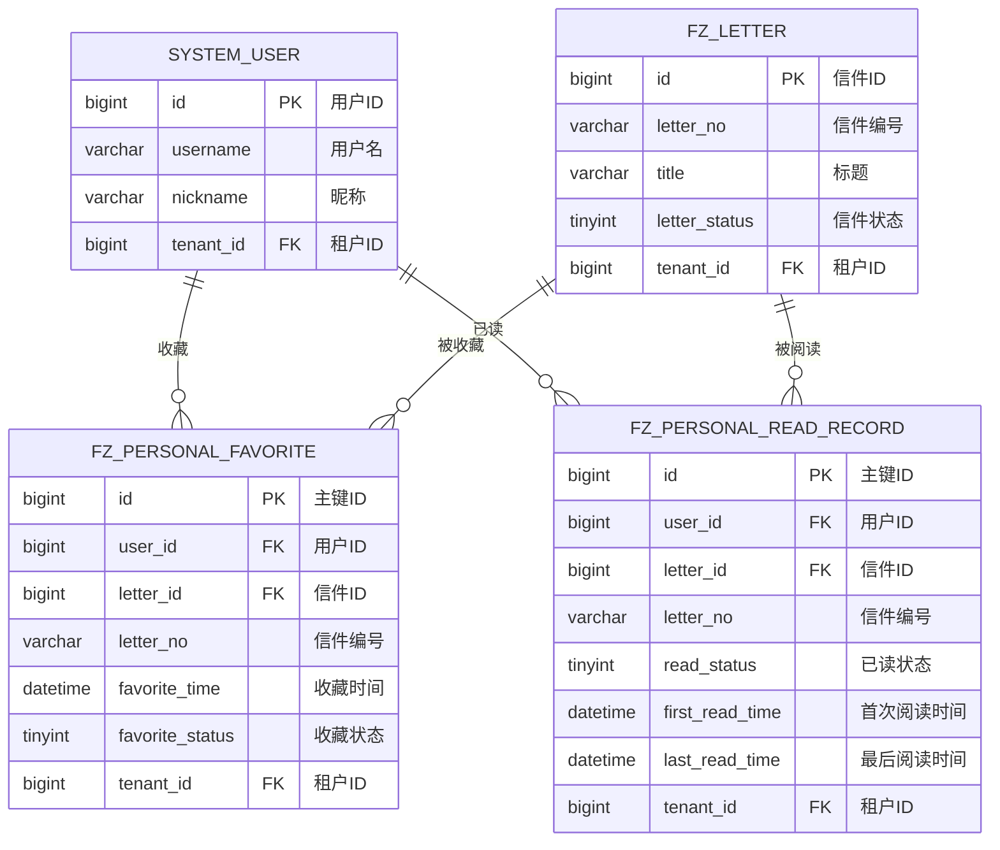

# M07 个人中心模块 - 数据库设计

## 文档信息

**产品名称：** gaxx-pro 信件处理系统
**模块名称：** M07 个人中心模块
**文档版本：** v1.0
**创建日期：** 2026-04-13
**状态：** 设计稿

---

## 1. 数据表清单

| 序号 | 表名 | 表描述 | 关联实体 |
|------|------|--------|----------|
| 1 | fz_personal_favorite | 用户收藏记录表 | 收藏记录 |
| 2 | fz_personal_read_record | 用户已读记录表 | 已读记录 |

---

## 2. 表结构设计

### 2.1 用户收藏记录表 (fz_personal_favorite)

存储用户收藏信件的记录，支持收藏/取消收藏操作。

```sql
CREATE TABLE `fz_personal_favorite` (
  `id` bigint NOT NULL AUTO_INCREMENT COMMENT '主键ID',
  `tenant_id` bigint NOT NULL DEFAULT 0 COMMENT '租户ID',
  `user_id` bigint NOT NULL COMMENT '用户ID',
  `letter_id` bigint NOT NULL COMMENT '信件ID',
  `letter_no` varchar(64) DEFAULT NULL COMMENT '信件编号',
  `favorite_time` datetime NOT NULL COMMENT '收藏时间',
  `favorite_status` tinyint NOT NULL DEFAULT 1 COMMENT '收藏状态：1-正常，2-已取消',
  `creator` varchar(64) DEFAULT '' COMMENT '创建者',
  `create_time` datetime NOT NULL DEFAULT CURRENT_TIMESTAMP COMMENT '创建时间',
  `updater` varchar(64) DEFAULT '' COMMENT '更新者',
  `update_time` datetime NOT NULL DEFAULT CURRENT_TIMESTAMP ON UPDATE CURRENT_TIMESTAMP COMMENT '更新时间',
  `deleted` bit(1) NOT NULL DEFAULT b'0' COMMENT '是否删除',
  PRIMARY KEY (`id`),
  KEY `idx_user_status` (`user_id`, `favorite_status`),
  KEY `idx_letter` (`letter_id`),
  KEY `idx_tenant` (`tenant_id`)
) ENGINE=InnoDB DEFAULT CHARSET=utf8mb4 COLLATE=utf8mb4_unicode_ci COMMENT='用户收藏记录表';
```

#### 字段说明

| 字段名 | 类型 | 是否必填 | 默认值 | 说明 |
|--------|------|----------|--------|------|
| id | bigint(20) | 是 | 自增 | 主键ID |
| tenant_id | bigint(20) | 是 | 0 | 租户ID，用于多租户数据隔离 |
| user_id | bigint(20) | 是 | - | 收藏用户的ID，关联 system_user 表 |
| letter_id | bigint(20) | 是 | - | 信件ID，关联 fz_letter 表 |
| letter_no | varchar(64) | 否 | NULL | 信件编号，冗余存储便于查询展示 |
| favorite_time | datetime | 是 | - | 收藏时间，最后一次收藏操作的时间 |
| favorite_status | tinyint(1) | 是 | 1 | 收藏状态：1=正常，2=已取消 |
| creator | varchar(64) | 否 | '' | 创建者用户名 |
| create_time | datetime | 是 | CURRENT_TIMESTAMP | 创建时间 |
| updater | varchar(64) | 否 | '' | 更新者用户名 |
| update_time | datetime | 是 | CURRENT_TIMESTAMP | 更新时间 |
| deleted | bit(1) | 是 | b'0' | 是否删除（软删除标记） |

---

### 2.2 用户已读记录表 (fz_personal_read_record)

存储用户已读信件的记录，用于标记信件阅读状态。

```sql
CREATE TABLE `fz_personal_read_record` (
  `id` bigint NOT NULL AUTO_INCREMENT COMMENT '主键ID',
  `tenant_id` bigint NOT NULL DEFAULT 0 COMMENT '租户ID',
  `user_id` bigint NOT NULL COMMENT '用户ID',
  `letter_id` bigint NOT NULL COMMENT '信件ID',
  `letter_no` varchar(64) DEFAULT NULL COMMENT '信件编号',
  `read_status` tinyint NOT NULL DEFAULT 1 COMMENT '已读状态：0-未读，1-已读',
  `first_read_time` datetime DEFAULT NULL COMMENT '首次阅读时间',
  `last_read_time` datetime DEFAULT NULL COMMENT '最后阅读时间',
  `creator` varchar(64) DEFAULT '' COMMENT '创建者',
  `create_time` datetime NOT NULL DEFAULT CURRENT_TIMESTAMP COMMENT '创建时间',
  `updater` varchar(64) DEFAULT '' COMMENT '更新者',
  `update_time` datetime NOT NULL DEFAULT CURRENT_TIMESTAMP ON UPDATE CURRENT_TIMESTAMP COMMENT '更新时间',
  `deleted` bit(1) NOT NULL DEFAULT b'0' COMMENT '是否删除',
  PRIMARY KEY (`id`),
  UNIQUE KEY `uk_user_letter` (`user_id`, `letter_id`, `deleted`),
  KEY `idx_letter` (`letter_id`),
  KEY `idx_tenant` (`tenant_id`)
) ENGINE=InnoDB DEFAULT CHARSET=utf8mb4 COLLATE=utf8mb4_unicode_ci COMMENT='用户已读记录表';
```

#### 字段说明

| 字段名 | 类型 | 是否必填 | 默认值 | 说明 |
|--------|------|----------|--------|------|
| id | bigint(20) | 是 | 自增 | 主键ID |
| tenant_id | bigint(20) | 是 | 0 | 租户ID，用于多租户数据隔离 |
| user_id | bigint(20) | 是 | - | 用户ID，关联 system_user 表 |
| letter_id | bigint(20) | 是 | - | 信件ID，关联 fz_letter 表 |
| letter_no | varchar(64) | 否 | NULL | 信件编号，冗余存储便于查询展示 |
| read_status | tinyint(1) | 是 | 1 | 已读状态：0=未读，1=已读 |
| first_read_time | datetime | 否 | NULL | 首次阅读时间，首次打开信件时记录 |
| last_read_time | datetime | 否 | NULL | 最后阅读时间，每次打开信件时更新 |
| creator | varchar(64) | 否 | '' | 创建者用户名 |
| create_time | datetime | 是 | CURRENT_TIMESTAMP | 创建时间 |
| updater | varchar(64) | 否 | '' | 更新者用户名 |
| update_time | datetime | 是 | CURRENT_TIMESTAMP | 更新时间 |
| deleted | bit(1) | 是 | b'0' | 是否删除（软删除标记） |

---

## 3. ER图设计



---

## 4. 索引设计说明

### 4.1 fz_personal_favorite 表索引

| 索引名 | 索引类型 | 索引字段 | 说明 |
|--------|----------|----------|------|
| PRIMARY | 主键索引 | id | 主键自增索引 |
| idx_user_status | 普通索引 | user_id, favorite_status | 用于查询用户的收藏列表（核心查询场景） |
| idx_letter | 普通索引 | letter_id | 用于查询信件的收藏情况 |
| idx_tenant | 普通索引 | tenant_id | 多租户数据隔离查询 |

**索引设计理由：**
- `idx_user_status`：收藏列表查询是最频繁的操作，按用户ID和收藏状态组合索引可显著提升性能
- `idx_letter`：查询某信件的收藏用户列表时使用
- 未设计 user_id + letter_id 的唯一索引：因为收藏记录可以复用（取消后再次收藏），使用状态字段控制

### 4.2 fz_personal_read_record 表索引

| 索引名 | 索引类型 | 索引字段 | 说明 |
|--------|----------|----------|------|
| PRIMARY | 主键索引 | id | 主键自增索引 |
| uk_user_letter | 唯一索引 | user_id, letter_id, deleted | 保证同一用户对同一信件只有一条有效记录 |
| idx_letter | 普通索引 | letter_id | 用于查询信件的已读用户列表 |
| idx_tenant | 普通索引 | tenant_id | 多租户数据隔离查询 |

**索引设计理由：**
- `uk_user_letter`：已读记录是用户对信件的唯一状态标记，需要唯一约束避免重复记录
- 唯一索引包含 deleted 字段：支持软删除后重建记录的场景

---

## 5. 数据字典

### 5.1 收藏状态枚举 (favorite_status)

| 值 | 名称 | 说明 |
|----|------|------|
| 1 | NORMAL | 正常状态，信件已收藏 |
| 2 | CANCELED | 已取消状态，收藏已取消 |

### 5.2 已读状态枚举 (read_status)

| 值 | 名称 | 说明 |
|----|------|------|
| 0 | UNREAD | 未读状态 |
| 1 | READ | 已读状态 |

---

## 6. 数据量估算与性能优化建议

### 6.1 数据量估算

| 表名 | 估算日增量 | 估算年增量 | 说明 |
|------|------------|------------|------|
| fz_personal_favorite | 50-100条 | 18,000-36,000条 | 每用户平均每日收藏0.5-1封信件 |
| fz_personal_read_record | 200-500条 | 72,000-180,000条 | 每用户平均每日阅读2-5封信件 |

### 6.2 性能优化建议

1. **分页查询优化**
   - 收藏列表查询使用覆盖索引，避免回表
   - 建议查询返回字段限制在必要范围内

2. **缓存策略**
   - 已读状态更新频繁，建议使用Redis缓存用户已读标记
   - 缓存Key格式：`personal:read:{userId}:{letterId}`
   - 缓存过期时间：24小时，异步同步到数据库

3. **批量操作优化**
   - 批量标记已读使用INSERT ON DUPLICATE KEY UPDATE
   - 批量取消收藏使用UPDATE语句配合IN条件

4. **定时清理**
   - 建议定期清理已取消收藏超过一定时间的记录（如6个月）
   - 已读记录可保留更长时间用于统计分析

---

## 7. 与其他模块的关联关系

### 7.1 关联表

| 本模块表 | 关联表 | 关联字段 | 关联说明 |
|----------|--------|----------|----------|
| fz_personal_favorite | fz_letter | letter_id | 收藏的信件信息 |
| fz_personal_favorite | system_user | user_id | 收藏的用户信息 |
| fz_personal_read_record | fz_letter | letter_id | 已读的信件信息 |
| fz_personal_read_record | system_user | user_id | 已读的用户信息 |

### 7.2 业务联动

| 触发事件 | 响应操作 | 说明 |
|----------|----------|------|
| 信件删除（软删除） | 关联收藏记录标记为已取消 | 通过业务逻辑处理，避免删除时级联问题 |
| 信件删除（硬删除） | 关联收藏和已读记录软删除 | 极端情况，一般不执行硬删除 |

---

## 变更历史

| 版本 | 日期 | 变更内容 | 变更人 |
|-----|------|---------|--------|
| v1.0 | 2026-04-13 | 初始版本，包含收藏记录表和已读记录表设计 | 后端架构师 |