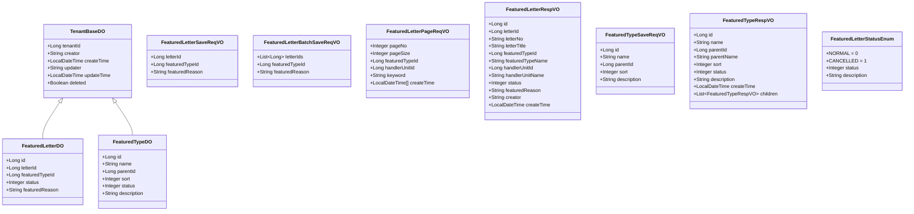

# M08 特色信息模块 - 实体设计

## 文档信息

**产品名称：** gaxx-pro 信件处理系统
**模块编号：** M08
**文档版本：** v1.0
**创建日期：** 2026-04-13
**状态：** 草稿

---

## 1. DO实体类设计

### 1.1 FeaturedLetterDO（信件选登实体）

继承 TenantBaseDO，对应数据库表 `fz_featured_letter`。

```java
package cn.iocoder.yudao.module.fz.dal.dataobject.featured;

import cn.iocoder.yudao.framework.mybatis.core.dataobject.TenantBaseDO;
import com.baomidou.mybatisplus.annotation.KeySequence;
import com.baomidou.mybatisplus.annotation.TableId;
import com.baomidou.mybatisplus.annotation.TableName;
import lombok.*;

/**
 * 信件选登 DO
 *
 * 用于记录优秀信件的选登信息，将办理质量高的信件标记为特色信息
 */
@TableName("fz_featured_letter")
@KeySequence("fz_featured_letter_seq")
@Data
@EqualsAndHashCode(callSuper = true)
@ToString(callSuper = true)
@Builder
@NoArgsConstructor
@AllArgsConstructor
public class FeaturedLetterDO extends TenantBaseDO {

    /**
     * 主键ID
     */
    @TableId
    private Long id;

    /**
     * 关联信件ID
     *
     * 指向 mail_letter 表的信件记录
     */
    private Long letterId;

    /**
     * 选登类型ID
     *
     * 指向 fz_featured_type 表的类型记录
     */
    private Long featuredTypeId;

    /**
     * 选登状态
     *
     * 0-正常选登，1-已取消
     *
     * @see FeaturedLetterStatusEnum
     */
    private Integer status;

    /**
     * 选登原因/备注
     *
     * 最大500字
     */
    private String featuredReason;

}
```

### 1.2 FeaturedTypeDO（选登类型实体）

继承 TenantBaseDO，对应数据库表 `fz_featured_type`。

```java
package cn.iocoder.yudao.module.fz.dal.dataobject.featured;

import cn.iocoder.yudao.framework.mybatis.core.dataobject.TenantBaseDO;
import com.baomidou.mybatisplus.annotation.KeySequence;
import com.baomidou.mybatisplus.annotation.TableId;
import com.baomidou.mybatisplus.annotation.TableName;
import lombok.*;

/**
 * 选登类型 DO
 *
 * 用于定义选登分类类型，支持层级结构
 */
@TableName("fz_featured_type")
@KeySequence("fz_featured_type_seq")
@Data
@EqualsAndHashCode(callSuper = true)
@ToString(callSuper = true)
@Builder
@NoArgsConstructor
@AllArgsConstructor
public class FeaturedTypeDO extends TenantBaseDO {

    /**
     * 主键ID
     */
    @TableId
    private Long id;

    /**
     * 类型名称
     *
     * 如：典型案例、优秀回复、创新做法
     */
    private String name;

    /**
     * 上级类型ID
     *
     * 0表示顶级类型
     */
    private Long parentId;

    /**
     * 排序值
     *
     * 用于列表显示顺序
     */
    private Integer sort;

    /**
     * 状态
     *
     * 0-启用，1-禁用
     *
     * @see cn.iocoder.yudao.framework.common.enums.CommonStatusEnum
     */
    private Integer status;

    /**
     * 类型描述
     *
     * 最大500字
     */
    private String description;

}
```

---

## 2. VO类设计

### 2.1 信件选登VO类

#### 2.1.1 FeaturedLetterSaveReqVO（创建请求VO）

```java
package cn.iocoder.yudao.module.fz.controller.admin.featured.vo;

import io.swagger.v3.oas.annotations.media.Schema;
import lombok.Data;
import javax.validation.constraints.NotNull;

@Schema(description = "管理后台 - 特色信息创建 Request VO")
@Data
public class FeaturedLetterSaveReqVO {

    @Schema(description = "信件ID", requiredMode = Schema.RequiredMode.REQUIRED, example = "1024")
    @NotNull(message = "信件ID不能为空")
    private Long letterId;

    @Schema(description = "选登类型ID", requiredMode = Schema.RequiredMode.REQUIRED, example = "1")
    @NotNull(message = "选登类型ID不能为空")
    private Long featuredTypeId;

    @Schema(description = "选登原因/备注", example = "办理规范，回复专业")
    private String featuredReason;

}
```

#### 2.1.2 FeaturedLetterBatchSaveReqVO（批量创建请求VO）

```java
package cn.iocoder.yudao.module.fz.controller.admin.featured.vo;

import io.swagger.v3.oas.annotations.media.Schema;
import lombok.Data;
import javax.validation.constraints.NotEmpty;
import javax.validation.constraints.NotNull;
import java.util.List;

@Schema(description = "管理后台 - 特色信息批量创建 Request VO")
@Data
public class FeaturedLetterBatchSaveReqVO {

    @Schema(description = "信件ID列表", requiredMode = Schema.RequiredMode.REQUIRED, example = "[1024, 1025, 1026]")
    @NotEmpty(message = "信件ID列表不能为空")
    private List<Long> letterIds;

    @Schema(description = "选登类型ID", requiredMode = Schema.RequiredMode.REQUIRED, example = "1")
    @NotNull(message = "选登类型ID不能为空")
    private Long featuredTypeId;

    @Schema(description = "选登原因/备注", example = "批量选登的优秀案例")
    private String featuredReason;

}
```

#### 2.1.3 FeaturedLetterPageReqVO（分页查询请求VO）

```java
package cn.iocoder.yudao.module.fz.controller.admin.featured.vo;

import cn.iocoder.yudao.framework.common.pojo.PageParam;
import io.swagger.v3.oas.annotations.media.Schema;
import lombok.Data;
import lombok.EqualsAndHashCode;
import lombok.ToString;
import org.springframework.format.annotation.DateTimeFormat;

import java.time.LocalDateTime;

@Schema(description = "管理后台 - 特色信息分页查询 Request VO")
@Data
@EqualsAndHashCode(callSuper = true)
@ToString(callSuper = true)
public class FeaturedLetterPageReqVO extends PageParam {

    @Schema(description = "选登类型ID筛选", example = "1")
    private Long featuredTypeId;

    @Schema(description = "办理单位ID筛选", example = "100")
    private Long handlerUnitId;

    @Schema(description = "关键词搜索（信件标题）", example = "交通管理")
    private String keyword;

    @Schema(description = "选登时间范围筛选")
    @DateTimeFormat(pattern = "yyyy-MM-dd HH:mm:ss")
    private LocalDateTime[] createTime;

}
```

#### 2.1.4 FeaturedLetterRespVO（响应VO）

```java
package cn.iocoder.yudao.module.fz.controller.admin.featured.vo;

import io.swagger.v3.oas.annotations.media.Schema;
import lombok.Data;

import java.time.LocalDateTime;

@Schema(description = "管理后台 - 特色信息 Response VO")
@Data
public class FeaturedLetterRespVO {

    @Schema(description = "主键ID", example = "1024")
    private Long id;

    @Schema(description = "关联信件ID", example = "2048")
    private Long letterId;

    @Schema(description = "信件编号", example = "XL20260001")
    private String letterNo;

    @Schema(description = "信件标题", example = "关于交通管理的建议")
    private String letterTitle;

    @Schema(description = "选登类型ID", example = "1")
    private Long featuredTypeId;

    @Schema(description = "选登类型名称", example = "典型案例")
    private String featuredTypeName;

    @Schema(description = "办理单位ID", example = "100")
    private Long handlerUnitId;

    @Schema(description = "办理单位名称", example = "市局交警支队")
    private String handlerUnitName;

    @Schema(description = "选登状态：0-正常选登，1-已取消", example = "0")
    private Integer status;

    @Schema(description = "选登原因/备注", example = "办理规范，回复专业")
    private String featuredReason;

    @Schema(description = "选登操作人", example = "admin")
    private String creator;

    @Schema(description = "选登时间")
    private LocalDateTime createTime;

}
```

---

### 2.2 选登类型VO类

#### 2.2.1 FeaturedTypeSaveReqVO（创建/更新请求VO）

```java
package cn.iocoder.yudao.module.fz.controller.admin.featured.vo;

import io.swagger.v3.oas.annotations.media.Schema;
import lombok.Data;
import javax.validation.constraints.NotBlank;
import javax.validation.constraints.Size;

@Schema(description = "管理后台 - 选登类型创建/更新 Request VO")
@Data
public class FeaturedTypeSaveReqVO {

    @Schema(description = "类型ID（更新时必填）", example = "1024")
    private Long id;

    @Schema(description = "类型名称", requiredMode = Schema.RequiredMode.REQUIRED, example = "典型案例")
    @NotBlank(message = "类型名称不能为空")
    @Size(max = 100, message = "类型名称长度不能超过100字")
    private String name;

    @Schema(description = "上级类型ID，0表示顶级类型", example = "0")
    private Long parentId;

    @Schema(description = "排序值", example = "1")
    private Integer sort;

    @Schema(description = "类型描述", example = "具有典型示范意义的信件办理案例")
    @Size(max = 500, message = "类型描述长度不能超过500字")
    private String description;

}
```

#### 2.2.2 FeaturedTypeRespVO（响应VO）

```java
package cn.iocoder.yudao.module.fz.controller.admin.featured.vo;

import io.swagger.v3.oas.annotations.media.Schema;
import lombok.Data;

import java.time.LocalDateTime;
import java.util.List;

@Schema(description = "管理后台 - 选登类型 Response VO")
@Data
public class FeaturedTypeRespVO {

    @Schema(description = "类型ID", example = "1024")
    private Long id;

    @Schema(description = "类型名称", example = "典型案例")
    private String name;

    @Schema(description = "上级类型ID", example = "0")
    private Long parentId;

    @Schema(description = "上级类型名称", example = "")
    private String parentName;

    @Schema(description = "排序值", example = "1")
    private Integer sort;

    @Schema(description = "状态：0-启用，1-禁用", example = "0")
    private Integer status;

    @Schema(description = "类型描述", example = "具有典型示范意义的信件办理案例")
    private String description;

    @Schema(description = "创建时间")
    private LocalDateTime createTime;

    @Schema(description = "子类型列表")
    private List<FeaturedTypeRespVO> children;

}
```

---

## 3. 枚举类设计

### 3.1 FeaturedLetterStatusEnum（选登状态枚举）

```java
package cn.iocoder.yudao.module.fz.enums;

import cn.iocoder.yudao.framework.common.core.IntArrayValuable;
import lombok.AllArgsConstructor;
import lombok.Getter;

import java.util.Arrays;

/**
 * 选登状态枚举
 */
@Getter
@AllArgsConstructor
public enum FeaturedLetterStatusEnum implements IntArrayValuable {

    NORMAL(0, "正常选登"),
    CANCELLED(1, "已取消");

    public static final int[] ARRAYS = Arrays.stream(values()).mapToInt(FeaturedLetterStatusEnum::getStatus).toArray();

    /**
     * 状态值
     */
    private final Integer status;

    /**
     * 状态描述
     */
    private final String description;

    @Override
    public int[] array() {
        return ARRAYS;
    }

    /**
     * 判断是否为正常选登状态
     */
    public static boolean isNormal(Integer status) {
        return NORMAL.getStatus().equals(status);
    }

    /**
     * 判断是否为已取消状态
     */
    public static boolean isCancelled(Integer status) {
        return CANCELLED.getStatus().equals(status);
    }

}
```

---

## 4. 类结构总览

### 4.1 类图



---

## 5. 文件目录结构

```
mailletter-sys-fz/
├── src/main/java/cn/iocoder/yudao/module/fz/
│   ├── controller/admin/featured/
│   │   ├── FeaturedLetterController.java
│   │   ├── FeaturedTypeController.java
│   │   └── vo/
│   │       ├── FeaturedLetterSaveReqVO.java
│   │       ├── FeaturedLetterBatchSaveReqVO.java
│   │       ├── FeaturedLetterPageReqVO.java
│   │       ├── FeaturedLetterRespVO.java
│   │       ├── FeaturedTypeSaveReqVO.java
│   │       └── FeaturedTypeRespVO.java
│   ├── dal/dataobject/featured/
│   │   ├── FeaturedLetterDO.java
│   │   └── FeaturedTypeDO.java
│   ├── dal/mysql/featured/
│   │   ├── FeaturedLetterMapper.java
│   │   └── FeaturedTypeMapper.java
│   ├── service/featured/
│   │   ├── FeaturedLetterService.java
│   │   ├── FeaturedLetterServiceImpl.java
│   │   ├── FeaturedTypeService.java
│   │   └── FeaturedTypeServiceImpl.java
│   └── enums/
│       └── FeaturedLetterStatusEnum.java
```

---

## 6. Mapper接口设计

### 6.1 FeaturedLetterMapper

```java
package cn.iocoder.yudao.module.fz.dal.mysql.featured;

import cn.iocoder.yudao.framework.mybatis.core.mapper.BaseMapperX;
import cn.iocoder.yudao.framework.mybatis.core.query.LambdaQueryWrapperX;
import cn.iocoder.yudao.module.fz.dal.dataobject.featured.FeaturedLetterDO;
import org.apache.ibatis.annotations.Mapper;

import java.util.List;

/**
 * 信件选登 Mapper
 */
@Mapper
public interface FeaturedLetterMapper extends BaseMapperX<FeaturedLetterDO> {

    /**
     * 查询指定信件在指定类型下的选登记录
     *
     * @param letterId 信件ID
     * @param featuredTypeId 选登类型ID
     * @return 选登记录
     */
    default FeaturedLetterDO selectByLetterIdAndTypeId(Long letterId, Long featuredTypeId) {
        return selectOne(new LambdaQueryWrapperX<FeaturedLetterDO>()
                .eq(FeaturedLetterDO::getLetterId, letterId)
                .eq(FeaturedLetterDO::getFeaturedTypeId, featuredTypeId));
    }

    /**
     * 查询指定信件的选登记录列表
     *
     * @param letterId 信件ID
     * @return 选登记录列表
     */
    default List<FeaturedLetterDO> selectListByLetterId(Long letterId) {
        return selectList(new LambdaQueryWrapperX<FeaturedLetterDO>()
                .eq(FeaturedLetterDO::getLetterId, letterId));
    }

    /**
     * 批量更新状态
     *
     * @param ids ID列表
     * @param status 目标状态
     */
    default int updateStatusByIds(List<Long> ids, Integer status) {
        return update(FeaturedLetterDO.builder().status(status).build(),
                new LambdaQueryWrapperX<FeaturedLetterDO>()
                        .in(FeaturedLetterDO::getId, ids));
    }

}
```

### 6.2 FeaturedTypeMapper

```java
package cn.iocoder.yudao.module.fz.dal.mysql.featured;

import cn.iocoder.yudao.framework.mybatis.core.mapper.BaseMapperX;
import cn.iocoder.yudao.framework.mybatis.core.query.LambdaQueryWrapperX;
import cn.iocoder.yudao.module.fz.dal.dataobject.featured.FeaturedTypeDO;
import org.apache.ibatis.annotations.Mapper;

import java.util.List;

/**
 * 选登类型 Mapper
 */
@Mapper
public interface FeaturedTypeMapper extends BaseMapperX<FeaturedTypeDO> {

    /**
     * 查询指定名称的类型
     *
     * @param name 类型名称
     * @return 类型记录
     */
    default FeaturedTypeDO selectByName(String name) {
        return selectOne(new LambdaQueryWrapperX<FeaturedTypeDO>()
                .eq(FeaturedTypeDO::getName, name));
    }

    /**
     * 查询子类型列表
     *
     * @param parentId 上级类型ID
     * @return 子类型列表
     */
    default List<FeaturedTypeDO> selectListByParentId(Long parentId) {
        return selectList(new LambdaQueryWrapperX<FeaturedTypeDO>()
                .eq(FeaturedTypeDO::getParentId, parentId)
                .orderByAsc(FeaturedTypeDO::getSort));
    }

    /**
     * 查询指定状态下的类型列表
     *
     * @param status 状态
     * @return 类型列表
     */
    default List<FeaturedTypeDO> selectListByStatus(Integer status) {
        return selectList(new LambdaQueryWrapperX<FeaturedTypeDO>()
                .eqIfPresent(FeaturedTypeDO::getStatus, status)
                .orderByAsc(FeaturedTypeDO::getSort));
    }

}
```

---

## 7. Service接口设计

### 7.1 FeaturedLetterService

```java
package cn.iocoder.yudao.module.fz.service.featured;

import cn.iocoder.yudao.framework.common.pojo.PageResult;
import cn.iocoder.yudao.module.fz.controller.admin.featured.vo.*;
import cn.iocoder.yudao.module.fz.dal.dataobject.featured.FeaturedLetterDO;

import java.util.List;

/**
 * 信件选登 Service接口
 */
public interface FeaturedLetterService {

    /**
     * 创建特色信息（选登信件）
     *
     * @param createReqVO 创建请求
     * @return 选登记录ID
     */
    Long createFeaturedLetter(FeaturedLetterSaveReqVO createReqVO);

    /**
     * 批量创建特色信息
     *
     * @param batchReqVO 批量创建请求
     * @return 选登记录ID列表
     */
    List<Long> createFeaturedLetterList(FeaturedLetterBatchSaveReqVO batchReqVO);

    /**
     * 取消选登（状态变更）
     *
     * @param id 选登记录ID
     */
    void cancelFeaturedLetter(Long id);

    /**
     * 批量取消选登
     *
     * @param ids 选登记录ID列表
     */
    void cancelFeaturedLetterList(List<Long> ids);

    /**
     * 获取特色信息详情
     *
     * @param id 选登记录ID
     * @return 选登记录
     */
    FeaturedLetterDO getFeaturedLetter(Long id);

    /**
     * 分页查询特色信息列表
     *
     * @param pageReqVO 分页查询请求
     * @return 分页结果
     */
    PageResult<FeaturedLetterDO> getFeaturedLetterPage(FeaturedLetterPageReqVO pageReqVO);

    /**
     * 获取特色信息列表（不分页）
     *
     * @param featuredTypeId 选登类型ID筛选
     * @return 列表
     */
    List<FeaturedLetterDO> getFeaturedLetterList(Long featuredTypeId);

}
```

### 7.2 FeaturedTypeService

```java
package cn.iocoder.yudao.module.fz.service.featured;

import cn.iocoder.yudao.module.fz.controller.admin.featured.vo.*;
import cn.iocoder.yudao.module.fz.dal.dataobject.featured.FeaturedTypeDO;

import java.util.List;

/**
 * 选登类型 Service接口
 */
public interface FeaturedTypeService {

    /**
     * 创建选登类型
     *
     * @param createReqVO 创建请求
     * @return 类型ID
     */
    Long createFeaturedType(FeaturedTypeSaveReqVO createReqVO);

    /**
     * 更新选登类型
     *
     * @param updateReqVO 更新请求
     */
    void updateFeaturedType(FeaturedTypeSaveReqVO updateReqVO);

    /**
     * 删除选登类型
     *
     * @param id 类型ID
     */
    void deleteFeaturedType(Long id);

    /**
     * 更新选登类型状态
     *
     * @param id 类型ID
     * @param status 目标状态
     */
    void updateFeaturedTypeStatus(Long id, Integer status);

    /**
     * 获取选登类型详情
     *
     * @param id 类型ID
     * @return 类型记录
     */
    FeaturedTypeDO getFeaturedType(Long id);

    /**
     * 获取选登类型列表
     *
     * @param status 状态筛选
     * @return 列表
     */
    List<FeaturedTypeDO> getFeaturedTypeList(Integer status);

}
```

---

## 变更历史

| 版本 | 日期 | 变更内容 | 变更人 |
|-----|------|---------|--------|
| v1.0 | 2026-04-13 | 初始版本，包含DO、VO、枚举、Mapper、Service设计 | Claude |