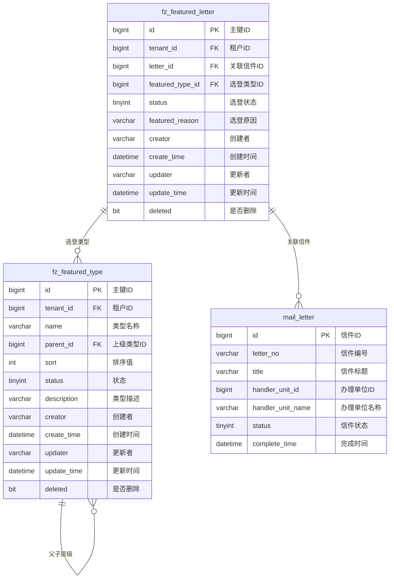

# M08 特色信息模块 - 数据库设计

## 文档信息

**产品名称：** gaxx-pro 信件处理系统
**模块编号：** M08
**文档版本：** v1.0
**创建日期：** 2026-04-13
**状态：** 草稿

---

## 1. 数据库表结构设计

### 1.1 信件选登表（fz_featured_letter）

用于记录优秀信件的选登信息，将办理质量高的信件标记为特色信息。

```sql
CREATE TABLE `fz_featured_letter` (
  `id` bigint NOT NULL AUTO_INCREMENT COMMENT '主键ID',
  `tenant_id` bigint NOT NULL COMMENT '租户ID',
  `letter_id` bigint NOT NULL COMMENT '关联信件ID',
  `featured_type_id` bigint NOT NULL COMMENT '选登类型ID',
  `status` tinyint NOT NULL DEFAULT 0 COMMENT '选登状态：0-正常选登，1-已取消',
  `featured_reason` varchar(500) DEFAULT NULL COMMENT '选登原因/备注',
  `creator` varchar(64) DEFAULT '' COMMENT '创建者（选登操作人）',
  `create_time` datetime NOT NULL DEFAULT CURRENT_TIMESTAMP COMMENT '创建时间（选登时间）',
  `updater` varchar(64) DEFAULT '' COMMENT '更新者',
  `update_time` datetime NOT NULL DEFAULT CURRENT_TIMESTAMP ON UPDATE CURRENT_TIMESTAMP COMMENT '更新时间',
  `deleted` bit(1) NOT NULL DEFAULT b'0' COMMENT '是否删除',
  PRIMARY KEY (`id`),
  KEY `idx_tenant_id` (`tenant_id`),
  KEY `idx_letter_id` (`letter_id`),
  KEY `idx_featured_type_id` (`featured_type_id`),
  KEY `idx_status` (`status`),
  KEY `idx_create_time` (`create_time`)
) ENGINE=InnoDB DEFAULT CHARSET=utf8mb4 COLLATE=utf8mb4_unicode_ci COMMENT='信件选登表';
```

### 1.2 选登类型表（fz_featured_type）

用于定义选登分类类型，支持层级结构。

```sql
CREATE TABLE `fz_featured_type` (
  `id` bigint NOT NULL AUTO_INCREMENT COMMENT '主键ID',
  `tenant_id` bigint NOT NULL COMMENT '租户ID',
  `name` varchar(100) NOT NULL COMMENT '类型名称',
  `parent_id` bigint DEFAULT 0 COMMENT '上级类型ID，0表示顶级类型',
  `sort` int NOT NULL DEFAULT 0 COMMENT '排序值',
  `status` tinyint NOT NULL DEFAULT 0 COMMENT '状态：0-启用，1-禁用',
  `description` varchar(500) DEFAULT NULL COMMENT '类型描述',
  `creator` varchar(64) DEFAULT '' COMMENT '创建者',
  `create_time` datetime NOT NULL DEFAULT CURRENT_TIMESTAMP COMMENT '创建时间',
  `updater` varchar(64) DEFAULT '' COMMENT '更新者',
  `update_time` datetime NOT NULL DEFAULT CURRENT_TIMESTAMP ON UPDATE CURRENT_TIMESTAMP COMMENT '更新时间',
  `deleted` bit(1) NOT NULL DEFAULT b'0' COMMENT '是否删除',
  PRIMARY KEY (`id`),
  KEY `idx_tenant_id` (`tenant_id`),
  KEY `idx_parent_id` (`parent_id`),
  KEY `idx_status` (`status`)
) ENGINE=InnoDB DEFAULT CHARSET=utf8mb4 COLLATE=utf8mb4_unicode_ci COMMENT='选登类型表';
```

---

## 2. ER图（实体关系图）



---

## 3. 索引设计

### 3.1 信件选登表索引

| 索引名 | 索引字段 | 索引类型 | 说明 |
|--------|----------|----------|------|
| PRIMARY | id | 主键 | 主键索引 |
| idx_tenant_id | tenant_id | 普通 | 租户隔离查询 |
| idx_letter_id | letter_id | 普通 | 按信件查询选登记录 |
| idx_featured_type_id | featured_type_id | 普通 | 按类型筛选查询 |
| idx_status | status | 普通 | 按状态筛选（正常选登/已取消） |
| idx_create_time | create_time | 普通 | 按选登时间排序查询 |
| uk_letter_type | letter_id, featured_type_id, tenant_id | 唯一 | 防止同一信件在同一类型下重复选登 |

### 3.2 选登类型表索引

| 索引名 | 索引字段 | 索引类型 | 说明 |
|--------|----------|----------|------|
| PRIMARY | id | 主键 | 主键索引 |
| idx_tenant_id | tenant_id | 普通 | 租户隔离查询 |
| idx_parent_id | parent_id | 普通 | 查询子类型列表 |
| idx_status | status | 普通 | 按状态筛选（启用/禁用） |
| uk_name_tenant | name, tenant_id | 唯一 | 同一租户下类型名称唯一 |

---

## 4. 字段详细说明

### 4.1 信件选登表字段说明

| 字段名 | 数据类型 | 是否必填 | 默认值 | 说明 |
|--------|----------|----------|--------|------|
| id | bigint | 是 | AUTO_INCREMENT | 主键ID，自增 |
| tenant_id | bigint | 是 | - | 租户ID，用于多租户隔离 |
| letter_id | bigint | 是 | - | 关联信件ID，指向mail_letter表 |
| featured_type_id | bigint | 是 | - | 选登类型ID，指向fz_featured_type表 |
| status | tinyint | 是 | 0 | 选登状态：0-正常选登，1-已取消 |
| featured_reason | varchar(500) | 否 | NULL | 选登原因或备注说明 |
| creator | varchar(64) | 否 | '' | 创建者，即执行选登操作的用户 |
| create_time | datetime | 是 | CURRENT_TIMESTAMP | 创建时间，即选登时间 |
| updater | varchar(64) | 否 | '' | 更新者 |
| update_time | datetime | 是 | CURRENT_TIMESTAMP | 更新时间，自动更新 |
| deleted | bit(1) | 是 | 0 | 逻辑删除标记，0-未删除，1-已删除 |

### 4.2 选登类型表字段说明

| 字段名 | 数据类型 | 是否必填 | 默认值 | 说明 |
|--------|----------|----------|--------|------|
| id | bigint | 是 | AUTO_INCREMENT | 主键ID，自增 |
| tenant_id | bigint | 是 | - | 租户ID，用于多租户隔离 |
| name | varchar(100) | 是 | - | 类型名称，如"典型案例"、"优秀回复"、"创新做法" |
| parent_id | bigint | 否 | 0 | 上级类型ID，0表示顶级类型 |
| sort | int | 是 | 0 | 排序值，用于列表显示顺序 |
| status | tinyint | 是 | 0 | 状态：0-启用，1-禁用 |
| description | varchar(500) | 否 | NULL | 类型描述说明 |
| creator | varchar(64) | 否 | '' | 创建者 |
| create_time | datetime | 是 | CURRENT_TIMESTAMP | 创建时间 |
| updater | varchar(64) | 否 | '' | 更新者 |
| update_time | datetime | 是 | CURRENT_TIMESTAMP | 更新时间，自动更新 |
| deleted | bit(1) | 是 | 0 | 逻辑删除标记 |

---

## 5. 数据约束与业务规则

### 5.1 唯一性约束

- 同一信件在同一选登类型下不能重复选登（uk_letter_type唯一索引）
- 同一租户下选登类型名称唯一（uk_name_tenant唯一索引）

### 5.2 状态约束

- 信件选登状态：
  - 0：正常选登（显示在特色信息列表中）
  - 1：已取消（从列表中移除，但记录保留）

- 选登类型状态：
  - 0：启用（可用于选登）
  - 1：禁用（不可用于选登）

### 5.3 业务约束

| 规则编号 | 规则描述 | 实现方式 |
|----------|----------|----------|
| R08-01 | 只有状态为"已完成"的信件才能被选登 | Service层校验 |
| R08-02 | 选登类型必须为启用状态才能使用 | Service层校验 |
| R08-04 | 取消选登为状态变更，非物理删除 | status字段变更 |
| R08-05 | 信件选登记录关联信件必须存在 | 外键关联逻辑校验 |

---

## 6. 初始化数据

### 6.1 选登类型初始数据

```sql
-- 初始化选登类型数据
INSERT INTO `fz_featured_type` (`tenant_id`, `name`, `parent_id`, `sort`, `status`, `description`, `creator`) VALUES
(1, '典型案例', 0, 1, 0, '具有典型示范意义的信件办理案例', 'system'),
(1, '优秀回复', 0, 2, 0, '回复内容规范、专业性强的信件', 'system'),
(1, '创新做法', 0, 3, 0, '办理方式创新、效果显著的信件', 'system'),
(1, '高效办理', 0, 4, 0, '办理效率高、流程规范的信件', 'system');
```

---

## 7. 表与模块关系

| 表名 | 所属模块 | 关联模块 | 说明 |
|------|----------|----------|------|
| fz_featured_letter | M08 特色信息模块 | M01 信件核心模块 | 关联信件表 |
| fz_featured_type | M08 特色信息模块 | 无 | 独立配置表 |

---

## 变更历史

| 版本 | 日期 | 变更内容 | 变更人 |
|-----|------|---------|--------|
| v1.0 | 2026-04-13 | 初始版本，包含信件选登表和选登类型表设计 | Claude |