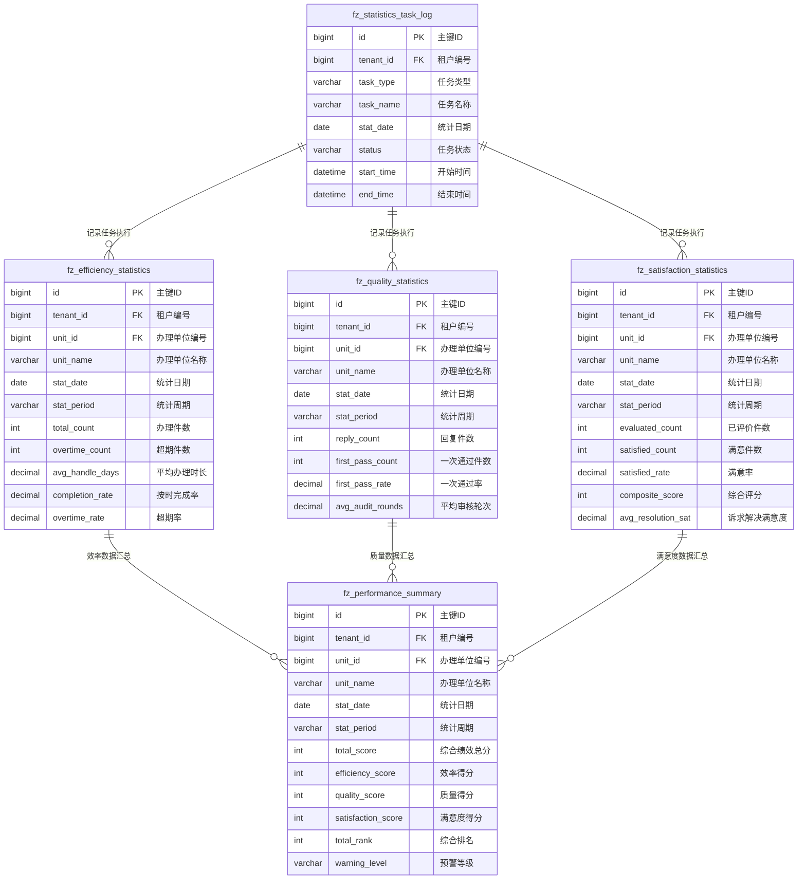

# M09 绩效统计模块 - 数据库设计

## 文档信息

**产品名称：** gaxx-pro 信件处理系统
**模块编号：** M09
**文档版本：** v1.0
**创建日期：** 2026-04-13
**状态：** 草稿

---

## 1. 设计概述

### 1.1 设计原则

绩效统计模块是一个**只读统计模块**，主要功能是对现有信件数据进行聚合统计分析。基于此特点，数据库设计遵循以下原则：

1. **预聚合策略**：创建统计汇总表存储预计算的指标数据，提高查询性能
2. **数据源复用**：统计数据来源于M01、M02、M03模块的现有表，不重复存储原始数据
3. **增量更新**：统计表采用增量更新机制，每日凌晨自动计算前一天数据
4. **租户隔离**：所有表继承TenantBaseDO，支持多租户数据隔离

### 1.2 数据依赖关系

本模块统计数据来源于以下现有数据实体：

| 模块 | 数据实体 | 统计用途 |
|------|----------|----------|
| M01 | 信件(Letter) | 信件状态、登记时间、回复时间、满意度 |
| M02 | 办理单位(HandlingUnit) | 办理状态、回复状态、答复时间 |
| M02 | 流转记录(FlowRecord) | 是否超期、超期天数、延期次数、催办次数 |
| M02 | 信件办理(LetterHandling) | 各维度满意度评价 |
| M03 | 信件回复(LetterReply) | 回复状态、审核状态 |
| M03 | 信件流程(LetterProcess) | 流程节点、审核结果 |

---

## 2. 表结构设计

### 2.1 办理效率统计汇总表 (fz_efficiency_statistics)

存储各单位办理效率指标的预聚合数据，支持按日、周、月维度汇总。

```sql
CREATE TABLE fz_efficiency_statistics (
    id              BIGINT          NOT NULL AUTO_INCREMENT COMMENT '主键ID',
    tenant_id       BIGINT          NOT NULL COMMENT '租户编号',
    
    -- 统计维度
    unit_id         BIGINT          NOT NULL COMMENT '办理单位编号',
    unit_name       VARCHAR(100)    NOT NULL COMMENT '办理单位名称',
    unit_code       VARCHAR(50)     NULL COMMENT '办理单位编码',
    parent_unit_id  BIGINT          NULL COMMENT '上级单位编号',
    stat_date       DATE            NOT NULL COMMENT '统计日期',
    stat_period     VARCHAR(20)     NOT NULL COMMENT '统计周期类型(DAILY/WEEKLY/MONTHLY)',
    stat_year       INT             NOT NULL COMMENT '统计年份',
    stat_month      INT             NOT NULL COMMENT '统计月份',
    
    -- 办理数量统计
    total_count     INT             NOT NULL DEFAULT 0 COMMENT '办理件数总数',
    completed_count INT             NOT NULL DEFAULT 0 COMMENT '按时完成件数',
    overtime_count  INT             NOT NULL DEFAULT 0 COMMENT '超期件数',
    extended_count  INT             NOT NULL DEFAULT 0 COMMENT '延期件数',
    
    -- 时长统计
    avg_handle_days DECIMAL(10,2)   NULL COMMENT '平均办理时长(工作日)',
    max_handle_days DECIMAL(10,2)   NULL COMMENT '最大办理时长(工作日)',
    min_handle_days DECIMAL(10,2)   NULL COMMENT '最小办理时长(工作日)',
    
    -- 效率指标
    completion_rate DECIMAL(10,4)   NULL COMMENT '按时完成率(百分比)',
    overtime_rate   DECIMAL(10,4)   NULL COMMENT '超期率(百分比)',
    extension_rate  DECIMAL(10,4)   NULL COMMENT '延期率(百分比)',
    
    -- 催办统计
    reminder_count  INT             NOT NULL DEFAULT 0 COMMENT '催办总次数',
    avg_reminder    DECIMAL(10,2)   NULL COMMENT '平均催办次数',
    
    -- 信件类型分布(JSON格式)
    type_distribution JSON          NULL COMMENT '按信件类型的件数分布',
    
    -- 通用字段
    create_time     DATETIME        NOT NULL DEFAULT CURRENT_TIMESTAMP COMMENT '创建时间',
    update_time     DATETIME        NOT NULL DEFAULT CURRENT_TIMESTAMP ON UPDATE CURRENT_TIMESTAMP COMMENT '更新时间',
    creator         VARCHAR(64)     NULL COMMENT '创建者',
    updater         VARCHAR(64)     NULL COMMENT '更新者',
    deleted         BIT             NOT NULL DEFAULT 0 COMMENT '是否删除',
    
    PRIMARY KEY (id),
    INDEX idx_unit_date (unit_id, stat_date),
    INDEX idx_period (stat_period, stat_year, stat_month),
    INDEX idx_tenant (tenant_id)
) ENGINE=InnoDB DEFAULT CHARSET=utf8mb4 COMMENT='办理效率统计汇总表';
```

### 2.2 回复质量统计汇总表 (fz_quality_statistics)

存储各单位回复内容审核质量指标的预聚合数据。

```sql
CREATE TABLE fz_quality_statistics (
    id              BIGINT          NOT NULL AUTO_INCREMENT COMMENT '主键ID',
    tenant_id       BIGINT          NOT NULL COMMENT '租户编号',
    
    -- 统计维度
    unit_id         BIGINT          NOT NULL COMMENT '办理单位编号',
    unit_name       VARCHAR(100)    NOT NULL COMMENT '办理单位名称',
    unit_code       VARCHAR(50)     NULL COMMENT '办理单位编码',
    parent_unit_id  BIGINT          NULL COMMENT '上级单位编号',
    stat_date       DATE            NOT NULL COMMENT '统计日期',
    stat_period     VARCHAR(20)     NOT NULL COMMENT '统计周期类型(DAILY/WEEKLY/MONTHLY)',
    stat_year       INT             NOT NULL COMMENT '统计年份',
    stat_month      INT             NOT NULL COMMENT '统计月份',
    
    -- 回复数量统计
    reply_count     INT             NOT NULL DEFAULT 0 COMMENT '回复件数总数',
    first_pass_count INT            NOT NULL DEFAULT 0 COMMENT '一次通过件数',
    final_pass_count INT            NOT NULL DEFAULT 0 COMMENT '终审通过件数',
    return_modify_count INT         NOT NULL DEFAULT 0 COMMENT '退回修改件数',
    return_rehandle_count INT       NOT NULL DEFAULT 0 COMMENT '重新办理件数',
    
    -- 审核轮次统计
    total_audit_rounds INT          NOT NULL DEFAULT 0 COMMENT '审核轮次总数',
    avg_audit_rounds DECIMAL(10,2)  NULL COMMENT '平均审核轮次',
    
    -- 审核时长统计
    avg_audit_days  DECIMAL(10,2)   NULL COMMENT '平均审核时长(工作日)',
    
    -- 质量指标
    first_pass_rate DECIMAL(10,4)   NULL COMMENT '一次通过率(百分比)',
    final_pass_rate DECIMAL(10,4)   NULL COMMENT '终审通过率(百分比)',
    return_modify_rate DECIMAL(10,4) NULL COMMENT '退回修改率(百分比)',
    return_rehandle_rate DECIMAL(10,4) NULL COMMENT '重新办理率(百分比)',
    
    -- 退回原因分布(JSON格式)
    return_reason_distribution JSON NULL COMMENT '退回原因分类统计',
    
    -- 审核流程分布(JSON格式)
    audit_flow_distribution JSON    NULL COMMENT '审核流程节点分布',
    
    -- 通用字段
    create_time     DATETIME        NOT NULL DEFAULT CURRENT_TIMESTAMP COMMENT '创建时间',
    update_time     DATETIME        NOT NULL DEFAULT CURRENT_TIMESTAMP ON UPDATE CURRENT_TIMESTAMP COMMENT '更新时间',
    creator         VARCHAR(64)     NULL COMMENT '创建者',
    updater         VARCHAR(64)     NULL COMMENT '更新者',
    deleted         BIT             NOT NULL DEFAULT 0 COMMENT '是否删除',
    
    PRIMARY KEY (id),
    INDEX idx_unit_date (unit_id, stat_date),
    INDEX idx_period (stat_period, stat_year, stat_month),
    INDEX idx_tenant (tenant_id)
) ENGINE=InnoDB DEFAULT CHARSET=utf8mb4 COMMENT='回复质量统计汇总表';
```

### 2.3 满意度统计汇总表 (fz_satisfaction_statistics)

存储各单位满意度评价指标的预聚合数据，支持各维度满意率统计。

```sql
CREATE TABLE fz_satisfaction_statistics (
    id              BIGINT          NOT NULL AUTO_INCREMENT COMMENT '主键ID',
    tenant_id       BIGINT          NOT NULL COMMENT '租户编号',
    
    -- 统计维度
    unit_id         BIGINT          NOT NULL COMMENT '办理单位编号',
    unit_name       VARCHAR(100)    NOT NULL COMMENT '办理单位名称',
    unit_code       VARCHAR(50)     NULL COMMENT '办理单位编码',
    parent_unit_id  BIGINT          NULL COMMENT '上级单位编号',
    stat_date       DATE            NOT NULL COMMENT '统计日期',
    stat_period     VARCHAR(20)     NOT NULL COMMENT '统计周期类型(DAILY/WEEKLY/MONTHLY)',
    stat_year       INT             NOT NULL COMMENT '统计年份',
    stat_month      INT             NOT NULL COMMENT '统计月份',
    
    -- 评价数量统计
    evaluated_count INT             NOT NULL DEFAULT 0 COMMENT '已评价件数',
    satisfied_count INT             NOT NULL DEFAULT 0 COMMENT '满意件数',
    neutral_count   INT             NOT NULL DEFAULT 0 COMMENT '基本满意件数',
    unsatisfied_count INT           NOT NULL DEFAULT 0 COMMENT '不满意件数',
    pending_eval_count INT          NOT NULL DEFAULT 0 COMMENT '未评价件数',
    
    -- 满意率指标
    satisfied_rate  DECIMAL(10,4)   NULL COMMENT '满意率(百分比)',
    neutral_rate    DECIMAL(10,4)   NULL COMMENT '基本满意率(百分比)',
    unsatisfied_rate DECIMAL(10,4)  NULL COMMENT '不满意率(百分比)',
    pending_eval_rate DECIMAL(10,4) NULL COMMENT '未评价率(百分比)',
    
    -- 综合评分(百分制)
    composite_score INT             NULL COMMENT '综合评分(0-100)',
    
    -- 各维度满意度均值(1-5分)
    avg_resolution_sat DECIMAL(10,2) NULL COMMENT '诉求解决满意度均值',
    avg_response_sat   DECIMAL(10,2) NULL COMMENT '响应速度满意度均值',
    avg_attitude_sat   DECIMAL(10,2) NULL COMMENT '服务态度满意度均值',
    avg_ability_sat    DECIMAL(10,2) NULL COMMENT '办事能力满意度均值',
    avg_followup_sat   DECIMAL(10,2) NULL COMMENT '跟进服务满意度均值',
    
    -- 满意度趋势(JSON格式)
    satisfaction_trend JSON         NULL COMMENT '满意度趋势数据(按周/月)',
    
    -- 不满意原因分布(JSON格式)
    unsatisfied_reason_distribution JSON NULL COMMENT '不满意原因分类统计',
    
    -- 通用字段
    create_time     DATETIME        NOT NULL DEFAULT CURRENT_TIMESTAMP COMMENT '创建时间',
    update_time     DATETIME        NOT NULL DEFAULT CURRENT_TIMESTAMP ON UPDATE CURRENT_TIMESTAMP COMMENT '更新时间',
    creator         VARCHAR(64)     NULL COMMENT '创建者',
    updater         VARCHAR(64)     NULL COMMENT '更新者',
    deleted         BIT             NOT NULL DEFAULT 0 COMMENT '是否删除',
    
    PRIMARY KEY (id),
    INDEX idx_unit_date (unit_id, stat_date),
    INDEX idx_period (stat_period, stat_year, stat_month),
    INDEX idx_tenant (tenant_id)
) ENGINE=InnoDB DEFAULT CHARSET=utf8mb4 COMMENT='满意度统计汇总表';
```

### 2.4 综合绩效汇总表 (fz_performance_summary)

存储各单位综合绩效指标汇总，整合效率、质量、满意度三个维度。

```sql
CREATE TABLE fz_performance_summary (
    id              BIGINT          NOT NULL AUTO_INCREMENT COMMENT '主键ID',
    tenant_id       BIGINT          NOT NULL COMMENT '租户编号',
    
    -- 统计维度
    unit_id         BIGINT          NOT NULL COMMENT '办理单位编号',
    unit_name       VARCHAR(100)    NOT NULL COMMENT '办理单位名称',
    unit_code       VARCHAR(50)     NULL COMMENT '办理单位编码',
    parent_unit_id  BIGINT          NULL COMMENT '上级单位编号',
    stat_date       DATE            NOT NULL COMMENT '统计日期',
    stat_period     VARCHAR(20)     NOT NULL COMMENT '统计周期类型(DAILY/WEEKLY/MONTHLY)',
    stat_year       INT             NOT NULL COMMENT '统计年份',
    stat_month      INT             NOT NULL COMMENT '统计月份',
    
    -- 综合绩效评分
    total_score     INT             NULL COMMENT '综合绩效总分(0-100)',
    efficiency_score INT            NULL COMMENT '效率维度得分(权重40%)',
    quality_score   INT             NULL COMMENT '质量维度得分(权重30%)',
    satisfaction_score INT          NULL COMMENT '满意度维度得分(权重30%)',
    
    -- 效率关键指标
    completion_rate_key DECIMAL(10,4) NULL COMMENT '按时完成率(关键指标)',
    avg_handle_days_key DECIMAL(10,2) NULL COMMENT '平均办理时长(关键指标)',
    overtime_rate_key DECIMAL(10,4) NULL COMMENT '超期率(关键指标)',
    
    -- 质量关键指标
    first_pass_rate_key DECIMAL(10,4) NULL COMMENT '一次通过率(关键指标)',
    return_modify_rate_key DECIMAL(10,4) NULL COMMENT '退回修改率(关键指标)',
    
    -- 满意度关键指标
    satisfied_rate_key DECIMAL(10,4) NULL COMMENT '满意率(关键指标)',
    composite_score_key INT          NULL COMMENT '综合评分(关键指标)',
    
    -- 排名信息
    total_rank      INT             NULL COMMENT '综合绩效排名',
    efficiency_rank INT             NULL COMMENT '效率排名',
    quality_rank    INT             NULL COMMENT '质量排名',
    satisfaction_rank INT           NULL COMMENT '满意度排名',
    
    -- 预警标识
    warning_level   VARCHAR(20)     NULL COMMENT '预警等级(NORMAL/WARNING/SERIOUS)',
    warning_reasons JSON            NULL COMMENT '预警原因列表',
    
    -- 同比环比数据
    yoy_score       INT             NULL COMMENT '同比综合得分',
    yoy_change      DECIMAL(10,4)   NULL COMMENT '同比变化率',
    mom_score       INT             NULL COMMENT '环比综合得分',
    mom_change      DECIMAL(10,4)   NULL COMMENT '环比变化率',
    
    -- 通用字段
    create_time     DATETIME        NOT NULL DEFAULT CURRENT_TIMESTAMP COMMENT '创建时间',
    update_time     DATETIME        NOT NULL DEFAULT CURRENT_TIMESTAMP ON UPDATE CURRENT_TIMESTAMP COMMENT '更新时间',
    creator         VARCHAR(64)     NULL COMMENT '创建者',
    updater         VARCHAR(64)     NULL COMMENT '更新者',
    deleted         BIT             NOT NULL DEFAULT 0 COMMENT '是否删除',
    
    PRIMARY KEY (id),
    INDEX idx_unit_date (unit_id, stat_date),
    INDEX idx_period (stat_period, stat_year, stat_month),
    INDEX idx_rank (stat_period, stat_year, stat_month, total_rank),
    INDEX idx_warning (warning_level),
    INDEX idx_tenant (tenant_id)
) ENGINE=InnoDB DEFAULT CHARSET=utf8mb4 COMMENT='综合绩效汇总表';
```

### 2.5 统计任务日志表 (fz_statistics_task_log)

记录统计计算任务的执行日志，用于监控统计任务状态。

```sql
CREATE TABLE fz_statistics_task_log (
    id              BIGINT          NOT NULL AUTO_INCREMENT COMMENT '主键ID',
    tenant_id       BIGINT          NOT NULL COMMENT '租户编号',
    
    -- 任务信息
    task_type       VARCHAR(50)     NOT NULL COMMENT '任务类型(EFFICIENCY/QUALITY/SATISFACTION/SUMMARY)',
    task_name       VARCHAR(100)    NOT NULL COMMENT '任务名称',
    stat_date       DATE            NOT NULL COMMENT '统计日期',
    stat_period     VARCHAR(20)     NOT NULL COMMENT '统计周期类型',
    
    -- 执行状态
    status          VARCHAR(20)     NOT NULL COMMENT '任务状态(PENDING/RUNNING/SUCCESS/FAILED)',
    start_time      DATETIME        NULL COMMENT '开始时间',
    end_time        DATETIME        NULL COMMENT '结束时间',
    duration        INT             NULL COMMENT '执行耗时(秒)',
    
    -- 执行结果
    processed_count INT             NULL COMMENT '处理数据条数',
    error_count     INT             NULL COMMENT '错误条数',
    error_message   TEXT            NULL COMMENT '错误信息',
    
    -- 执行详情(JSON格式)
    detail_info     JSON            NULL COMMENT '执行详情',
    
    -- 通用字段
    create_time     DATETIME        NOT NULL DEFAULT CURRENT_TIMESTAMP COMMENT '创建时间',
    update_time     DATETIME        NOT NULL DEFAULT CURRENT_TIMESTAMP ON UPDATE CURRENT_TIMESTAMP COMMENT '更新时间',
    creator         VARCHAR(64)     NULL COMMENT '创建者',
    updater         VARCHAR(64)     NULL COMMENT '更新者',
    deleted         BIT             NOT NULL DEFAULT 0 COMMENT '是否删除',
    
    PRIMARY KEY (id),
    INDEX idx_task_date (task_type, stat_date),
    INDEX idx_status (status),
    INDEX idx_tenant (tenant_id)
) ENGINE=InnoDB DEFAULT CHARSET=utf8mb4 COMMENT='统计任务日志表';
```

---

## 3. ER图



---

## 4. 索引设计

### 4.1 索引策略

| 表名 | 索引名 | 索引字段 | 索引类型 | 说明 |
|------|--------|----------|----------|------|
| fz_efficiency_statistics | idx_unit_date | unit_id, stat_date | 普通 | 按单位和日期快速查询 |
| fz_efficiency_statistics | idx_period | stat_period, stat_year, stat_month | 普通 | 按统计周期查询 |
| fz_quality_statistics | idx_unit_date | unit_id, stat_date | 普通 | 按单位和日期快速查询 |
| fz_quality_statistics | idx_period | stat_period, stat_year, stat_month | 普通 | 按统计周期查询 |
| fz_satisfaction_statistics | idx_unit_date | unit_id, stat_date | 普通 | 按单位和日期快速查询 |
| fz_satisfaction_statistics | idx_period | stat_period, stat_year, stat_month | 普通 | 按统计周期查询 |
| fz_performance_summary | idx_rank | stat_period, stat_year, stat_month, total_rank | 普通 | 查询排名列表 |
| fz_performance_summary | idx_warning | warning_level | 普通 | 查询预警单位 |
| fz_statistics_task_log | idx_task_date | task_type, stat_date | 普通 | 查询任务执行记录 |

### 4.2 唯一约束

建议添加唯一约束防止重复统计：

```sql
-- 效率统计唯一约束
ALTER TABLE fz_efficiency_statistics 
ADD UNIQUE INDEX uk_unit_period (tenant_id, unit_id, stat_date, stat_period);

-- 质量统计唯一约束
ALTER TABLE fz_quality_statistics 
ADD UNIQUE INDEX uk_unit_period (tenant_id, unit_id, stat_date, stat_period);

-- 满意度统计唯一约束
ALTER TABLE fz_satisfaction_statistics 
ADD UNIQUE INDEX uk_unit_period (tenant_id, unit_id, stat_date, stat_period);

-- 综合绩效唯一约束
ALTER TABLE fz_performance_summary 
ADD UNIQUE INDEX uk_unit_period (tenant_id, unit_id, stat_date, stat_period);
```

---

## 5. 字段说明

### 5.1 统计周期类型(stat_period)

| 值 | 说明 |
|----|------|
| DAILY | 日统计 |
| WEEKLY | 周统计 |
| MONTHLY | 月统计 |
| QUARTERLY | 季度统计 |
| YEARLY | 年统计 |

### 5.2 满意度等级

| 等级 | 对应值 | 说明 |
|------|--------|------|
| 满意 | SATISFIED | 整体满意度='满意' |
| 基本满意 | NEUTRAL | 整体满意度='基本满意' |
| 不满意 | UNSATISFIED | 整体满意度='不满意' |

### 5.3 预警等级(warning_level)

| 等级 | 说明 | 触发条件 |
|------|------|----------|
| NORMAL | 正常 | 综合得分>=70分 |
| WARNING | 预警 | 综合得分<70分 或 任一维度得分<60分 |
| SERIOUS | 严重预警 | 综合得分<60分 或 任一维度得分<50分 |

### 5.4 综合评分计算公式

**绩效总分计算(满分100分)：**

```
total_score = efficiency_score * 0.4 + quality_score * 0.3 + satisfaction_score * 0.3
```

**效率维度得分(满分100分)：**

```
efficiency_score = completion_rate * 50 + (1 - overtime_rate) * 30 + (10 - avg_handle_days) / 10 * 20
```

**质量维度得分(满分100分)：**

```
quality_score = first_pass_rate * 50 + (1 - return_modify_rate) * 30 + (3 - avg_audit_rounds) / 3 * 20
```

**满意度维度得分(满分100分)：**

```
satisfaction_score = satisfied_rate * 50 + composite_score / 100 * 30 + (1 - unsatisfied_rate) * 20
```

---

## 6. 数据更新策略

### 6.1 定时任务配置

| 任务类型 | 执行时间 | 执行内容 |
|----------|----------|----------|
| 日统计任务 | 每日凌晨02:00 | 计算前一天统计数据 |
| 周统计任务 | 每周一凌晨03:00 | 汇总上周数据 |
| 月统计任务 | 每月1日凌晨04:00 | 汇算上月数据 |
| 综合汇总任务 | 各统计任务后 | 计算综合绩效排名 |

### 6.2 手动刷新限制

- 用户可手动触发实时刷新
- 每小时最多刷新1次
- 刷新范围仅限当前用户权限范围内的单位

---

## 变更历史

| 版本 | 日期 | 变更内容 | 变更人 |
|-----|------|---------|--------|
| v1.0 | 2026-04-13 | 初始版本，完成数据库设计 | Claude |